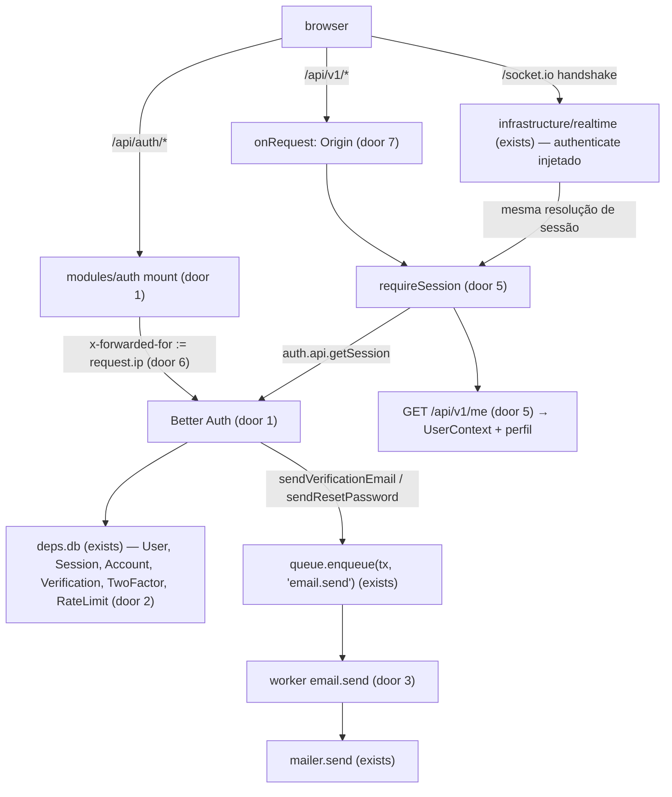
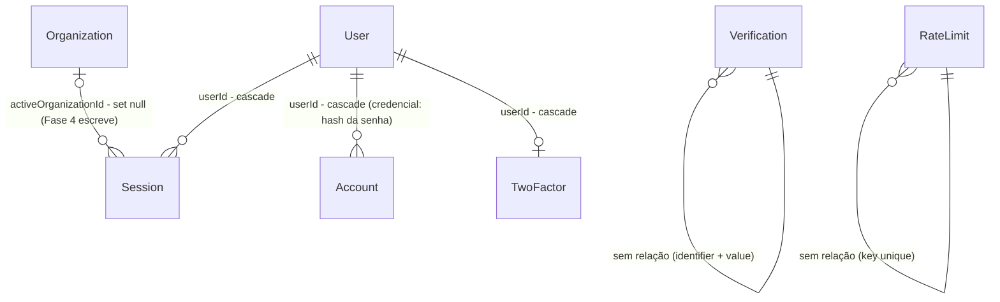

# Auth core

> Fase 3, feature 1 de 5 (ver `.specs/STATE.md`). Server apenas; as telas vêm em `auth-web`.

## Problem

Hoje ninguém se identifica no sistema: não existe usuário, senha, sessão nem cookie, e toda rota
responde a qualquer um. O `RequestContext` exige `organizationId`, mas um usuário recém-cadastrado
não pertence a organização nenhuma até a Fase 4, então não há como representar "quem está chamando"
sem inventar um tenant. O Socket.IO aceita qualquer conexão, o job `email.send` da arquitetura não
existe (um `ReactElement` não serializa na fila) e `/api/docs` não é servido. Quem paga: todas as
fases seguintes, que precisam de um usuário autenticado para existir; e o staging, que não pode
subir sem login. Não há incidente nem dado: o banco está vazio.

Com isso pronto, uma pessoa cria conta por e-mail e senha, confirma o e-mail pelo link, entra,
recupera a senha, liga o 2FA, e cada request (HTTP ou socket) chega ao código com um
`UserContext` validado ou é recusado com 401.

## Flow

Reusa o Better Auth para identidade, sessão, 2FA e rate limit (ADR-003), o client Prisma do app
(`deps.db`, role `bens_app`, ADR-004), o `queue.enqueue(tx)` e o `mailer` da Fase 2; nada de
senha, token ou sessão é escrito à mão.

1. `POST|GET /api/auth/*` → rota catch-all do módulo `auth` → monta um `Request` web (URL de `APP_URL`, headers do Fastify com `x-forwarded-for` trocado por `request.ip`) → `auth.handler` → a resposta volta com status, headers e `set-cookie` intactos
2. Better Auth grava/lê as tabelas de identidade por `deps.db` — tabelas **sem** `organizationId`, fora do RLS (Relations)
3. verificação de e-mail e reset de senha → `queue.enqueue` (exists) numa transação curta, payload do job `email.send` (door 3) → worker valida o payload, renderiza o template de `src/emails` e chama `mailer.send`
4. `/api/*` com método mutável → hook `onRequest` compara `Origin` com a origem de `APP_URL` → 403 antes de qualquer handler
5. rota autenticada → preHandler `requireSession` → `auth.api.getSession({ headers })` → `request.user: UserContext` ou 401 `UNAUTHENTICATED`
6. handshake do Socket.IO → `allowRequest` confere o `Origin`; middleware chama o mesmo resolvedor de sessão → `socket.data.user` ou conexão recusada. Sem rooms (Fase 4)
7. `@fastify/helmet` em toda resposta; `@fastify/swagger-ui` em `/api/docs` só quando `NODE_ENV !== 'production'`

## Impact

| Front | What changes |
| --- | --- |
| domain | novo termo: **`UserContext`** — quem chama, sem tenant (`requestId`, `userId`, `sessionId`, `isSuperAdmin`); vive em `shared/request-context.ts` (AD-001) |
| domain | termo existente: **`RequestContext`** era "quem chama + tenant" montado pela sessão; passa a ser explicitamente o contexto de **tenant** = `UserContext & { organizationId }`. Quem usa hoje: `database.ts` (`withTenant`, só `organizationId`), `test/factories.ts` (`contextFor`). Os dois ganham `sessionId`/`isSuperAdmin` no factory; nada muda em `withTenant` |
| domain | novo termo: **super-admin efetivo** — `User.isSuperAdmin` **e** `twoFactorEnabled`; só o efetivo vira `isSuperAdmin: true` no contexto |
| API | toda rota mutável de `/api/*` passa a exigir `Origin` igual a `APP_URL`; os testes existentes que fazem `POST` (`app.spec.ts`) passam a enviar `Origin` |
| API | respostas ganham os headers do helmet |
| config | chaves novas obrigatórias: `BETTER_AUTH_SECRET`, `APP_URL`; opcional `TRUST_PROXY` (padrão `false`). `.env.example`, `test/app.ts`, `boot.spec.ts` e CI recebem valores |
| infra | `db.withoutTenant(tx => …)` (novo em `database.ts`): transação sem tenant, usada para tabelas de usuário e para enfileirar o `email.send` fora de um tenant (door 9) |
| infra | `src/workers.ts` registra todo worker depois do `queue.start()`, no server e no harness de testes (`buildTestApp({ workers: true })`); o Fastify expõe `app.realtime` para as fases que emitirem em rooms |
| stored data | nada a migrar (banco vazio); migration nova cria 6 tabelas |

## Relations

One-way constraints: nenhuma dessas tabelas tem coluna `organizationId` (door 2) — são de usuário,
não de tenant, então ficam fora do RLS e o teste de schema continua verde;
`User.email` único global (door 2); `Session.token` único; `RateLimit.key` único. Ids UUID v7
gerados pelo Prisma (door 2). No columns and no types here.

## Surface

| Route | In | Out | Status |
| --- | --- | --- | --- |
| `POST/GET /api/auth/*` | contrato do Better Auth 1.7 (`sign-up/email`, `sign-in/email`, `sign-out`, `verify-email`, `send-verification-email`, `request-password-reset`, `reset-password`, `get-session`, `two-factor/*`) | idem + `set-cookie` | `200`, `302` (links de e-mail), `400`, `401`, `403`, `429` |
| `GET /api/v1/me` | cookie de sessão | `id`, `name`, `email`, `emailVerified`, `twoFactorEnabled`, `isSuperAdmin`, `activeOrganizationId` | `200`, `401` |
| `GET /api/docs` | — | Swagger UI | `200` fora de produção, `404` em produção |
| socket `/socket.io` handshake | cookie de sessão, `Origin` | conexão | `101` aceita; handshake `403` com `Origin` estranho; `connect_error` `UNAUTHENTICATED` sem sessão |
| qualquer `POST/PUT/PATCH/DELETE /api/*` | header `Origin` | — | `403` `ORIGIN_NOT_ALLOWED` quando ausente ou diferente de `APP_URL` |

## Landing

| One-way door | Literal shape | Alternative rejected |
| --- | --- | --- |
| 1. Better Auth montado no Fastify | dependência `better-auth@1.7.x` (latest estável que passar no `minimumReleaseAge`); `betterAuth({ database: prismaAdapter(deps.db, { provider: 'postgresql' }), baseURL: APP_URL, basePath: '/api/auth', secret: BETTER_AUTH_SECRET, trustedOrigins: [origin(APP_URL)], telemetry: { enabled: false }, emailAndPassword: { enabled: true, requireEmailVerification: true, minPasswordLength: 8, revokeSessionsOnPasswordReset: true }, emailVerification: { sendOnSignUp: true, autoSignInAfterVerification: true, expiresIn: 86_400 }, session: { expiresIn: 259_200, updateAge: 43_200 }, plugins: [twoFactor({ issuer: 'Bens Seguros' })] })`, rota `app.route({ method: ['GET','POST'], url: '/api/auth/*', schema: { hide: true } })` | `toNodeHandler` direto no `http.Server` - fura o pipeline do Fastify (sem `onRequest` de Origin, sem requestId, sem helmet); auth própria - reescreve o que o ADR-003 decidiu não reescrever |
| 2. tabelas de identidade | models `User`, `Session`, `Account`, `Verification`, `TwoFactor`, `RateLimit` com `id String @id @default(uuid(7)) @db.Uuid`, Better Auth com `advanced.database.generateId: false`; `User.isSuperAdmin Boolean @default(false)` e `Session.activeOrganizationId String? @db.Uuid` como `additionalFields` com `input: false`; **nenhuma** coluna `organizationId` | ids `text` gerados pelo Better Auth - quebra a convenção UUID v7 do resto do schema; `Session.organizationId` - o teste de schema exigiria RLS numa tabela que não é de tenant |
| 3. payload do job `email.send` (AD-003) | `{ template: 'verify-email' \| 'reset-password', to: string, props: { name: string, url: string } }`, validado por `z.discriminatedUnion('template', …)` no worker; `registerWorker('email.send', …, { retries: 3, backoff: true })`; enfileirado com `db.$transaction(tx => queue.enqueue(tx, 'email.send', payload))` | `ReactElement` no payload - não serializa; HTML já renderizado no payload - engorda a fila e congela o template antigo em retries; enviar direto no callback do Better Auth - segura a request no SMTP e expõe timing do reset |
| 4. política de sessão | cookie do Better Auth sem `domain` (host-only), `SameSite=Lax`, `httpOnly`, `Secure` + prefixo `__Secure-` quando `APP_URL` é `https`; `expiresIn` 3 dias, `updateAge` 12 h, `cookieCache` desligado (padrão) | `crossSubDomainCookies` do legado - desnecessário com mesma origem (ADR-008) e amplia quem recebe o cookie |
| 5. contexto de usuário separado do de tenant (AD-001) | `export type UserContext = { requestId: string; userId: string; sessionId: string; isSuperAdmin: boolean }` e `export type RequestContext = UserContext & { organizationId: string }` em `shared/request-context.ts`; `requireSession` preenche `request.user`; a Fase 4 cria `requireTenant` → `request.ctx` | `organizationId: string \| null` no mesmo tipo - todo repository teria de checar null e `withTenant(null)` compilaria; tenant "pessoal" falso por usuário - cria dados de tenant sem organização real |
| 6. IP do cliente (AD-002) | `Fastify({ trustProxy: config.TRUST_PROXY })`; o mount faz `headers.set('x-forwarded-for', request.ip)` antes de `auth.handler`; `rateLimit: { enabled: true, storage: 'database', window: 60, max: 100, customRules: { '/sign-in/email': { window: 900, max: 10 }, '/sign-up/email': { window: 3600, max: 5 }, '/request-password-reset': { window: 3600, max: 3 }, '/send-verification-email': { window: 3600, max: 3 }, '/two-factor/*': { window: 900, max: 10 } } }` | deixar o Better Auth ler o `x-forwarded-for` do cliente - sem proxy na frente, qualquer um troca de bucket mandando o header |
| 7. Origin em métodos mutáveis (AD-004) | hook `onRequest` global: `POST/PUT/PATCH/DELETE` em `/api/*` exige `request.headers.origin === new URL(APP_URL).origin`, senão `403 { error: { code: 'ORIGIN_NOT_ALLOWED', message: 'Origem da requisição não permitida.' } }` | confiar só no `SameSite=Lax` - não cobre um subdomínio irmão (same-site); checar `Referer` - pode ser suprimido por política do browser |
| 8. dependências novas | `better-auth`, `@fastify/helmet`, `@fastify/swagger-ui`, versões estáveis mais recentes que passem no `minimumReleaseAge`; exceções no `pnpm-workspace.yaml` reportadas no resumo | `helmet` do Express - não integra ao ciclo do Fastify |
| 9. transação sem tenant (achado no build) | `withoutTenant<T>(run: (tx: Transaction) => Promise<T>) { return client.$transaction(run) }` na extensão de `createDatabase`, ao lado de `withTenant`; toda tabela tenant-scoped falha dentro dela, como fora de `withTenant` | `db.$transaction` do client estendido - o `tx` tem outro tipo e não entra em `queue.enqueue(tx)`; expor o client base - abriria um segundo caminho ao banco sem o contrato do ADR-004 |

- Nothing else in this change is hard to reverse

## Criteria

### S1: Cadastro, verificação e login (P1)

Uma pessoa cria conta, confirma o e-mail e entra com cookie de sessão.

**Acceptance Criteria**

1. WHEN `POST /api/auth/sign-up/email` recebe `name`, `email` novo e `password` de 8 a 128 caracteres THEN o sistema SHALL criar o `User` com `emailVerified = false`, SHALL não emitir cookie de sessão e SHALL enfileirar um job `email.send` com `template: 'verify-email'` e `to` igual ao e-mail
2. IF `POST /api/auth/sign-up/email` recebe um e-mail já cadastrado THEN o sistema SHALL responder como no cadastro novo (sem revelar que o e-mail existe) e SHALL não criar um segundo `User`
3. IF `POST /api/auth/sign-in/email` recebe credenciais de um usuário com `emailVerified = false` THEN o sistema SHALL responder `403` e SHALL não emitir cookie de sessão
4. WHEN o link de verificação do e-mail é aberto (`GET /api/auth/verify-email?token=…`) THEN o sistema SHALL marcar `emailVerified = true` e SHALL emitir o cookie de sessão (auto sign-in)
5. WHEN `POST /api/auth/sign-in/email` recebe credenciais corretas de usuário verificado THEN o sistema SHALL responder `200` com `set-cookie` do token de sessão `HttpOnly`, `SameSite=Lax`, `Path=/`, sem atributo `Domain`
6. WHERE `APP_URL` é `https` the system SHALL emitir o cookie de sessão com `Secure` e prefixo `__Secure-`
7. IF `POST /api/auth/sign-in/email` recebe senha errada THEN o sistema SHALL responder `401` e SHALL não emitir cookie de sessão
8. WHEN `POST /api/auth/sign-out` é chamado com sessão válida THEN o sistema SHALL apagar a `Session` do banco, e o mesmo cookie SHALL receber `401` em `GET /api/v1/me`

**Independent test:** `app.inject` cadastra, lê o job `email.send`, abre a URL do payload, chama `/api/v1/me` com o cookie recebido e vê `emailVerified: true`.

### S2: Recuperação de senha (P1)

Quem esqueceu a senha recebe um link e define outra; as sessões antigas caem.

**Acceptance Criteria**

9. WHEN `POST /api/auth/request-password-reset` recebe o e-mail de um usuário THEN o sistema SHALL responder `200` e SHALL enfileirar `email.send` com `template: 'reset-password'`
10. IF `POST /api/auth/request-password-reset` recebe um e-mail não cadastrado THEN o sistema SHALL responder `200` com o mesmo corpo do caso cadastrado e SHALL não enfileirar e-mail
11. WHEN `POST /api/auth/reset-password` recebe o token do link e uma senha nova válida THEN o sistema SHALL trocar a senha, SHALL apagar todas as `Session` do usuário, e o login SHALL funcionar só com a senha nova
12. IF `POST /api/auth/reset-password` recebe um token já usado ou expirado (1 h) THEN o sistema SHALL responder `400` e SHALL manter a senha anterior

**Independent test:** pedir o reset, trocar a senha pelo token do job, ver o cookie antigo receber `401` e o login novo funcionar.

### S3: Sessão e contexto de usuário (P1)

Toda rota autenticada recebe `request.user`, e só com sessão viva.

**Acceptance Criteria**

13. WHEN `GET /api/v1/me` é chamado com cookie de sessão válido THEN o sistema SHALL responder `200` com `id`, `name`, `email`, `emailVerified`, `twoFactorEnabled`, `isSuperAdmin` e `activeOrganizationId` (`null` antes da Fase 4)
14. IF `GET /api/v1/me` é chamado sem cookie, com token inexistente ou com sessão de `expiresAt` no passado THEN o sistema SHALL responder `401 { error: { code: 'UNAUTHENTICATED', message: 'Sessão inválida ou expirada.' } }`
15. The sistema SHALL criar sessões com `expiresAt` 3 dias após o login, SHALL estender `expiresAt` quando a sessão usada tem mais de 12 h desde a última atualização, e SHALL ler a sessão do banco em toda request (sem cache de cookie): apagar a `Session` no banco SHALL fazer a request seguinte receber `401`
16. IF um usuário tem `isSuperAdmin = true` e `twoFactorEnabled = false` THEN o contexto e o `/me` SHALL trazer `isSuperAdmin: false`; WHEN os dois são `true` THEN SHALL trazer `isSuperAdmin: true`
17. IF `POST /api/auth/sign-up/email` ou `update-user` recebe `isSuperAdmin` ou `activeOrganizationId` no corpo THEN o sistema SHALL não gravar esses campos

**Independent test:** logar, zerar o `expiresAt` da sessão no banco e ver `/api/v1/me` passar de `200` para `401`.

### S4: 2FA (P1)

O usuário liga TOTP e, a partir daí, o login exige o segundo fator.

**Acceptance Criteria**

18. WHEN um usuário logado chama `POST /api/auth/two-factor/enable` com a senha correta THEN o sistema SHALL devolver `totpURI` (issuer `Bens Seguros`) e códigos de backup, e SHALL marcar `twoFactorEnabled = true` só depois de `POST /api/auth/two-factor/verify-totp` com um código válido desse segredo
19. WHILE o usuário tem `twoFactorEnabled = true`, WHEN `POST /api/auth/sign-in/email` recebe credenciais corretas THEN o sistema SHALL responder com `twoFactorRedirect: true` e SHALL não criar `Session`
20. WHEN, depois do passo anterior, `POST /api/auth/two-factor/verify-totp` recebe o código TOTP correto THEN o sistema SHALL emitir o cookie de sessão; IF o código está errado THEN SHALL responder `401` e não emitir sessão
21. WHEN `POST /api/auth/two-factor/disable` recebe a senha correta THEN `twoFactorEnabled` SHALL voltar a `false` e o login seguinte SHALL criar sessão sem segundo fator
22. The segredo TOTP SHALL ser gravado cifrado em `TwoFactor.secret` (o valor no banco difere do segredo presente no `totpURI`)

**Independent test:** ligar 2FA com um código calculado no teste, sair, entrar de novo e só obter cookie depois do `verify-totp`.

### S5: Rate limit persistido (P1)

Força bruta no login para, e o bloqueio sobrevive a um restart.

**Acceptance Criteria**

23. WHEN o mesmo IP faz a 11ª tentativa de `POST /api/auth/sign-in/email` em 15 min THEN o sistema SHALL responder `429`
24. WHEN o server é recriado (novo `buildApp` + novas dependências, mesmo banco) depois de 10 tentativas THEN a tentativa seguinte do mesmo IP SHALL receber `429`
25. IF a request traz `x-forwarded-for` com IPs variados e `TRUST_PROXY` é `false` THEN todas SHALL contar no bucket do IP da conexão (o header do cliente não troca de bucket)
26. WHERE `TRUST_PROXY` é `true` the system SHALL contar o rate limit pelo IP informado pelo proxy em `x-forwarded-for`
27. The sistema SHALL aplicar os limites `/sign-up/email` 5/h, `/request-password-reset` 3/h, `/send-verification-email` 3/h e `/two-factor/*` 10 por 15 min por IP, respondendo `429` ao exceder

**Independent test:** 10 logins errados, `close()` do app, novo app no mesmo schema, 11º login → `429`.

### S6: E-mail pela fila (P1)

Os e-mails de auth saem pelo job, com o template certo, e só se a transação confirmar.

**Acceptance Criteria**

28. WHEN o worker `email.send` processa `{ template: 'verify-email', to, props: { name, url } }` THEN o sistema SHALL enviar por SMTP um e-mail para `to`, com assunto `Confirme seu e-mail` e o `url` no corpo HTML e no texto
29. WHEN o worker processa `template: 'reset-password'` THEN o e-mail SHALL ter assunto `Redefina sua senha` e o `url` no corpo
30. IF o payload tem `template` desconhecido ou `props` inválidas THEN o job SHALL falhar sem enviar e-mail
31. IF o envio SMTP falha THEN o job SHALL ser tentado de novo até 3 vezes com backoff

**Independent test:** processar um job de cada template contra o Mailpit e ler assunto e link pela API do Mailpit.

### S7: Origin, headers e docs (P1)

Nenhuma escrita vem de outra origem; a API tem headers de segurança; a doc só existe fora de produção.

**Acceptance Criteria**

32. IF uma request `POST`, `PUT`, `PATCH` ou `DELETE` em `/api/*` chega sem `Origin` ou com `Origin` diferente da origem de `APP_URL` THEN o sistema SHALL responder `403 { error: { code: 'ORIGIN_NOT_ALLOWED', message: 'Origem da requisição não permitida.' } }` sem executar o handler
33. WHEN uma request `GET` chega sem `Origin` THEN o sistema SHALL processá-la normalmente
34. The API SHALL responder com os headers do helmet, incluindo `x-content-type-options: nosniff` e `strict-transport-security`
35. WHERE `NODE_ENV` é `development` ou `test` the system SHALL servir o Swagger UI em `GET /api/docs`; WHEN `NODE_ENV` é `production` THEN `GET /api/docs` SHALL responder `404`
36. IF `BETTER_AUTH_SECRET` tem menos de 32 caracteres ou `APP_URL` falta THEN o server SHALL sair com código 1 no boot citando a variável

**Independent test:** `POST /api/auth/sign-in/email` com `Origin: https://evil.example` → `403`; `GET /api/docs` com config de produção → `404`.

### S8: Socket autenticado (P1)

O socket só conecta com a mesma sessão do HTTP.

**Acceptance Criteria**

37. WHEN um cliente Socket.IO conecta com o cookie de sessão válido e `Origin` igual a `APP_URL` THEN a conexão SHALL ser aceita e `socket.data.user.userId` SHALL ser o id do usuário
38. IF o cliente conecta sem cookie, com sessão expirada ou revogada THEN a conexão SHALL ser recusada com `connect_error` de mensagem `UNAUTHENTICATED`
39. IF o handshake traz `Origin` diferente de `APP_URL` THEN a conexão SHALL ser recusada mesmo com cookie válido

**Independent test:** `socket.io-client` com e sem o cookie obtido no login.

## Out of scope

| Excluded | Why |
| --- | --- |
| `SIGNUP_MODE`, e-mail temporário, Turnstile | feature `signup-gates` |
| termos versionados | feature `terms` |
| telas de login/cadastro/2FA | feature `auth-web` |
| organização ativa, `requireTenant`, `Member`, rooms `org:*`/`user:*` | Fase 4 |
| `requirePermission` / RBAC | Fase 4; as rotas desta feature usam `requireSession` |
| auditoria de login | o `AuditLog` é tenant-scoped e nasce na Fase 4; login não tem tenant — decisão da Fase 4 |
| rota ou guard de super-admin | não há rota de super-admin até a Fase 12; esta feature só entrega o `isSuperAdmin` efetivo |
| rate limit do resto da API (`@fastify/rate-limit`) | nenhuma rota pública além de `/api/auth/*` nesta fase |
| login social, magic link, OTP por e-mail | fora do legado e do ADR-003 |

## Assumptions

| Assumption | Chosen default | Rationale | Confirmed? |
| --- | --- | --- | --- |
| rate limit por IP, não por e-mail | só IP (mecanismo nativo do Better Auth com `storage: "database"`) | o legado também limitava por e-mail; o Better Auth não oferece chave por e-mail sem código próprio; credential stuffing distribuído fica para quando houver sinal | n |
| token no payload do job | a URL com token fica na tabela do pg-boss até o expurgo dele | o token já está em texto no `Verification` do Better Auth; a fila não aumenta a exposição | n |
| e-mail duplicado em retry | aceitar: um retry após SMTP aceitar e o ack falhar pode reenviar | reenviar um link de verificação ou reset é inofensivo; dedupe exigiria outbox | n |
| mensagens de erro do Better Auth | o server repassa `{ code, message }` do Better Auth (inglês); o web traduz por `code` (feature `auth-web`) | reescrever respostas do Better Auth quebraria o client oficial | n |
| `TRUST_PROXY` | booleano; `true` só atrás do Caddy, com a porta do server não publicada | um único proxy na frente; CIDR é complexidade sem uso hoje | n |
| política de senha | 8 a 128 caracteres, sem regra de composição | paridade com o legado (`minPasswordLength: 8`) | n |

**Open questions:** none - all resolved or logged above.

## Observable

| Surface | Decision | Landing |
| --- | --- | --- |
| API `/api/auth/*` | response shape e error shape | existing - contrato do Better Auth 1.7 (Assumptions) |
| API `/api/auth/*` | quem pode chamar | AC 3, 7, 19 |
| API `/api/auth/*` | rate limit | AC 23, 24, 25, 26, 27 |
| API `/api/auth/*` | versionamento | n/a - o prefixo é do Better Auth; o contrato é travado pela versão fixada no `package.json` |
| API `GET /api/v1/me` | response shape | AC 13 |
| API `GET /api/v1/me` | error shape e códigos | AC 14 |
| API `GET /api/v1/me` | quem pode chamar | AC 14, 15 |
| API `GET /api/v1/me` | rate limit | n/a - só leitura autenticada; rate limit geral fora desta fase (Out of scope) |
| API `GET /api/v1/me` | versionamento | existing - prefixo `/api/v1` |
| API métodos mutáveis `/api/*` | error shape | AC 32 |
| API `GET /api/docs` | quem pode chamar | AC 34 |
| socket `/socket.io` | quem pode conectar | AC 37, 38, 39 |
| job `email.send` | o que acontece quando falha no meio | AC 30, 31 |
| documento: e-mails de verificação e reset | estrutura, tom, próximo passo | AC 28, 29 - pt-BR, um botão com o link, layout de `emails/layout.tsx` |
| boot do server | o que imprime ao falhar | AC 35 |

## Sources

- `docs/decisions/ADR-003-authentication.md` - Better Auth só para identidade/sessão/2FA, sessão 3 d / 12 h, sem `cookieCache`, cookie host-only Lax
- `docs/decisions/ADR-004-tenant-isolation.md` - role `bens_app`; tabela com `organizationId` exige RLS
- `docs/roadmap.md` (Fase 3) e `prompts/prompt-03.md` - escopo, pendências da Fase 2
- Better Auth 1.7 docs (Context7 `/better-auth/better-auth`): integração Fastify, rate limit `storage: "database"`, 2FA, segurança (Origin/CSRF)
