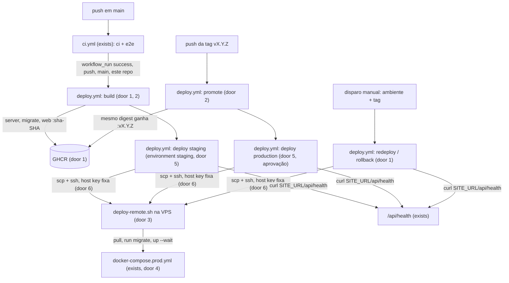

# CD na VPS

> Antecipa o marco "Staging publicado" (roadmap, antes da F3) e o deploy por tag do ADR-008.
> Entrega o workflow, o script remoto e o tutorial, tudo validado localmente. O primeiro deploy
> real, o push e a configuração da VPS e do GitHub são feitos pelo usuário seguindo o tutorial
> (regra 8 da skill: push e deploy pedem ok explícito).

## Problem

Hoje o CI (lint, typecheck, testes, build e e2e em `main`) termina e nada chega a um servidor.
Para pôr uma versão numa VPS, alguém precisa entrar por SSH, fazer `git clone`/`checkout`,
editar o `.env` e rodar `docker compose … up --build` na própria máquina, seguindo o
`docs/runbooks/staging.md`. A imagem que sobe é compilada na VPS, então não é a mesma que o CI
testou. Não há registro de qual versão está rodando, e o rollback é um `checkout` manual. Quem
paga: cada fase a partir da F3, cujo critério é "e2e verde no staging" (roadmap), e o go-live,
que depende de um deploy repetível.

O usuário escolheu (2026-09-24): Docker + GitHub + VPS da Hostinger; staging automático a cada
push em `main` com CI verde, produção por tag `v*` com aprovação manual, uma VPS por ambiente;
backup continua na F11.

Com isso pronto, um push em `main` com CI verde publica as imagens e atualiza o staging sem
ninguém entrar na VPS. Uma tag `v1.2.3` promove para produção as mesmas imagens, depois de uma
aprovação no GitHub, e um botão no GitHub reinstala qualquer versão anterior.

## Flow

Reusa o `docker-compose.prod.yml`, os dois Dockerfiles e o `Caddyfile` da feature `staging`, sem
mudança de comportamento, e o `ci.yml` existente como porta de qualidade: o deploy só roda depois
dele.

1. `ci.yml` (exists) roda em todo push em `main`; ao terminar, dispara `deploy.yml` por `workflow_run`
2. `deploy.yml` (door 1, 2), job `build`: só se a conclusão foi `success`, o evento foi `push`, o branch é `main` e o repositório de origem é este; compila as três imagens do `head_sha` e publica `:sha-<SHA>` no GHCR
3. job `deploy-staging` chama `deploy-environment.yml` (door 5, environment `staging`), que copia `docker-compose.prod.yml`, `docker/postgres/init/01-app-role.sh` e `scripts/deploy-remote.sh` para `DEPLOY_PATH` na VPS e roda o script com a tag e o token do registry por stdin
4. `deploy-remote.sh` (door 3), na VPS: login no GHCR, `pull` das três imagens, `run --rm migrate`, `up -d --wait`, confere a imagem do `server` em execução, grava a tag em `deploy.env`, logout
5. o job pede `SITE_URL/api/health` (exists) do runner, de fora da VPS, e falha sem `200`
6. tag `vX.Y.Z`, job `promote`: confere que o commit está em `main` e que `:sha-<SHA>` existe; adiciona `:vX.Y.Z` ao mesmo digest; `deploy-production` (environment `production`, com aprovação) repete 3–5 com `vX.Y.Z`
7. disparo manual do `deploy.yml` (door 1): valida o formato e a existência da tag e repete 3–5; é o rollback

## Impact

| Front | What changes |
| --- | --- |
| domain | termo novo: **release** — a tag `vX.Y.Z` no git e as mesmas três imagens com essa tag no GHCR; só é criada sobre um commit de `main` que já passou no CI |
| domain | termo existente: **staging** era "o compose de produção numa VPS subido à mão"; agora é o environment `staging` do GitHub, atualizado a cada push verde em `main`. Quem depende do termo: o roadmap (marco de staging, critérios da F3, F4, F9, F10) e o `docs/architecture.md`, que apontam para o runbook |
| infra | `docker-compose.prod.yml` ganha `image:` nos serviços `migrate`, `server` e `caddy`, mantendo o `build:`; a validação local (`scripts/staging-smoke.mjs`) continua compilando |
| infra | arquivos novos: `.github/workflows/deploy.yml`, `.github/workflows/deploy-environment.yml` (o job de deploy, reusado pelos três caminhos), `scripts/deploy-remote.sh`, `scripts/deploy-smoke.mjs` (valida o script remoto com um registry local), `docs/runbooks/deploy.md` (o tutorial) |
| docs | `docs/runbooks/deploy.md` substitui `docs/runbooks/staging.md` (apagado); o passo `runbook` do `staging-smoke.mjs` (C15 da feature `staging`) passa a ler o novo arquivo com as seções dele; os links no `docs/architecture.md` e no `docs/roadmap.md` mudam; ADR-008 ganha uma linha de revisão (o deploy por tag existe, mais o staging automático) |
| stored data | nada a migrar; o volume do Postgres na VPS nasce no primeiro deploy |

## Relations

None - no stored-data shape change

## Surface

None - nothing consumed outside over HTTP: the only route touched is `/api/health`, which exists unchanged. The two commands this adds (the `workflow_dispatch` of `deploy.yml` and `scripts/deploy-remote.sh <tag>`) have their inputs in Landing 3 and 5 and their exit behaviour in S2 and S5.

## Landing

| One-way door | Literal shape | Alternative rejected |
| --- | --- | --- |
| 1. nomes e tags das imagens | `ghcr.io/arturmois/bens-seguros-v2/server`, `…/migrate`, `…/web`; tag `sha-<SHA de 40 caracteres>` no build e `v<MAJOR>.<MINOR>.<PATCH>` na promoção; nenhuma tag móvel (`latest`, `main`); só `linux/amd64` | tag móvel `latest`: a VPS não sabe o que está rodando e o rollback não tem para onde voltar |
| 2. construir uma vez, promover | a produção instala o mesmo digest que o staging recebeu: `docker buildx imagetools create -t …:vX.Y.Z …:sha-<SHA>`; a tag só é promovida se `git merge-base --is-ancestor <SHA> origin/main` | recompilar na tag: os bytes em produção não seriam os que passaram no CI e no staging |
| 3. layout na VPS | `DEPLOY_PATH` (sugerido `/opt/bens-seguros`) contém `docker-compose.prod.yml`, `docker/postgres/init/01-app-role.sh`, `deploy-remote.sh` (copiados a cada deploy), `.env` (escrito à mão, `chmod 600`) e `deploy.env` / `deploy.env.previous` (`IMAGE_REGISTRY=…` e `IMAGE_TAG=…`, escritos pelo script); o compose é chamado com `--env-file .env --env-file deploy.env` | `git clone` na VPS: exige credencial do repositório no servidor e leva o código-fonte para lá |
| 4. imagem no compose | `image: ${IMAGE_REGISTRY:-bens-seguros}/server:${IMAGE_TAG:-local}` (idem `migrate` e `web`), com o `build:` mantido; na VPS o script usa `pull` e `up --no-build` | um segundo compose só para a VPS: duas definições da mesma pilha que divergem |
| 5. onde ficam os segredos | environment do GitHub guarda só o acesso: secrets `SSH_HOST`, `SSH_USER`, `SSH_PRIVATE_KEY`, `SSH_KNOWN_HOSTS`; variables `DEPLOY_PATH`, `SITE_URL`. Segredos da aplicação só no `.env` da VPS; o token do GHCR é o `GITHUB_TOKEN` do job (`packages: read`), passado por stdin e descartado com `docker logout` | montar o `.env` a partir de secrets do GitHub: cada segredo da aplicação passa a existir em dois lugares e trafega pelo runner a cada deploy |
| 6. acesso SSH | `ssh`/`scp` do próprio runner com `StrictHostKeyChecking=yes` e `UserKnownHostsFile` vindo de `SSH_KNOWN_HOSTS`; ações oficiais só da Docker (`docker/setup-buildx-action`, `docker/login-action`, `docker/build-push-action`); na VPS, usuário `deploy` no grupo `docker`, chave com a opção `restrict` no `authorized_keys` | ação SSH de terceiros (ex.: `appleboy/ssh-action`): código de fora do projeto com acesso à chave privada; `StrictHostKeyChecking=no`: aceita um servidor falso |

- Nothing else in this change is hard to reverse

## Criteria

### S1: Imagens publicadas uma vez por commit verde em `main` (P1)

Cada push em `main` que passou no CI vira três imagens no GHCR com o SHA do commit.

**Acceptance Criteria**

1. WHEN o workflow `CI` termina com conclusão `success` para um evento `push` no branch `main` deste repositório THEN o `deploy.yml` SHALL publicar `ghcr.io/arturmois/bens-seguros-v2/server`, `…/migrate` e `…/web` com a tag `sha-<head_sha>`, compiladas a partir de `head_sha`
2. IF a conclusão do `CI` não é `success`, ou o evento não é `push`, ou o branch não é `main`, ou o repositório de origem não é este THEN o `deploy.yml` SHALL não compilar nem publicar imagem e SHALL não fazer deploy
3. The job de build SHALL pedir só as permissões `contents: read` e `packages: write`

**Independent test:** push em `main`; as três imagens aparecem em Packages com `sha-<SHA>`.

### S2: O script remoto instala uma tag com segurança (P1)

`deploy-remote.sh` é o único código que roda na VPS; ele instala uma tag, ou falha sem derrubar o que está no ar.

**Acceptance Criteria**

4. WHEN `deploy-remote.sh <tag>` roda com o token do registry no stdin THEN SHALL fazer `pull` das três imagens `<tag>`, rodar o `migrate` até sair com `0`, subir a pilha com `up -d --wait --no-build` e sair com `0` só se o container do `server` em execução usa `…/server:<tag>`
5. WHEN o deploy termina com `0` THEN `deploy.env` SHALL conter `IMAGE_TAG=<tag>` e `deploy.env.previous` SHALL conter a tag que estava em `deploy.env` antes
6. IF a tag não existe no registry THEN o script SHALL sair com código `≠ 0` antes de parar ou recriar qualquer container, e o `server` que estava rodando SHALL continuar com a imagem anterior
7. IF o `migrate` sai com código `≠ 0` THEN o script SHALL sair com código `≠ 0` sem recriar o `server` e sem alterar `deploy.env`
8. IF `.env` não existe em `DEPLOY_PATH`, ou tem permissão além de `600` THEN o script SHALL sair com código `≠ 0` sem chamar o Docker
9. WHEN o script termina, com sucesso ou falha THEN SHALL ter feito `docker logout` do registry, sem credencial dele no config do Docker
10. The token do registry SHALL chegar ao script só por stdin, nunca por argumento ou variável de ambiente do comando SSH

**Independent test:** `node scripts/deploy-smoke.mjs` contra um registry local com autenticação.

### S3: Staging automático (P1)

**Acceptance Criteria**

11. WHEN o build do S1 termina THEN o job `deploy-staging` SHALL rodar no environment `staging`, copiar os três arquivos do door 3 para `DEPLOY_PATH` e executar `deploy-remote.sh sha-<head_sha>`
12. WHEN o script remoto sai com `0` THEN o job SHALL pedir `SITE_URL/api/health` do runner e SHALL falhar se não receber `200` em até 60 segundos
13. The conexão SSH SHALL usar `StrictHostKeyChecking=yes` com `SSH_KNOWN_HOSTS` como `UserKnownHostsFile`; IF a chave do host não confere THEN o job SHALL falhar antes de qualquer comando remoto
14. The jobs de deploy SHALL usar o grupo de concorrência `deploy-<environment>` com `cancel-in-progress: false`

**Independent test:** push em `main` com CI verde; `https://staging.<domínio>/api/health` responde `200` e `deploy.env` na VPS tem o SHA.

### S4: Produção por tag, com aprovação (P1)

**Acceptance Criteria**

15. WHEN a tag `vX.Y.Z` é enviada e o commit dela está em `origin/main` e `…/server:sha-<SHA>` existe THEN o job `promote` SHALL adicionar a tag `vX.Y.Z` ao mesmo digest das três imagens, sem recompilar
16. IF o commit da tag não está em `origin/main` THEN o `promote` SHALL falhar sem criar tag de imagem
17. IF as imagens `sha-<SHA>` do commit não existem THEN o `promote` SHALL falhar com a mensagem `Imagens sha-<SHA> não encontradas: o CI deste commit passou em main?`
18. WHEN o `promote` termina THEN o job `deploy-production` SHALL rodar no environment `production` e instalar `vX.Y.Z` pelos passos 11–12

**Independent test:** `git tag v0.1.0 && git push origin v0.1.0`; aprovar no GitHub; `https://<domínio>/api/health` responde `200`.

### S5: Redeploy e rollback manuais (P2)

**Acceptance Criteria**

19. WHEN o `workflow_dispatch` recebe `environment` e `image_tag` THEN o `deploy.yml` SHALL instalar `image_tag` nesse environment pelos passos 11–12
20. IF `image_tag` não casa com `^(sha-[0-9a-f]{40}|v[0-9]+\.[0-9]+\.[0-9]+)$` THEN o job SHALL falhar antes de abrir conexão SSH
21. IF `image_tag` casa com o formato mas não existe no GHCR THEN o job SHALL falhar antes de abrir conexão SSH

**Independent test:** Actions → Deploy → Run workflow com a tag anterior.

### S6: A validação local continua igual (P1)

**Acceptance Criteria**

22. WHEN `node scripts/staging-smoke.mjs up` e `node scripts/staging-smoke.mjs all` rodam THEN SHALL terminar com `0`, com a pilha compilada localmente (tags `bens-seguros/<imagem>:local`)

**Independent test:** os dois comandos.

### S7: Tutorial (P1)

**Acceptance Criteria**

23. The `docs/runbooks/deploy.md` SHALL trazer, nesta ordem, as seções: visão geral, pré-requisitos, criar a VPS na Hostinger, proteger a VPS, instalar o Docker, usuário de deploy, DNS, `.env`, chave SSH do deploy, configurar o GitHub, primeiro deploy, produção por tag, rollback, operação do dia a dia, problemas comuns e pendências
24. The tutorial SHALL citar só arquivos, secrets e variables que existem no repositório ou no `deploy.yml`, com os mesmos nomes
25. The tutorial SHALL explicar que migration não volta no rollback e que o backup é da F11

**Independent test:** leitura do tutorial e o passo `runbook` do `staging-smoke.mjs`.

## Out of scope

| Excluded | Why |
| --- | --- |
| backup `pg_dump` off-site e restore | decisão do usuário: F11 (roadmap) |
| Sentry, monitor externo, `/api/ready`, alertas | F11 |
| staging e produção na mesma VPS | os dois Caddy disputariam as portas 80/443; decisão do usuário: uma VPS por ambiente |
| deploy sem downtime (blue-green) | o `up` recria o `server` em segundos; desproporcional para o MVP |
| preview por PR | ADR-008 |
| serviço `whatsapp` no compose | F9 (ADR-012) |
| executar o primeiro deploy real | exige a VPS, o domínio e o ok do usuário (Open questions) |

## Assumptions

| Assumption | Chosen default | Rationale | Confirmed? |
| --- | --- | --- | --- |
| sistema da VPS | Ubuntu 24.04 LTS da Hostinger (plano KVM), `x86_64` | template padrão da Hostinger e LTS; as imagens são `linux/amd64` | n |
| visibilidade das imagens | privadas; o deploy faz login com o `GITHUB_TOKEN` do job | funciona com imagem pública ou privada, sem token de longa duração na VPS | n |
| firewall | firewall do painel da Hostinger e `ufw`, liberando 22, 80, 443/tcp e 443/udp | duas camadas; o Docker publica só as portas do Caddy | n |
| formato da tag | `vMAJOR.MINOR.PATCH`, sem pré-release | basta para o MVP; pré-release entra se aparecer necessidade | n |
| downtime | alguns segundos a cada deploy, enquanto o `server` é recriado | ver Out of scope | n |
| versões das ações | a major mais recente de cada ação oficial na hora do build, conferida na documentação | mesma convenção do `ci.yml` | n |

**Open questions:**

| # | Kind | Question | Until answered |
| --- | --- | --- | --- |
| 1 | blocks go-live | VPS da Hostinger criada, domínio e subdomínio do staging, e o ok para o primeiro push que dispara o deploy | S1, S3 e S4 ficam provados só estaticamente (actionlint e leitura do YAML) e S2 pelo registry local; o primeiro deploy real acontece quando o usuário seguir o tutorial |

## Observable

| Surface | Decision | Landing |
| --- | --- | --- |
| comando `deploy-remote.sh` | saída e verbosidade | AC 4: uma linha por etapa (`pull`, `migrate`, `up`, conferência) |
| comando `deploy-remote.sh` | exit codes | AC 4, 6, 7, 8 |
| comando `deploy-remote.sh` | o que acontece quando falha no meio | AC 6, 7 (a versão anterior continua no ar), AC 9 (logout mesmo na falha) |
| comando `deploy-remote.sh` | flags e defaults | AC 4: um argumento posicional, a tag; sem flags |
| workflow `deploy.yml` (dispatch) | entradas e validação | AC 19, 20, 21 |
| workflow `deploy.yml` | quem pode disparar | AC 2 (só push em `main` deste repositório), AC 18 (produção exige aprovação do environment) |
| workflow `deploy.yml` | o que acontece com dois deploys ao mesmo tempo | AC 14 |
| documento `docs/runbooks/deploy.md` | estrutura, profundidade e próximo passo | AC 23, 24, 25 |
| `/api/health` | shape e códigos | existing - `200 {"status":"ok"}` (feature `staging`) |
| workflow e script | versionamento, rate limit | n/a - não são API consumida de fora |

## Sources

- `docs/decisions/ADR-008-deployment.md` - deploy por tag, GHCR, SSH, `run --rm migrate`, `up -d`, health check, rollback pela tag anterior
- `docs/roadmap.md` - marco "Staging publicado" antes da F3
- decisões do usuário nesta sessão (2026-09-24): staging + produção, uma VPS por ambiente, Hostinger, backup na F11
