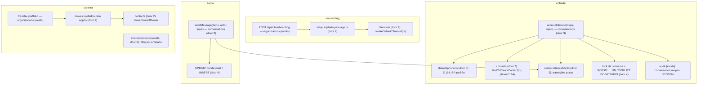
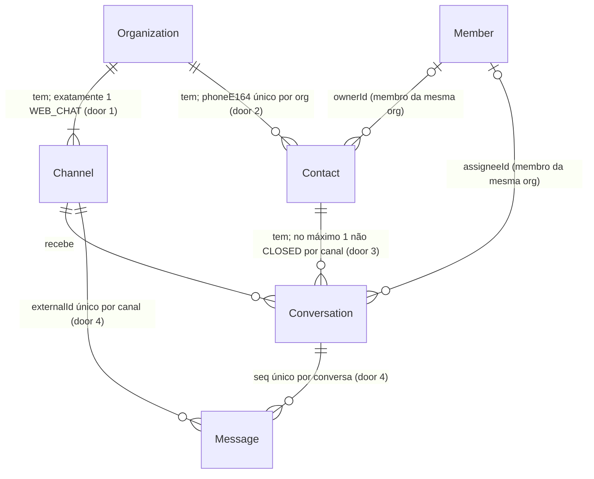

# Conversation core

> F2, feature 2 de 4. Depende da `audit-actors` (autor `SYSTEM` da reabertura). Perfil: standard (máquina de estados, concorrência, carteira, backfill).

## Problem

O produto existe para atender o cliente da corretora por Web Chat e WhatsApp, e hoje não há onde uma mensagem do cliente caia: não existe contato, conversa, mensagem nem canal. O Web Chat (F3) e o WhatsApp (F9) precisam de um ponto de entrada único; se cada canal gravar do seu jeito, as regras que o handoff exige deixam de valer em algum deles: nenhuma mensagem perdida nem duplicada, ordem por conversa, conversa encerrada que reabre sem perder o histórico, e a IA que nunca retoma sozinha uma conversa de humano (§5, §15, §17, §20, §21). O v1 falhou nisso: status único misturando estado e responsável, mensagens sem índice único (duplicação por corrida) e ordem por `createdAt` (ADR-013).

A carteira do COMMERCIAL ainda é o filtro por `salespersonId`, um campo que nenhuma tabela tem, e a transferência de carteira não move nada (`portfolioMoves` vazio). Com contatos com dono, a transferência "funcionaria" e deixaria os leads com o comercial antigo.

As organizações criadas até hoje, inclusive as do staging, não têm canal. Sem o canal Web Chat padrão, a F3 não teria onde gravar a primeira conversa.

Quando isso for entregue, uma mensagem que chega por qualquer canal vira contato (telefone E.164), conversa e mensagem com `seq`, sem duplicar nem perder ordem. Toda organização, nova ou existente, tem exatamente um canal Web Chat.

## Flow

Reusa o `withTenant` (RLS), o `audit.record` com `SYSTEM_ACTOR` (`audit-actors`), o `uuidv7` do server, a transferência de carteira que já existe (`POST /api/v1/members/:id/transfer-portfolio`) e o onboarding que já cria organização, ADMIN e trial na mesma transação.

1. Onboarding: `organizations` (exists) chama os passos de setup que o `app.ts` lhe entrega; o único é `createDefaultChannel(tx)` do `channels` (door 1, door 9), na mesma transação que cria a organização.
2. Migration: backfill do canal Web Chat de cada organização existente (door 7).
3. Entrada: o adapter de canal (F3/F9) chama `receiveInbound` do `conversations` com `{ channelId, externalId, fromPhone, kind, text?, sentAt }`. O use case normaliza o telefone (`shared/phone.ts`), acha ou cria o contato (`contacts/index.ts`), acha, reabre ou cria a conversa, trava a linha da conversa e insere a mensagem com `seq = lastSeq + 1` e `ON CONFLICT DO NOTHING` no único parcial de `externalId`. Só quando a mensagem entrou: `status` e `handler` pelas funções puras, `lastSeq` e `lastMessageAt`, e a auditoria `conversation.reopen` (autor `SYSTEM`) se reabriu.
4. Saída: `sendMessage` aplica a transição de saída com `UPDATE` condicional (`status <> 'CLOSED'` e a guarda do autor), que também reserva o `seq`; 0 linhas → 404 ou 409. Insere `Message` `OUTBOUND` com `deliveryStatus` `SENT` (Web Chat: entrega na própria transação, ADR-013).
5. Carteira: `scopeFor(ctx)` devolve o filtro por entidade (door 8); a transferência roda os `portfolioMoves` que o `app.ts` lhe entrega, e o único é `moveContactOwner` do `contacts` (door 9).

## Impact

| Front | What changes |
| --- | --- |
| domain | termo novo: **canal** (`Channel`) - por onde a conversa entra; na F2 só `WEB_CHAT`, um por organização. Vive no `channels` |
| domain | termo novo: **contato** (`Contact`) - o cliente da corretora, identificado pelo telefone E.164, único por organização; `ownerId` nulo = lead na fila. Vive no `contacts` |
| domain | termo novo: **conversa** (`Conversation`) - `status` (`OPEN`, `WAITING` = aguardando o cliente, `CLOSED`) × `handler` (`AI`, `QUEUE`, `HUMAN`), `assigneeId` quando `HUMAN`. Vive no `conversations` |
| domain | termo novo: **mensagem** (`Message`) - `seq` por conversa, `direction`, `author` (`CONTACT`, `AI`, `HUMAN`, `SYSTEM`), `kind` (`TEXT`, `UNSUPPORTED`), `deliveryStatus` na saída. Vive no `conversations` |
| domain | `scopeFor` muda de forma: de `{ salespersonId? }` para um filtro por entidade. Quem ramifica hoje: só `scope.spec.ts` (nenhum repository usa `scopeFor` ainda) |
| domain | `portfolioMoves` deixa de ser uma constante vazia do `organizations` e passa a vir do `app.ts`. Quem usa: `member.ts` (`transferPortfolio`) e `organizations/index.ts` |
| stored data | backfill na migration: um canal `WEB_CHAT` para cada organização existente (door 7). As outras tabelas nascem vazias |
| deploy | a migration roda no staging no próximo push (só com o ok do usuário) |
| dependency | `libphonenumber-js@1.13.13` no `apps/server` (door 6). A 1.13.14 saiu em 2026-09-24 e o `minimumReleaseAge` do pnpm a bloqueia; a 1.13.13 (2026-09-10) entra sem exceção no `pnpm-workspace.yaml` |

## Relations

One-way constraints:
- `Channel`: um `WEB_CHAT` por organização (door 1).
- `Contact`: telefone único por organização e em E.164 (door 2); o dono é um membro da mesma organização (door 2).
- `Conversation`: no máximo uma conversa não encerrada por contato e canal (door 3); `assigneeId` preenchido se e somente se `handler = HUMAN` (door 3); `closedAt` preenchido se e somente se `status = CLOSED` (door 3); o responsável é um membro da mesma organização (door 3).
- `Message`: `seq` único por conversa (door 4); `externalId` único por canal quando presente (door 4); o canal da mensagem é o canal da conversa (door 4); entrada ⇔ autor `CONTACT` ⇔ sem `deliveryStatus`; `authorUserId` ⇔ autor `HUMAN`; `TEXT` ⇔ tem texto (door 4).
- Toda relação entre tabelas do tenant usa FK composta com `organizationId`; FK para `Organization` e `User` é `RESTRICT` (ADR-004).

## Surface

`None - nenhuma rota nova nesta feature` (a leitura pelo painel é a `conversations-api`; as rotas públicas do chat são da F3). O contrato interno que os adapters da F3/F9 vão chamar é o `receiveInbound` (door 3).

## Landing

| One-way door | Literal shape | Alternative rejected |
| --- | --- | --- |
| 1. Canal | `enum ChannelKind { WEB_CHAT }`; `Channel(id, organizationId, kind, name, createdAt, updatedAt)`, RLS `ENABLE` + `FORCE` + `tenant_isolation`; `CREATE UNIQUE INDEX "Channel_one_web_chat" ON "Channel"("organizationId") WHERE "kind" = 'WEB_CHAT'`; nome padrão `Web Chat`. `WHATSAPP`, `phoneE164`, `connectionStatus` e `aiEnabled` entram com a F9/F4 (`ALTER TYPE … ADD VALUE`) | o enum já com `WHATSAPP`: um valor sem produtor nem teste até a F9; `publicChatKey` no `Channel`: a F1 já o pôs na `Organization` e o ADR-014 resolve o tenant por ele |
| 2. Contato | `Contact(id, organizationId, phoneE164, ownerId?, createdAt, updatedAt)`; `@@unique([organizationId, phoneE164])`; `CHECK ("phoneE164" ~ '^\+[1-9][0-9]{7,14}$')`; FK `("organizationId", "ownerId") → Member("organizationId", "userId") ON DELETE RESTRICT ON UPDATE RESTRICT`. `name`, `email`, `leadStatus`, `interest`, `notes` entram com a F4/F6 | FK de `ownerId` para `User`: aceitaria como dono um usuário de outra organização; telefone como texto livre: o mesmo cliente em dois formatos viraria dois contatos |
| 3. Conversa | `enum ConversationStatus { OPEN WAITING CLOSED }`, `enum ConversationHandler { AI QUEUE HUMAN }`; `Conversation(id, organizationId, contactId, channelId, status, handler, assigneeId?, lastSeq int default 0, lastMessageAt?, closedAt?, createdAt, updatedAt)`; `CREATE UNIQUE INDEX "Conversation_one_open" ON "Conversation"("organizationId", "contactId", "channelId") WHERE "status" <> 'CLOSED'`; `CHECK (("handler" = 'HUMAN') = ("assigneeId" IS NOT NULL))`; `CHECK (("status" = 'CLOSED') = ("closedAt" IS NOT NULL))`; FK `("organizationId", "assigneeId") → Member("organizationId", "userId")`; `@@unique([id, channelId, organizationId])` (alvo da FK de `Message`) | status único do v1: mistura estado e responsável (ADR-013); abrir conversa nova ao receber numa encerrada: o §17 manda reabrir preservando o histórico |
| 4. Mensagem, ordem e dedupe | `enum MessageDirection { INBOUND OUTBOUND }`, `enum MessageAuthor { CONTACT AI HUMAN SYSTEM }`, `enum MessageKind { TEXT UNSUPPORTED }`, `enum DeliveryStatus { PENDING SENT FAILED }`; `Message(id, organizationId, conversationId, channelId, seq, direction, author, authorUserId?, kind, text?, deliveryStatus?, externalId?, failureReason?, sentAt, createdAt)`; `@@unique([organizationId, conversationId, seq])`; `CREATE UNIQUE INDEX "Message_channel_externalId" ON "Message"("organizationId", "channelId", "externalId") WHERE "externalId" IS NOT NULL`; FK `("conversationId", "channelId", "organizationId") → Conversation("id", "channelId", "organizationId")`; `CHECK`s: `("direction" = 'INBOUND') = ("author" = 'CONTACT')`, `("direction" = 'INBOUND') = ("deliveryStatus" IS NULL)`, `("author" = 'HUMAN') = ("authorUserId" IS NOT NULL)`, `("kind" = 'TEXT') = ("text" IS NOT NULL)`. Entrada: `SELECT … FROM "Conversation" WHERE id = $1 FOR UPDATE`, depois `INSERT … SELECT "lastSeq" + 1 … ON CONFLICT ("organizationId", "channelId", "externalId") WHERE "externalId" IS NOT NULL DO NOTHING RETURNING id, seq`, e só com linha devolvida `UPDATE "Conversation" SET "lastSeq" = $seq, …`. Saída: `UPDATE "Conversation" SET "lastSeq" = "lastSeq" + 1, … WHERE id = $1 AND status <> 'CLOSED' AND <guarda do autor> RETURNING "lastSeq"`, depois o `INSERT` | `findFirst` + `create`: duas entradas iguais em paralelo gravariam duas (o bug do v1); `UPDATE lastSeq + 1` antes do `INSERT` na entrada: o duplicado queimaria um `seq` (buraco); ordem por `createdAt` ou por `id`: empates e relógios diferentes entre processos (ADR-013) |
| 5. Máquina de estados | `conversations/conversation-state.ts`, funções puras sem banco: `onInbound(status)`, `onOutbound(status)`, `close(status)`, `reopenHandler({ aiAvailable })`, `handlerAfter(handler, event)` com `event ∈ { requestHuman, aiFailure, aiLimit, take, assign, returnToQueue, returnToAi }` e `canSend(conversation, author, userId)`. Resultado: o novo valor ou `{ error: 'FORBIDDEN_TRANSITION' }` | transições espalhadas nos use cases: a regra "nada volta sozinho para `AI`" não teria um lugar testável (ADR-013) |
| 6. Telefone E.164 | `shared/phone.ts`: `normalizePhone(raw, defaultCountry = 'BR'): string \| null` com `parsePhoneNumberFromString(raw, { defaultCountry, extract: false })` de `libphonenumber-js/max`, exige `isValid()` e devolve `.number`. Dependência nova `libphonenumber-js@1.13.13` | regex própria: não sabe quantos dígitos cada país tem nem o nono dígito do celular brasileiro; metadata `min` (padrão do pacote): `isValid()` só confere o tamanho (README do pacote) |
| 7. Backfill que passa pelo RLS | na migration, um único `DO $$ … $$` (atômico): `ALTER TABLE "Organization" NO FORCE ROW LEVEL SECURITY`; para cada organização, `set_config('app.tenant_id', id::text, true)` e `INSERT INTO "Channel" … ON CONFLICT DO NOTHING`; `ALTER TABLE "Organization" FORCE ROW LEVEL SECURITY`; `set_config('app.tenant_id', '', true)`. O `INSERT` passa pelo `WITH CHECK` da política do `Channel`, sem exceção nela. Só este arquivo toca em `app.tenant_id` fora do `database.ts` (a regra do `architecture.spec` vale para `src/`) | `INSERT … SELECT FROM "Organization"` direto: hoje funciona porque o dono (`POSTGRES_USER`) é superuser e ignora o RLS, mas com um dono não-superuser o `FORCE` esconderia todas as organizações e o backfill criaria zero canais sem erro; criação preguiçosa no primeiro uso: espalha uma escrita por caminhos de leitura, precisa de trava própria e não prova que toda organização existente tem canal |
| 8. Carteira por entidade (revisa a AD-009) | `scopeFor(ctx)` devolve `{ contact: Prisma.ContactWhereInput, conversation: Prisma.ConversationWhereInput }`. COMMERCIAL: contato `ownerId = eu OR ownerId IS NULL`; conversa `assigneeId = eu OR handler = QUEUE OR contact.ownerId = eu OR contact.ownerId IS NULL` (decisão do usuário, 2026-09-24). ADMIN e MANAGER: `{}` nos dois. `shared/scope.ts` importa só os tipos de `generated/prisma` | filtro só `assigneeId = eu OR QUEUE`: esconderia do COMMERCIAL a conversa em `AI` de um lead sem dono, que o §19 deixa ele assumir; `scopeFor` genérico por nome de campo: as duas entidades não têm o mesmo campo de dono |
| 9. Composição sem ciclo | `organizationRoutes({ …, setupOrganization: [createDefaultChannel] })` e `memberRoutes({ …, portfolioMoves: [moveContactOwner] })`, montados no `app.ts`; `organizations` exporta os tipos `OrganizationSetup = (tx) => Promise<void>` e `PortfolioMove` e não importa `channels` nem `contacts`. O `architecture.spec` passa a falhar em ciclo entre módulos | `organizations` importar `channels` e `contacts`: fecha um ciclo assim que o `channels` (F3) ou o `contacts` (F5) tiverem rotas, que importam `requireTenant` do `organizations` |

- `receiveInbound` e `sendMessage` são o contrato dos canais (ADR-013): a assinatura é door 3/4 e vai para a AD nova.
- Nada mais nesta mudança é difícil de reverter.

## Criteria

### S1: Canal Web Chat padrão (P1)

Toda organização tem exatamente um canal Web Chat.

**Acceptance Criteria**

1. WHEN `POST /api/v1/onboarding` conclui THEN the system SHALL criar, na mesma transação, exatamente um `Channel` `WEB_CHAT` chamado `Web Chat` na nova organização
2. WHEN a migration roda sobre um banco com organizações existentes THEN the system SHALL deixar cada uma com exatamente um `Channel` `WEB_CHAT`, inclusive quando o dono das tabelas não é superuser e o `FORCE ROW LEVEL SECURITY` vale para ele
3. WHEN a migration termina THEN the system SHALL deixar `Organization` e `Channel` com RLS `ENABLE` + `FORCE` e a política `tenant_isolation`
4. IF um segundo `Channel` `WEB_CHAT` é inserido na mesma organização THEN the database SHALL recusá-lo (`23505`); o `WEB_CHAT` de outra organização SHALL ser aceito
5. The system SHALL impedir que o tenant B leia ou altere o `Channel` do tenant A

**Independent test:** criar duas organizações pelo SQL da migration anterior, aplicar a migration da F2 como um dono não-superuser e contar um canal por organização.

### S2: Contato por telefone E.164 (P1)

**Acceptance Criteria**

6. WHEN `normalizePhone` recebe um número brasileiro sem `+` (`(11) 98765-4321`, `11987654321`, `011 98765-4321`) THEN the system SHALL devolver `+5511987654321`
7. WHEN `normalizePhone` recebe um número com `+` de outro país THEN the system SHALL devolver o E.164 desse país, sem aplicar o Brasil
8. IF `normalizePhone` recebe algo que não é um telefone válido (`123`, `abc`, `+55 11 1234`, `(11) 98765-4321 ramal 2` com letras) THEN the system SHALL devolver `null`
9. IF `receiveInbound` recebe um `fromPhone` que `normalizePhone` recusa THEN the system SHALL lançar `422 INVALID_PHONE` sem gravar nada
10. WHEN duas entradas trazem o mesmo telefone em formatos diferentes na mesma organização THEN the system SHALL usar um único `Contact`
11. WHEN o mesmo telefone chega em duas organizações THEN the system SHALL criar um `Contact` em cada, e nenhuma SHALL enxergar o da outra
12. IF uma linha de `Contact` é gravada com `phoneE164` fora de `^\+[1-9][0-9]{7,14}$` THEN the database SHALL recusá-la (`23514`)
13. IF `Contact.ownerId` aponta para um usuário sem `Member` na organização do contato THEN the database SHALL recusá-lo (`23503`)
14. WHEN um contato é criado por uma entrada THEN the system SHALL gravá-lo com `ownerId` nulo (lead na fila)

**Independent test:** `receiveInbound` com `(11) 98765-4321` e depois com `+55 11 98765-4321`: um contato, uma conversa, duas mensagens.

### S3: Entrada ordenada e idempotente (P1)

**Acceptance Criteria**

15. WHEN a primeira mensagem de um telefone chega num canal THEN the system SHALL criar `Contact`, `Conversation` (`OPEN`, `QUEUE`, sem `assigneeId`) e `Message` (`INBOUND`, `CONTACT`, `seq` 1, sem `deliveryStatus`) e devolver `{ conversationId, messageId, created: true }`
16. WHEN outra mensagem do mesmo telefone chega no mesmo canal com a conversa aberta THEN the system SHALL gravá-la na mesma conversa com `seq` = `lastSeq` anterior + 1 e atualizar `lastSeq` e `lastMessageAt`
17. WHEN uma mensagem do cliente chega numa conversa `WAITING` THEN the system SHALL mudar o `status` para `OPEN` sem mudar `handler` nem `assigneeId`
18. IF chega uma mensagem com `externalId` já gravado naquele canal THEN the system SHALL devolver `{ conversationId, messageId, created: false }` da mensagem existente, sem gravar outra, sem mudar `lastSeq`, `lastMessageAt`, `status` nem `handler`
19. WHEN 10 entradas com o mesmo `externalId` chegam em paralelo THEN the system SHALL gravar exatamente uma mensagem, e exatamente uma chamada SHALL devolver `created: true`
20. WHEN 50 entradas com `externalId` distintos chegam em paralelo na mesma conversa THEN the system SHALL gravar 50 mensagens com `seq` exatamente 1..50, sem buraco nem repetição, e `lastSeq` = 50
21. WHILE a linha da conversa A está travada por outra transação, the system SHALL concluir uma entrada na conversa B em menos de 2 s, e a entrada na conversa A SHALL esperar até a trava ser liberada
22. WHEN 10 primeiras mensagens de um telefone novo chegam em paralelo no mesmo canal THEN the system SHALL criar um único `Contact`, uma única `Conversation` e 10 mensagens com `seq` 1..10
23. WHEN chega uma entrada `UNSUPPORTED` THEN the system SHALL gravá-la com `kind` `UNSUPPORTED` e `text` nulo
24. IF uma entrada `TEXT` chega sem texto, com texto vazio depois do `trim` ou com mais de 65 536 caracteres THEN the system SHALL lançar `422 INVALID_MESSAGE` sem gravar nada
25. IF o `channelId` da entrada não existe no tenant THEN the system SHALL lançar `404 NOT_FOUND` sem gravar nada
26. WHEN uma entrada `TEXT` chega sem `externalId` THEN the system SHALL gravá-la (sem dedupe), e duas entradas assim SHALL virar duas mensagens

**Independent test:** 50 `receiveInbound` em paralelo na mesma conversa e `SELECT seq ORDER BY seq` = 1..50.

### S4: Reabertura (P1)

**Acceptance Criteria**

27. WHEN uma mensagem do cliente chega numa conversa `CLOSED` THEN the system SHALL reabri-la na mesma linha (`status` `OPEN`, `closedAt` nulo), manter todas as mensagens anteriores e gravar a nova com `seq` = `lastSeq` anterior + 1
28. WHEN a conversa reaberta estava com `handler` `HUMAN` e um `assigneeId` THEN the system SHALL deixá-la com `handler` `QUEUE` e `assigneeId` nulo, nunca com o humano anterior
29. WHEN uma conversa é reaberta THEN the system SHALL registrar `conversation.reopen` com autor `SYSTEM` e `changes` só com `status`, `handler` e `assigneeId` (antes e depois), sem texto nem telefone
30. WHEN 5 mensagens chegam em paralelo numa conversa `CLOSED` THEN the system SHALL reabrir a mesma conversa uma única vez (um registro `conversation.reopen`), manter uma só conversa não encerrada para o contato e o canal, e gravar as 5 mensagens com `seq` contíguo
31. WHILE a IA não existe (F4), the system SHALL decidir o `handler` da conversa nova e da reaberta por `reopenHandler({ aiAvailable: false })`, que devolve `QUEUE`

**Independent test:** encerrar no banco uma conversa `HUMAN` com três mensagens, chamar `receiveInbound`: mesma conversa, `OPEN` + `QUEUE`, quatro mensagens, uma linha de auditoria `SYSTEM`.

### S5: Saída (P1)

**Acceptance Criteria**

32. WHEN o humano que é o `assigneeId` de uma conversa `HUMAN` envia uma mensagem THEN the system SHALL gravar `Message` `OUTBOUND`, autor `HUMAN`, `authorUserId` dele, `seq` seguinte, `deliveryStatus` `SENT` (Web Chat) e mudar o `status` para `WAITING`
33. IF quem envia como `HUMAN` não é o `assigneeId`, ou a conversa não está em `HUMAN` THEN the system SHALL lançar `409 NOT_HANDLER` sem gravar nada e sem mudar `lastSeq`
34. IF a IA envia numa conversa cujo `handler` não é `AI` THEN the system SHALL lançar `409 NOT_HANDLER` sem gravar nada
35. WHEN o sistema envia (`SYSTEM`) numa conversa não encerrada, com qualquer `handler` THEN the system SHALL gravar a mensagem e mudar o `status` para `WAITING`
36. IF a conversa está `CLOSED` THEN the system SHALL lançar `409 CONVERSATION_CLOSED` para qualquer autor, sem gravar nada
37. IF a conversa não existe no tenant THEN `sendMessage` SHALL lançar `404 NOT_FOUND`
38. IF o texto de saída é vazio depois do `trim` ou passa de 65 536 caracteres THEN the system SHALL lançar `422 INVALID_MESSAGE` sem gravar nada
39. WHEN saídas e entradas concorrem na mesma conversa THEN the system SHALL manter `seq` contíguo e único entre todas elas

### S6: Máquina de estados pura (P1)

**Acceptance Criteria**

40. The system SHALL mapear, para cada `status` (`OPEN`, `WAITING`, `CLOSED`): entrada → `OPEN`; saída → `WAITING` a partir de `OPEN` e `WAITING`, e `FORBIDDEN_TRANSITION` a partir de `CLOSED`; encerrar → `CLOSED` a partir de `OPEN` e `WAITING`, e `FORBIDDEN_TRANSITION` a partir de `CLOSED`
41. The system SHALL mapear `handlerAfter` para as 21 combinações de `handler` × evento: `requestHuman`, `aiFailure`, `aiLimit` levam `AI` → `QUEUE`; `take` e `assign` levam `AI` e `QUEUE` → `HUMAN`; `returnToQueue` leva `HUMAN` → `QUEUE`; `returnToAi` leva `HUMAN` → `AI`; toda outra combinação SHALL devolver `FORBIDDEN_TRANSITION`
42. The system SHALL nunca devolver `AI` a partir de `QUEUE` ou `HUMAN` por um evento automático (`requestHuman`, `aiFailure`, `aiLimit`, entrada, saída, reabertura sem IA)
43. The system SHALL devolver `reopenHandler({ aiAvailable: true })` = `AI` e `reopenHandler({ aiAvailable: false })` = `QUEUE`, nunca `HUMAN`
44. The system SHALL decidir `canSend` para cada autor: `CONTACT` nunca (entrada não é saída); `AI` só com `handler` `AI`; `HUMAN` só com `handler` `HUMAN` e `assigneeId` igual ao autor; `SYSTEM` com qualquer `handler`; ninguém com `status` `CLOSED`

### S7: Carteira por dono (P1)

**Acceptance Criteria**

45. WHEN `scopeFor` recebe um COMMERCIAL THEN the system SHALL devolver o filtro de contato `ownerId = userId OR ownerId IS NULL` e o de conversa `assigneeId = userId OR handler = QUEUE OR contact.ownerId = userId OR contact.ownerId IS NULL`; para ADMIN e MANAGER SHALL devolver filtros vazios
46. WHEN um ADMIN transfere a carteira do membro X para o membro Y THEN the system SHALL mudar o `ownerId` de todos os contatos de X para Y, responder `transferred` igual a esse número e não mudar os contatos sem dono nem os de outro membro
47. WHEN o usuário de X também é membro de outra organização com contatos dele THEN a transferência SHALL não mudar os contatos da outra organização
48. IF o `Conversation.assigneeId` aponta para um usuário sem `Member` na organização THEN the database SHALL recusá-lo (`23503`)

### S8: Fronteiras dos módulos (P2)

**Acceptance Criteria**

49. The `architecture.spec` SHALL falhar se `conversations` importar `ai` ou `channels`, se `contacts` importar `conversations`, `channels` ou `ai`, ou se houver ciclo de imports entre módulos, e SHALL passar na árvore atual
50. The `architecture.spec` SHALL falhar se um módulo escrever (`create`, `createMany`, `update`, `updateMany`, `upsert`, `delete`, `deleteMany`, ou `INSERT`/`UPDATE`/`DELETE` em SQL cru) numa tabela de outro módulo, segundo o mapa de donos do `architecture.md` §3, e SHALL passar na árvore atual
51. The `schema.spec` SHALL conferir, no catálogo do PostgreSQL, os quatro únicos do ADR-013 com o predicado literal: `Message` `(organizationId, conversationId, seq)`; `Message_channel_externalId` com `WHERE "externalId" IS NOT NULL`; `Conversation_one_open` com `WHERE status <> 'CLOSED'`; `Contact` `(organizationId, phoneE164)`; e `Channel_one_web_chat` com `WHERE kind = 'WEB_CHAT'`
52. The system SHALL dar RLS `ENABLE` + `FORCE` + `tenant_isolation` a `Channel`, `Contact`, `Conversation` e `Message` (o teste de schema existente SHALL continuar falhando sem eles)

## Out of scope

| Excluded | Why |
| --- | --- |
| rotas públicas do chat, visitante, token, `ConsentRecord`, Turnstile | F3 (ADR-014) |
| rotas `take`, `return-to-queue`, `return-to-ai`, `close`, `claim`, `assign` | F3/F5; as transições puras ficam prontas aqui (S6) |
| resposta de orientação para `UNSUPPORTED` | só o WhatsApp produz mídia; F9 (§16) |
| envio real pelo WhatsApp (`PENDING` + job `whatsapp.send`, `FAILED`) | F9; o Web Chat entrega `SENT` na própria transação |
| enfileirar `ai.reply` e `aiEnabled` | F4 |
| `name`, `email`, `leadStatus`, `interest`, `notes` no contato | F4/F6, com quem os preenche |
| notificar o dono do contato na reabertura | F3/F5, quando existir o painel que mostra a notificação |
| auto-encerramento por inatividade | fora do MVP (ADR-013) |

## Assumptions

| Assumption | Chosen default | Rationale | Confirmed? |
| --- | --- | --- | --- |
| handler sem a F4 | `reopenHandler({ aiAvailable })`, com `aiAvailable` vindo de uma função única que devolve `false` até a F4 | decisão do usuário (2026-09-24); nenhuma coluna sem quem a use | y |
| carteira da conversa para COMMERCIAL | `assigneeId = eu OR QUEUE OR contact.ownerId = eu OR contact.ownerId IS NULL` | decisão do usuário (2026-09-24) | y |
| `CLOSED` mantém o `handler` | encerrar muda só o `status`; o `handler` e o `assigneeId` ficam até a reabertura trocá-los | o ADR-013 separa as duas dimensões; o painel (F3) mostra quem encerrou pelo último responsável | n |
| limite de texto no domínio | 1 a 65 536 caracteres depois do `trim` | é o limite do WhatsApp, o canal mais largo; a borda da F3 pode ser mais estreita | n |
| `sentAt` da entrada | o horário informado pelo canal, gravado em `Message.sentAt`; a ordem continua sendo o `seq` | o contrato do ADR-013 traz `sentAt`; na saída, `sentAt` é o `now()` da transação | n |
| backfill e o dono superuser | a migration funciona com e sem superuser, e o teste roda como dono não-superuser | hoje o dono é superuser (confirmado no banco local: `bens` com `rolsuper`), então só o teste com outro dono prova o caminho do `FORCE` | n |

**Open questions:** none - all resolved or logged above.

## Observable

`None - nenhuma superfície de usuário nesta feature` (o contrato dos canais é o `receiveInbound`, coberto de S2 a S4).

## Sources

- ADR-013 - estado × responsável, `seq`, dedupe, fronteira de canal, reabertura
- ADR-016 - carteira `ownerId` + fila, `scopeFor` por entidade (decisão do usuário sobre a conversa)
- ADR-004 - RLS, FKs compostas, únicos com o tenant
- handoff §5, §9, §15, §16, §17, §20, §21
