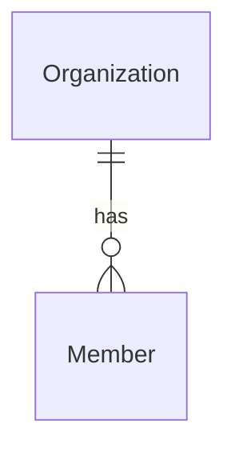

# ERP prune

> F0 do roadmap do MVP (`docs/roadmap.md`). Depende dos ADRs 011–017 aprovados. Processo:
> `tlc-spec-lean`, perfil `standard`.

## Problem

O repositório ainda carrega infraestrutura e conceitos do ERP que o MVP não usa (ADR-011):

- storage S3 e geração de PDF: `infrastructure/storage.ts` e `infrastructure/pdf.ts`, três
  dependências (`@aws-sdk/client-s3`, `@aws-sdk/s3-request-presigner`, `@react-pdf/renderer`), o
  MinIO no compose de dev e no CI, e seis variáveis `S3_*`, três delas obrigatórias no boot;
- o campo de comissão `Member.commissionSplitBp` no banco, na saída de `listMembers` e
  `updateMember` e no client gerado do web;
- prompts e documentos de fases do ERP (`prompts/prompt-0*.md`, `prompt-h2.md`,
  `docs/legacy-analysis.md`, `docs/original-brief.md`) e menções a S3/MinIO em docs vivos.

Quem paga: todo boot exige credenciais de um bucket que nada usa; todo run de CI sobe um serviço a
mais; toda sessão de agente lê conceitos de um produto que não existe mais. Sem incidente: não há
produção. Evidência: o inventário por `git grep` de 2026-09-23 (seção *Sources*).

Com isso pronto, o server sobe só com PostgreSQL e SMTP configurados, o dev e o CI não sobem o
MinIO, a API de membros não expõe comissão, e nenhum doc vivo aponta para o ERP.

## Flow

Reusa o harness e os gates existentes; nada é criado, só removido.

`single module - organizations` (remoção do campo de comissão), mais remoções pontuais em
`infrastructure/` (exists), `shared/config.ts` (exists), `dependencies.ts` (exists),
`server.ts` (exists), arquivos de ambiente, CI e docs.

## Impact

| Front | What changes |
| --- | --- |
| domain | termo removido: `commissionSplitBp` - percentual de repasse ao vendedor do ERP; ninguém ramifica nele hoje (só é gravado com 0 e devolvido na API) |
| domain | termo removido: `Storage`/`storage` em `Deps` - só `server.ts` (`ensureBucket`) e `dependencies.ts` (`close`) o usam |
| stored data | a coluna `Member.commissionSplitBp` é apagada; sem produção, e no dev todos os valores são o padrão 0; nada a migrar |
| config | o boot deixa de exigir `S3_BUCKET`, `S3_ACCESS_KEY_ID`, `S3_SECRET_ACCESS_KEY`; um ambiente que ainda as passa continua subindo (chave desconhecida é ignorada pelo schema) |
| API | `listMembers` e `updateMember` perdem o campo `commissionSplitBp`; único consumidor é o web, pelo client do Orval regenerado |

## Relations

One-way constraints: nenhuma nova; `Member` perde um atributo (door 1).

## Surface

Only routes whose signature changes.

| Route | In | Out | Status |
| --- | --- | --- | --- |
| `GET /api/v1/members` | - | `items[]`: `id`, `userId`, `role`, `active`, `email`, `name` | `200`, `401`, `403` |
| `PATCH /api/v1/members/:id` | inalterado | `id`, `userId`, `role`, `active`, `email`, `name` | `200`, `400`, `401`, `403`, `404`, `422` |

## Landing

| One-way door | Literal shape | Alternative rejected |
| --- | --- | --- |
| 1. Migration que apaga a coluna | nova migration com `ALTER TABLE "Member" DROP COLUMN "commissionSplitBp";` | manter a coluna sem uso: o conceito de ERP continua na API, no client gerado e no contexto dos agentes, e a comissão está fora do MVP (ADR-011) |
| 2. Contrato de `memberOutput` | `memberOutput` sem `commissionSplitBp`; `operationId` inalterados (`listMembers`, `updateMember`) | deprecar o campo por uma versão: não há consumidor fora deste repositório que precise de transição |

- Remover as dependências de storage e PDF não é uma porta: reverter é reinstalar e restaurar dois
  arquivos do git.
- Nothing else in this change is hard to reverse.

## Criteria

### S1: o server roda sem storage e sem PDF (P1)

Boot, testes, dev e CI funcionam sem MinIO e sem nenhuma variável `S3_*`.

**Acceptance Criteria**

1. WHEN `loadConfig` recebe apenas as variáveis obrigatórias restantes, sem nenhuma `S3_*`, THEN the system SHALL devolver a configuração sem lançar erro.
2. WHEN o app de teste sobe sem nenhuma `S3_*` no ambiente THEN the system SHALL responder `GET /api/health` com `200` e corpo `{ "status": "ok" }`.
3. The system SHALL não declarar `@aws-sdk/client-s3`, `@aws-sdk/s3-request-presigner` nem `@react-pdf/renderer` em `apps/server/package.json` nem no importer `apps/server` do `pnpm-lock.yaml`.
4. The system SHALL não conter `apps/server/src/infrastructure/storage.ts`, `storage.spec.ts`, `pdf.ts` nem `pdf.spec.tsx`.
5. The system SHALL declarar em `docker-compose.yml` exatamente os serviços `postgres` e `mailpit`, e o `.github/workflows/ci.yml` SHALL não iniciar nenhum container MinIO.
6. WHEN `node scripts/staging-smoke.mjs all` roda THEN the system SHALL terminar com exit code `0`, sem `infrastructure/pdf.js` nem `infrastructure/storage.js` na lista de módulos carregados.

**Independent test:** `docker compose up -d` sem MinIO, `pnpm test` e `pnpm dev` com um `.env` sem `S3_*`.

### S2: a API de membros não expõe comissão (P1)

O conceito de repasse de comissão sai do banco, da API e do client.

**Acceptance Criteria**

7. WHEN um ADMIN chama `GET /api/v1/members` THEN the system SHALL devolver `200` com cada item contendo exatamente as chaves `id`, `userId`, `role`, `active`, `email`, `name`.
8. WHEN um ADMIN chama `PATCH /api/v1/members/:id` com um corpo válido THEN the system SHALL devolver `200` com exatamente as chaves `id`, `userId`, `role`, `active`, `email`, `name`.
9. The system SHALL não ter a coluna `commissionSplitBp` na tabela `Member` depois de aplicar todas as migrations.
10. WHEN `pnpm api:generate` roda THEN the system SHALL não produzir diff em `apps/server/openapi.json` nem em `apps/web/src/api/`, e nenhum dos dois SHALL conter `commissionSplitBp`.

**Independent test:** listar membros no painel (`/settings/members`) e ver a resposta da rede sem o campo.

### S3: nenhum doc vivo aponta para o ERP (P2)

Agentes e humanos que leem o repositório não encontram instruções do produto antigo.

**Acceptance Criteria**

11. The system SHALL começar cada arquivo `prompts/*.md`, `docs/legacy-analysis.md` e `docs/original-brief.md` com um aviso de arquivado que cita o ADR-011.
12. The system SHALL não conter nenhuma ocorrência (sem diferenciar maiúsculas) de `minio`, `S3_` ou `commissionSplit` em `README.md`, `docs/runbooks/staging.md`, `.env.example`, `.env.prod.example`, `docker-compose.yml`, `docker-compose.prod.yml`, `docker-compose.staging-local.yml` e `scripts/staging-smoke.mjs`.
13. The system SHALL não conter `storage.ts`, `pdf.ts` nem `minio` em `docs/architecture.md`, nem as marcações "sai na F0" nesse arquivo.
17. WHEN um visitante abre a landing (`/`) THEN the system SHALL descrever o produto como captura de leads, atendimento com IA e acompanhamento comercial, sem as palavras `ERP`, `apólices` nem `comissões`. (acrescentado em 2026-09-23 após a rodada 1 da verificação, com aprovação do usuário)

**Independent test:** `git grep -i -E "minio|S3_|commissionSplit"` restrito aos arquivos acima volta vazio.

### S4: nenhuma regressão na fundação (P1)

A poda não enfraquece o que as Fases 1–4 provaram.

**Acceptance Criteria**

14. WHEN `pnpm lint && pnpm typecheck && pnpm test && pnpm build` roda THEN the system SHALL terminar com exit code `0`.
15. The system SHALL manter `test/schema.spec.ts`, `test/architecture.spec.ts` e `test/boot.spec.ts` passando, sem remover nenhuma asserção fora das que citam `S3_*`.
16. The system SHALL manter todo teste existente que não asserta storage, PDF, variáveis `S3_*` ou `commissionSplitBp`, sem alterar suas asserções.

**Independent test:** comparar a lista de testes de `pnpm test` antes e depois; as únicas ausências são as listadas no `Test policy` do `checks.md`.

## Out of scope

| Excluded | Why |
| --- | --- |
| Papéis `OWNER`/`VIEWER` e a invariante "≥ 1 ADMIN" | F1 (ADR-016) |
| `Plan`, `Subscription` e o módulo `billing` | F10 (ADR-017); o trial do onboarding e a quota de usuários ainda dependem deles |
| Publicar o staging na VPS | marco antes da F3 (ADR-011) |
| Prompts novos por fase do MVP | o roadmap e as specs em `.specs/features/` cumprem esse papel |
| Reescrever ADRs antigos e o apêndice histórico do `roadmap.md` | são histórico; já marcados pelos ADRs do MVP |
| Reescrever os Termos de Uso (`apps/web/src/features/legal/documents.ts`), que ainda descrevem o ERP | texto jurídico versionado: mudar obriga novo aceite; vira bloqueio de go-live junto do parecer do opt-in do WhatsApp, numa revisão jurídica única (decisão do usuário, 2026-09-23) |

## Assumptions

| Assumption | Chosen default | Rationale | Confirmed? |
| --- | --- | --- | --- |
| Como aposentar prompts e docs legados | aviso no topo de cada arquivo, sem mover nem apagar | 10 arquivos em `.specs/features/` apontam para `prompts/`; mesmo critério do stub de `docs/migration.md` | y |
| Execução do `staging-smoke.mjs` | roda com o `docker` CLI disponível no WSL (integração do Docker Desktop ativada) ou por um alias para `docker.exe` | hoje o comando `docker` não existe no WSL; o script chama `docker` | y |
| Testes removidos | só os que assertam storage, PDF, `S3_*` ou `commissionSplitBp`, listados um a um no `Test policy` | o comportamento some por decisão (ADR-011), não para fazer a suíte passar | y |
| Variáveis `S3_*` já presentes em `.env` locais | ignoradas pelo schema; nenhuma ação | remover do `.env` local é do desenvolvedor; `.env` não está no git | n |

**Open questions:** none - all resolved or logged above.

## Observable

| Surface | Decision | Landing |
| --- | --- | --- |
| API `GET /api/v1/members`, `PATCH /api/v1/members/:id` | response shape | AC 7, AC 8 |
| API `GET /api/v1/members`, `PATCH /api/v1/members/:id` | error shape and codes | existing - `{ error: { code, message } }` inalterado |
| API `GET /api/v1/members`, `PATCH /api/v1/members/:id` | who may call it | existing - `requirePermission` inalterado |
| API `GET /api/v1/members`, `PATCH /api/v1/members/:id` | versioning | n/a - único consumidor é o web deste repositório, regenerado junto (AC 10) |
| API `GET /api/v1/members`, `PATCH /api/v1/members/:id` | rate limit | n/a - sem mudança de comportamento de chamada |
| screen `/settings/members` | empty, loading, error, unauthorised states | existing - a tela não exibe o campo removido |
| command `scripts/staging-smoke.mjs` | exit codes and output | AC 6 |
| documents `prompts/*.md`, `docs/legacy-analysis.md`, `docs/original-brief.md` | what the reader does next | AC 11 - o aviso aponta para o ADR-011 e o roadmap do MVP |

## Sources

- `docs/decisions/ADR-011-pivot-to-mvp.md` - storage e PDF saem; comissão fora do MVP.
- `docs/roadmap.md`, F0 - escopo e critério de conclusão.
- Inventário `git grep -i -E "minio|S3_|storage\.ts|pdf|react-pdf|aws-sdk|commissionSplit|ensureBucket"` (2026-09-23).
