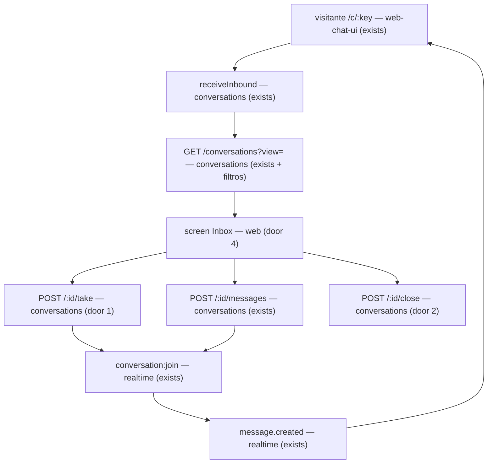

# Inbox

> F3, fatia fullstack (AD-019): API do painel + tela `/inbox` + smoke Playwright. Depende de `conversations-api` (leitura + carteira), `web-chat-ui` (`POST …/messages` com auto-take), `realtime-events` (`conversation:join` + `message.created`). Perfil: **ui**. Depois desta feature: e2e completo no staging (marco F3).

## Problem

O visitante já conversa pelo link público e a API do painel já lista conversas e envia mensagem (com auto-take na fila), mas o comercial não tem tela de inbox: não há fila/"minhas", assume explícito, responder pela UI nem encerrar. Quem atende hoje depende de API/smoke; o critério da F3 (cliente fala → comercial vê → responde → cliente vê) não fecha no navegador do painel.

Quando isso for entregue, o painel mostra a fila e as conversas do atendente, permite assumir, responder e encerrar com as regras de carteira e papel, e um smoke Playwright cobre visitante ↔ comercial pela UI.

## Flow

Reusa `listConversations` / `findReadableConversation` / `scopeFor` (exists), `POST …/messages` + auto-take em `QUEUE` (exists, door 3 do `web-chat-ui`), `sendMessage` / `handlerAfter` / `close` em `conversation-state.ts` (exists), `audit.record` (exists), Socket.IO do painel (`conversation:join` + `message.created`, exists), hooks Orval e o padrão Playwright de `apps/web/e2e/`.

1. Lista com `view=queue|mine` + ordem por atividade → `conversations` (exists; query ampliada).
2. Abrir conversa → detalhe + mensagens (exists) + `conversation:join` (exists).
3. Assumir → `POST /take` (door 1); responder → `POST /messages` (exists, sem reinventar); encerrar → `POST /close` (door 2).
4. Smoke: visitante inicia → comercial na UI vê na fila → assume/responde → visitante vê a resposta; comercial encerra pela UI.

## Impact

| Front | What changes |
| --- | --- |
| domain | ações auditadas novas `conversation.take` e `conversation.close` (AD-020 amplía a lista fechada da AD-013) |
| domain | permissão: reusa `conversation:write` para take/close/send; regra de encerramento por papel no use case (ADR-016), sem `conversation:close-any` nesta fatia |
| API | `GET /conversations` ganha `view` e passa a ordenar por `lastMessageAt`; `POST /:id/take` e `POST /:id/close` novos |
| web | rota `_app/inbox` (lista + thread); link no layout autenticado; filtros em search params |
| stored data | nada a migrar (take/close só atualizam linhas existentes; claim de `Contact.ownerId` quando nulo) |

## Relations

`None - no stored-data shape change` (mesmas entidades `Conversation` / `Contact` / `Message` / `AuditLog`; take pode preencher `Contact.ownerId` já nullable).

## Surface

| Route | In | Out | Status |
| --- | --- | --- | --- |
| `GET /api/v1/conversations` | query `view` opcional (`queue` ou `mine`), `cursor?`, `limit?` | `{ items, nextCursor }` (mesmo `ConversationSummary`) | `200`, `400`, `401`, `403`, `404` |
| `POST /api/v1/conversations/:id/take` | params `id` | `ConversationSummary` | `200`, `400`, `401`, `403`, `404`, `409` |
| `POST /api/v1/conversations/:id/close` | params `id`; body `{}` | `ConversationSummary` | `200`, `400`, `401`, `403`, `404`, `409` |
| screen Inbox (`/inbox`) | search `view` (`queue` ou `mine`), `conversationId?` | lista + thread | `200`, `404` |

`POST /api/v1/conversations/:id/messages` não muda de assinatura (reuso). O smoke Playwright cobre as screens (critérios S6), não é rota consumida.

De onde vem cada status (L-048):
- lista: `400` Zod `.strict()`; `401` sessão; `403` termos/permissão; `404` membro inativo; `200` página (vazia inclusa);
- take: `200` atualizou 1 linha (`handler IN (AI, QUEUE)` → `HUMAN` + `assigneeId = eu`); `409 ALREADY_ASSIGNED` se 0 linhas; `404` fora do tenant/carteira (igual ao inexistente); `400`/`401`/`403` como acima;
- close: `200` `status → CLOSED` + `closedAt`; `409 CONVERSATION_CLOSED` se já `CLOSED`; `404` se COMMERCIAL não é `assigneeId` ou fora da carteira (mesmo corpo); ADMIN/MANAGER encerram qualquer conversa legível; `400` body com campo extra;
- screen `200`: lista/thread montados; `404`: conversa selecionada inexistente ou fora da carteira (estado de erro na UI).

## Landing

| One-way door | Literal shape | Alternative rejected |
| --- | --- | --- |
| 1. Assumir (`take`) | `POST /api/v1/conversations/:id/take`, body vazio `.strict()`, `conversation:write`. Na mesma transação: `UPDATE Conversation SET handler='HUMAN', assigneeId=$me WHERE id=$id AND handler IN ('AI','QUEUE')` (ADR-016); 0 linhas → `409 ALREADY_ASSIGNED`; se `Contact.ownerId IS NULL`, `UPDATE Contact SET ownerId=$me` na mesma tx; `audit.record(…, { action: 'conversation.take', … })` sem PII | só auto-take no send: a UI "Assumir" sem mensagem ficaria impossível; `SELECT FOR UPDATE` + update: duas queries sem ganho (ADR-016) |
| 2. Encerrar (`close`) | `POST /api/v1/conversations/:id/close`, body `{}` `.strict()`, `conversation:write`. Use case: COMMERCIAL só se `assigneeId = eu`; ADMIN/MANAGER qualquer conversa legível; aplica `close(status)` → `CLOSED` + `closedAt=now()`; já `CLOSED` → `409 CONVERSATION_CLOSED`; `audit.record(…, { action: 'conversation.close' })` | permissão `conversation:close-any` só para MANAGER/ADMIN: duplica o que o papel já decide no use case nesta fatia; soft-delete: contradiz ADR-013 (reabre no inbound) |
| 3. Lista do inbox | `view=queue` → `handler = QUEUE` e `status <> CLOSED`; `view=mine` → `assigneeId = eu` e `status <> CLOSED`; default na UI `queue`. Ordem `lastMessageAt DESC NULLS LAST`, desempate `id DESC`; cursor = `id` da última linha, página seguinte via keyset `(lastMessageAt, id)` da linha do cursor (não `pageArgs` só por `id`) | ordem só por `id`: conversa antiga que recebe mensagem nova não sobe; filtro só no cliente: COMMERCIAL baixaria a carteira alheia |
| 4. Tela `/inbox` | rota `_app/inbox` com search params Zod (`view`, `conversationId?`); nav "Inbox" no `_app`; lista + painel da conversa; socket do painel `conversation:join` ao abrir a thread; envio pelo hook Orval de `sendConversationMessage` (exists) | fatias `inbox-api` depois `inbox-web`: viola AD-019; store global: filtros ficam fora do router (CLAUDE.md) |

- Nada mais nesta mudança é difícil de reverter.

## Criteria

### S1: Listar fila e minhas (P1)

Uma linha: o painel lista a fila e as próprias conversas abertas, na ordem da atividade, sem vazar carteira.

**Acceptance Criteria**

1. WHEN um usuário com `conversation:read` chama `GET /api/v1/conversations?view=queue` THEN the system SHALL devolver só conversas com `handler = QUEUE` e `status` diferente de `CLOSED`, ordenadas por `lastMessageAt` decrescente (nulos por último), e SHALL aplicar `scopeFor`
2. WHEN um usuário chama `GET /api/v1/conversations?view=mine` THEN the system SHALL devolver só conversas com `assigneeId` igual ao chamador e `status` diferente de `CLOSED`, na mesma ordem
3. WHEN a lista tem mais itens que o `limit` THEN the system SHALL paginar sem repetir nem pular conversa (keyset), e a última página SHALL ter `nextCursor` null
4. The system SHALL omitir conversas de outro tenant (`withTwoTenants`) e, para COMMERCIAL, conversas fora da carteira (`withTwoSalespeople`)
5. IF `view` é inválido (não é `queue` nem `mine`) THEN the system SHALL responder `400`; WHEN `view` está ausente THEN the system SHALL manter a lista legada (todas as conversas da carteira, ordem por `id` decrescente)

**Independent test:** `app.inject` na lista com seeds de QUEUE/HUMAN/CLOSED e dois comerciais.

### S2: Assumir (P1)

Uma linha: um humano tira a conversa da fila (ou da IA) de forma atômica.

**Acceptance Criteria**

6. WHEN quem pode ler a conversa em `QUEUE` (ou `AI`) chama `POST /api/v1/conversations/:id/take` THEN the system SHALL gravar `handler = HUMAN`, `assigneeId = eu`, e SHALL devolver o `ConversationSummary` atualizado
7. WHEN o contato da conversa tem `ownerId` nulo e o take sucede THEN the system SHALL gravar `Contact.ownerId = eu` na mesma transação
8. IF a conversa já não está em `AI` nem `QUEUE` THEN `POST …/take` SHALL responder `409 ALREADY_ASSIGNED`
9. IF a conversa está fora do tenant ou da carteira THEN `POST …/take` SHALL responder `404 NOT_FOUND` com o mesmo corpo de inexistente
10. WHEN o take sucede THEN the system SHALL gravar `audit` com `action = conversation.take` sem PII (`text`/`phone` redigidos se presentes em `changes`)

**Independent test:** take feliz + 409 + 404 carteira + audit row; claim de owner.

### S3: Responder pela UI (reuso) (P1)

Uma linha: o envio do painel continua o contrato já entregue; a tela o usa.

**Acceptance Criteria**

11. WHEN o comercial envia texto na thread do inbox THEN the client SHALL chamar `POST /api/v1/conversations/:id/messages` e a mensagem SHALL aparecer na lista do painel
12. WHEN uma mensagem `INBOUND` nova chega na conversa aberta (socket `message.created`) THEN the inbox thread SHALL mostrar o texto em menos de 2 s sem recarregar a página
13. The system SHALL não alterar a assinatura de `POST …/messages` nesta feature

**Independent test:** integração já existente do send + smoke/UI com socket do painel.

### S4: Encerrar (P1)

Uma linha: COMMERCIAL encerra as próprias; MANAGER/ADMIN qualquer legível.

**Acceptance Criteria**

14. WHEN o `assigneeId` (COMMERCIAL, MANAGER ou ADMIN) chama `POST …/close` em conversa não fechada THEN the system SHALL gravar `status = CLOSED` e `closedAt` não nulo
15. WHEN um MANAGER ou ADMIN chama `POST …/close` numa conversa `HUMAN` de outro membro THEN the system SHALL encerrar com `200`
16. IF um COMMERCIAL chama `POST …/close` numa conversa cujo `assigneeId` não é ele THEN the system SHALL responder `404 NOT_FOUND`
17. IF a conversa já está `CLOSED` THEN `POST …/close` SHALL responder `409 CONVERSATION_CLOSED`
18. WHEN o close sucede THEN the system SHALL gravar `audit` com `action = conversation.close` sem PII

**Independent test:** `app.inject` por papel + 409 + audit.

### S5: Tela Inbox (P1)

Uma linha: a SPA do painel cobre fila, minhas, thread e ações com os quatro estados.

**Acceptance Criteria**

19. WHEN o usuário autenticado com organização ativa abre `/inbox` THEN the page SHALL mostrar a lista da view `queue` (default) com estados vazio, carregando, erro e sucesso
20. WHEN o usuário escolhe a view `mine` (search param) THEN the page SHALL listar só as conversas atribuídas a ele
21. WHEN há conversa selecionada (`conversationId`) THEN the page SHALL carregar as mensagens, conectar `conversation:join` e oferecer enviar (se `handler` permite) e encerrar (se o papel/assignee permite)
22. WHEN a conversa está em `QUEUE` THEN the page SHALL oferecer a ação "Assumir"
23. WHEN o canal da conversa é `WEB_CHAT` THEN the page SHALL exibir o selo "Telefone não verificado" junto ao telefone
24. IF a lista ou o detalhe falha (rede/4xx) THEN the page SHALL mostrar erro em pt-BR sem fingir sucesso
25. The system SHALL incluir o link "Inbox" na navegação do layout autenticado

**Independent test:** smoke Playwright + asserts de estado na página.

### S6: Smoke Playwright (P1)

Uma linha: visitante e comercial no browser no caminho feliz da F3 (local).

**Acceptance Criteria**

26. WHEN o smoke sobe org + visitante inicia conversa no Web Chat e o comercial abre o inbox THEN the browser do comercial SHALL ver a conversa na fila
27. WHEN o comercial assume (se necessário) e responde pela UI THEN the browser do visitante SHALL ver a resposta em menos de 2 s
28. WHEN o comercial encerra pela UI THEN the conversa SHALL deixar de aparecer em `view=queue` e `view=mine` (status `CLOSED`)

**Independent test:** `apps/web/e2e/inbox.spec.ts` (ou equivalente).

## Out of scope

| Excluded | Why |
| --- | --- |
| e2e completo no staging | marco depois do `inbox`; critério de fechamento da F3 |
| `return-to-queue` / `return-to-ai` / `assign` por ADMIN | F5 |
| prova de concorrência N comerciais no take | F5 (esta fatia cobre 409 com segundo take) |
| IA atendendo / conversas nascem em `AI` | F4 (`aiAvailable` continua `false`) |
| WhatsApp | F9 |
| filtro "precisa de resposta" (`OPEN`) vs "aguardando" (`WAITING`) como abas | ADR-013; não está no recorte F3 (fila / minhas) |
| evento `conversation.changed` em `org:`/`user:` para a lista | evita vazar ids fora da carteira; lista atualiza no navigate/focus e após ações próprias |
| OTP / verificação de telefone | ADR-014; selo é informativo no Web Chat |
| reinventar `POST …/messages` | já entregue no `web-chat-ui` |

## Assumptions

| Assumption | Chosen default | Rationale | Confirmed? |
| --- | --- | --- | --- |
| fatia única `inbox` | API + UI + Playwright juntos | AD-019; usuário 2026-09-25 | y |
| permissões take/close | `conversation:write` nos três papéis | mesma superfície do send; regra de close no use case | y |
| views | só `queue` e `mine`; CLOSED fora das duas | roadmap F3; CLOSED reabre no inbound | y |
| ordem da lista | `lastMessageAt` desc | conversas-api deixou para o inbox; atividade recente | y |
| lista em tempo real | sem evento novo na room `org:`/`user:` | carteira; refetch basta para o smoke | y |
| selo telefone | texto fixo quando `channel.kind = WEB_CHAT` | sem OTP no Web Chat; pedido na `public-chat-api` | y |
| take desde `AI` | permitido (`handler IN (AI, QUEUE)`) | ADR-016; F4 usará o mesmo endpoint | y |
| confirmação ao encerrar | diálogo "Encerrar conversa?" antes do POST | ação destrutiva na surface screen | y |

**Open questions:** none - all resolved or logged above.

## Observable

| Surface | Decision | Landing |
| --- | --- | --- |
| screen Inbox lista | empty / loading / error / success | AC 19, AC 24 |
| screen Inbox lista | ordering / density | AC 1, AC 2, AC 20 |
| screen Inbox thread | empty / loading / error / success | AC 21, AC 24 |
| screen Inbox | destructive confirm (encerrar) | AC 14 + assumption confirmação |
| screen Inbox | unauthorized | existing - layout `_app` + permissões; sem inbox sem sessão |
| API `GET /conversations` | error shape / codes / who | AC 1–5; Surface |
| API `POST …/take` | error shape / codes / who | AC 6–10 |
| API `POST …/close` | error shape / codes / who | AC 14–18 |
| API `POST …/messages` | unchanged | AC 13 |
| all new panel routes | versioning / rate limit | n/a - `/api/v1` autenticado; MVP não rate-limita o painel |
| smoke Playwright | path | AC 26–28 |

## Sources

- ADR-016 - take condicional, carteira, COMMERCIAL encerra próprias / MANAGER·ADMIN qualquer
- ADR-013 / AD-015 - `close`, `handlerAfter('take')`, reabertura no inbound
- AD-013 (audit) - lista fechada; take/close entram antes do código
- AD-019 - fatia fullstack + Playwright
- architecture.md §9–10 - `POST …/take` \| `/close`; rota `_app/inbox`
- roadmap F3 - fila, minhas, responder, assumir, encerrar; testes de papel
- decisão do usuário (2026-09-25) - unificar `inbox-api`/`inbox-web` em `inbox`
