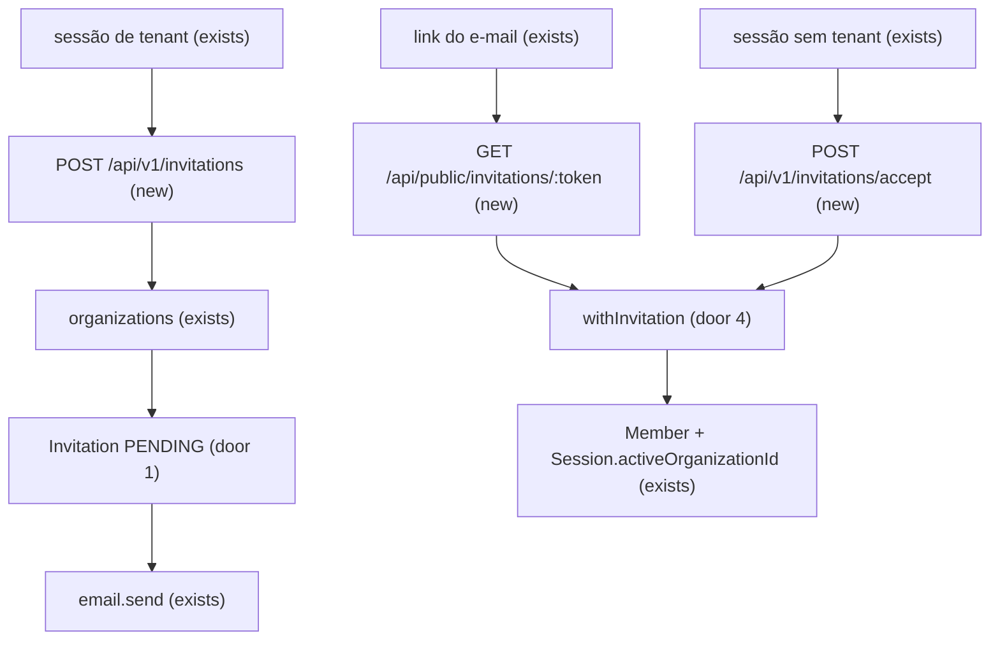
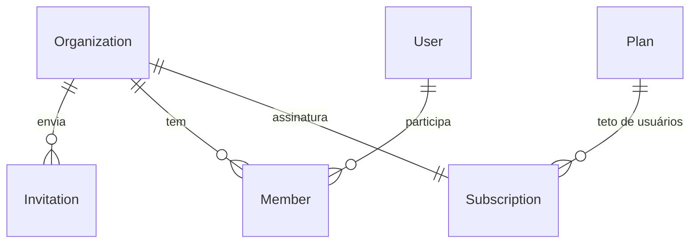

# Invitations

> Fase 4, feature 2 de 4. Ciclo próprio. Depois: `audit`, `org-web`. Este plano para antes dos checks.

## Problem

O OWNER cria a corretora e fica sozinho nela. Não há como chamar outra pessoa: não existe convite, o plano `trial` já guarda `maxUsers` e ninguém lê esse teto, e um segundo usuário só entra criando outra organização. Quem paga é a corretora que precisa de equipe antes da Fase 5. Sem incidente: ainda não há cliente.

Com isso pronto, OWNER ou ADMIN manda um convite por e-mail com papel e prazo. Quem tem a sessão daquele e-mail aceita, vira membro, e a vaga do plano é checada na hora do aceite.

## Flow

Reusa `requireTenant`, `enqueueEmail` (`email.send`, AD-003), `withTenant` e o teto `MAX_ORGS_PER_USER` do onboarding. O aceite não passa pela organização ativa da sessão: a organização sai da linha achada pelo token.

1. `POST /api/v1/invitations` entra com `requireTenant` (exists) e `invitation:create` → `organizations` (exists) grava `Invitation` (door 1) e chama `enqueueEmail` (exists) na mesma transação → `200`
2. `GET /api/public/invitations/:token` entra sem sessão → `withInvitation` (door 4) lê a linha pelo hash → `200` ou `404`
3. `POST /api/v1/invitations/accept` entra com sessão (exists), fora de `requireTenant` → `withInvitation` (door 4) lê a linha → `withTenant` (exists) da organização dessa linha cria `Member` (exists), marca o convite aceito e grava `Session.activeOrganizationId` (exists) → `200`
4. `GET` e `DELETE /api/v1/invitations` entram com `requireTenant` (exists) e `invitation:create` → lista ou revoga só o que o RLS devolve → `200` ou `404`

## Impact

| Front | What changes |
| --- | --- |
| domain | novo termo: **convite** — oferta de papel para um e-mail, com prazo, ainda sem `Member`. Vive em `organizations` |
| domain | `invitation:create` entra no mapa. Quem ramifica hoje: `ROLE_PERMISSIONS` em `shared/permissions.ts` (`OWNER` e `ADMIN`; os outros papéis ficam sem ela) |
| API | `acceptInvitation` entra na lista `SESSION_ONLY` junto de `onboardOrganization` e `setActiveOrganization`. Quem ramifica hoje: `tenant-context.ts` |
| stored data | `Invitation` nasce vazia. `Member` e `Plan` não mudam de forma; o aceite só insere membro |
| e-mail | o payload de `email.send` ganha o template `invitation` |

## Relations

Um convite `PENDING` por e-mail na organização (door 2). Hash do token único junto da organização (door 3). Sem colunas e sem tipos aqui.

## Surface

| Route | In | Out | Status |
| --- | --- | --- | --- |
| `POST /api/v1/invitations` | `email`, `role` | `id` · `email` · `role` · `expiresAt` · `status` | `200`, `400`, `401`, `403`, `409` |
| `GET /api/v1/invitations` | — | `items` (`id` · `email` · `role` · `expiresAt`) | `200`, `401`, `403` |
| `DELETE /api/v1/invitations/:id` | — | `id` · `status` | `200`, `401`, `403`, `404`, `422` |
| `GET /api/public/invitations/:token` | token na URL | `organizationName` · `email` · `role` · `status` · `expiresAt` | `200`, `404` |
| `POST /api/v1/invitations/accept` | `token` | `organizationId` · `role` | `200`, `400`, `401`, `403`, `409`, `422` |

## Landing

| One-way door | Literal shape | Alternative rejected |
| --- | --- | --- |
| 1. Convite persistido | tabela `Invitation` com `organizationId`, RLS `ENABLE` + `FORCE` e política `tenant_isolation`. Status gravado: `PENDING`, `ACCEPTED`, `REVOKED`. Expirado não é status | status `EXPIRED` escrito por cron: o prazo já está na linha, e um job a mais mente se o relógio muda |
| 2. Um pendente por e-mail | índice único parcial em `(organizationId, email)` onde `status = 'PENDING'` | único em todo status: depois de revogar não dá para convidar de novo |
| 3. Token só no e-mail | coluna de hash SHA-256 hex do token cru; índice único `(organizationId, tokenHash)`. O cru só vai no `url` do job | token cru na tabela: vazamento do banco vira aceite. Único global no hash: a ADR-004 exige `organizationId` em todo único de tabela tenant |
| 4. Leitura pelo token | `USING` é `organizationId = app.tenant_id` **ou** `tokenHash = current_setting('app.invitation_token', true)`; `WITH CHECK` é só o tenant. `app.invitation_token` só é gravado em `database.ts`, via `withInvitation`. O `organizationId` do `Member` novo sai dessa linha, nunca do body | predicado `userId = app.user_id` da AD-006: o convite não tem usuário até o aceite. `organizationId` na query: o tenant passaria a vir do request |
| 5. Quem convida | `invitation:create` só em `OWNER` e `ADMIN` | os cinco papéis: no legado o `MANAGER` não gere membros |
| 6. Aceite sem tenant | `operationId` `acceptInvitation` na lista fechada `SESSION_ONLY` | `requireTenant`: quem foi convidado ainda não é membro, e a org ativa não escolhe qual convite vale |

- Nada mais neste cambio é difícil de reverter. A cota lê `Plan.maxUsers` que o `org-core` já gravou (`trial` = 5). `assertQuota` e o bloqueio `402` continuam na Fase 5.

## Criteria

### S1: Enviar o convite (P1)

OWNER ou ADMIN convida um e-mail com papel e prazo. A pessoa ainda não é membro.

**Acceptance Criteria**

1. WHEN um `OWNER` ou `ADMIN` envia `POST /api/v1/invitations` com `email` válido e `role` `ADMIN`, `MANAGER`, `COMMERCIAL` ou `VIEWER` THEN o sistema SHALL responder `200` com `id`, `email` em minúsculas, `role`, `expiresAt` a 7 dias e `status: 'PENDING'`, sem o token no corpo, sem criar `Member`, e enfileirar `email.send` na mesma transação com `template: 'invitation'`, `to` igual a esse e-mail, `props.organizationName` o nome da corretora e `props.url` igual a `APP_URL` + `/accept-invitation?token=` + o token cru. O assunto do e-mail é `Convite para ` + o nome da corretora.
2. IF o body traz `role: 'OWNER'`, omite `email` ou `role`, traz campo extra, ou o e-mail é inválido THEN o sistema SHALL responder `400` com `error.code` `VALIDATION_ERROR` e não gravar linha.
3. IF o papel da sessão é `MANAGER`, `COMMERCIAL` ou `VIEWER` THEN o sistema SHALL responder `403` com `error.code` `FORBIDDEN` e não gravar linha.
4. IF não há sessão THEN o sistema SHALL responder `401` com `error.code` `UNAUTHENTICATED`.
5. WHILE os termos estão pendentes, WHEN `POST /api/v1/invitations` roda THEN o sistema SHALL responder `403` com `error.code` `TERMS_NOT_ACCEPTED` e não gravar linha.
6. IF já existe `Member` desse e-mail na organização, ativo ou não THEN o sistema SHALL responder `409` `{ error: { code: 'ALREADY_MEMBER', message: 'Esta pessoa já é membro da organização.' } }` e não gravar convite.
7. IF já existe convite `PENDING` para esse e-mail na organização THEN o sistema SHALL responder `409` `{ error: { code: 'INVITATION_PENDING', message: 'Já existe um convite pendente para este e-mail.' } }` e não gravar outro.
8. WHEN o e-mail do body é `Artur@Exemplo.com` THEN o sistema SHALL gravar `artur@exemplo.com`.
9. WHEN já há `maxUsers - 1` membros ativos e um convite `PENDING` THEN um `POST` para outro e-mail SHALL responder `200`. O pendente não ocupa vaga.
10. IF a transação do `POST` falha no meio THEN o sistema SHALL não deixar `Invitation` nem job `email.send` da tentativa.
11. The system SHALL gravar só o SHA-256 hex do token. A linha não contém o token cru.

**Independent test:** `POST /api/v1/invitations` como OWNER e ler o job `email.send`.

### S2: Lista e revogação (P1)

Quem convida vê os pendentes e cancela um.

**Acceptance Criteria**

12. WHEN `OWNER` ou `ADMIN` envia `GET /api/v1/invitations` THEN o sistema SHALL responder `200` com `{ items }` só dos `PENDING` da organização, do mais novo para o mais antigo, cada item com `id`, `email`, `role` e `expiresAt`. Sem pendente, `items` é `[]`.
13. IF o papel não tem `invitation:create` THEN `GET` e `DELETE /api/v1/invitations` SHALL responder `403` com `error.code` `FORBIDDEN`.
14. WHEN `DELETE /api/v1/invitations/:id` mira um `PENDING`, inclusive já expirado THEN o sistema SHALL responder `200` com esse `id` e `status: 'REVOKED'`.
15. IF o id não existe nesta organização THEN o sistema SHALL responder `404` com `error.code` `NOT_FOUND` e não alterar linha de outro tenant.
16. IF o convite está `ACCEPTED` ou `REVOKED` THEN o `DELETE` SHALL responder `422` `{ error: { code: 'INVITATION_CLOSED', message: 'Este convite não está mais aberto.' } }` e não mudar o status.
17. WHEN `withTwoTenants` lista com o tenant A THEN o sistema SHALL não devolver convite do tenant B.

**Independent test:** criar, listar, revogar, e o teste cross-tenant.

### S3: Ver o convite e aceitar (P1)

Quem tem o link vê o estado. Quem tem a sessão daquele e-mail entra na corretora se houver vaga e couber no teto de organizações.

**Acceptance Criteria**

18. WHEN `GET /api/public/invitations/:token` recebe o token cru de um `PENDING` não expirado, sem sessão THEN o sistema SHALL responder `200` com `organizationName`, `email`, `role`, `status: 'PENDING'` e `expiresAt`.
19. IF o token não casa com nenhuma linha THEN o sistema SHALL responder `404` com `error.code` `NOT_FOUND`.
20. WHEN o token é de um `PENDING` com `expiresAt` no passado THEN o `GET` SHALL responder `200` com `status: 'EXPIRED'` e a linha continua `PENDING`.
21. WHEN o token é de um `REVOKED` THEN o `GET` SHALL responder `200` com `status: 'REVOKED'`.
22. WHEN o token é de um `ACCEPTED` THEN o `GET` SHALL responder `200` com `status: 'ACCEPTED'`.
23. WHEN `POST /api/v1/invitations/accept` recebe `{ token }` de um `PENDING` não expirado e a sessão tem o mesmo e-mail, menos de 3 memberships e a organização tem menos membros ativos do que `maxUsers` THEN o sistema SHALL responder `200` com `organizationId` e `role`, gravar um `Member` ativo com `commissionSplitBp` 0, marcar o convite `ACCEPTED` e setar `Session.activeOrganizationId` para essa organização, na mesma transação. Termos pendentes não bloqueiam este aceite.
24. IF não há sessão no aceite THEN o sistema SHALL responder `401` com `error.code` `UNAUTHENTICATED`.
25. IF o body do aceite não é só `token` THEN o sistema SHALL responder `400` com `error.code` `VALIDATION_ERROR` e não criar `Member`.
26. IF o e-mail da sessão é outro THEN o sistema SHALL responder `403` `{ error: { code: 'INVITATION_EMAIL_MISMATCH', message: 'Este convite é para outro e-mail.' } }` e não criar `Member`.
27. IF o convite `PENDING` está expirado THEN o aceite SHALL responder `422` `{ error: { code: 'INVITATION_EXPIRED', message: 'Este convite expirou.' } }` e não criar `Member`.
28. IF o convite está `REVOKED` ou `ACCEPTED` THEN o aceite SHALL responder `422` com `error.code` `INVITATION_CLOSED` e não criar outro `Member`.
29. IF os membros ativos já são `maxUsers` (5 no plano `trial`) THEN o aceite SHALL responder `422` `{ error: { code: 'USER_QUOTA_REACHED', message: 'O plano não tem vagas para outro usuário.' } }` e o convite continua `PENDING`.
30. IF o usuário já tem 3 memberships THEN o aceite SHALL responder `422` `{ error: { code: 'ORG_LIMIT_REACHED', message: 'Você já participa do número máximo de organizações.' } }` e o convite continua `PENDING`.
31. IF o e-mail da sessão já é `Member` dessa organização THEN o aceite SHALL responder `409` com `error.code` `ALREADY_MEMBER` e o convite continua `PENDING`.
32. IF duas aceitações disputam a última vaga THEN o sistema SHALL persistir um só `Member` novo: uma resposta `200` e a outra `422` com `error.code` `USER_QUOTA_REACHED`.
33. WHEN a organização ativa da sessão é A e o token é da organização B THEN o `Member` novo SHALL ser da B e `activeOrganizationId` SHALL passar a ser B.
34. IF a transação do aceite falha no meio THEN o sistema SHALL não deixar `Member` novo e o convite continua `PENDING`.
35. The system SHALL recusar o boot se `app.invitation_token` aparecer fora de `infrastructure/database.ts`.
36. IF o mailer falha ao enviar THEN a linha `Invitation` SHALL continuar existindo. O job segue o retry já configurado de `email.send` (3 tentativas).

**Independent test:** abrir o link sem sessão, aceitar com a sessão do e-mail convidado e ler `GET /api/v1/organization` já na corretora nova.

## Out of scope

| Excluded | Why |
| --- | --- |
| Tela `/accept-invitation` e a lista de convites no web | feature `org-web` |
| Mudança de papel, remoção, reativação, auditoria, `scopeFor`, transferência de carteira | feature `audit` |
| Reenviar o mesmo pendente com prazo novo | revogar e criar de novo cobre o caso; um endpoint de reenvio é outro contrato |
| `assertQuota`, `requireFeature`, bloqueio `402` | Fase 5; aqui a vaga é a contagem de membros ativos contra `Plan.maxUsers` |
| Apagar convites expirados | a linha `PENDING` expirada já não aceita; expurgo não bloqueia o fluxo |
| Cadastro automático de quem não tem conta | o aceite exige sessão; criar a conta continua no fluxo da Fase 3 |
| Logo no e-mail | não há logo de organização neste ciclo |

## Assumptions

Os prazos, papéis e códigos acima já são critério.

**Open questions:** none - all resolved or logged above.

## Observable

| Surface | Decision | Landing |
| --- | --- | --- |
| API `POST /api/v1/invitations` | error shape and codes | AC 2, AC 3, AC 4, AC 5, AC 6, AC 7 |
| API `POST /api/v1/invitations` | empty state | n/a - criação, não lista |
| API `GET /api/v1/invitations` | empty state | AC 12 |
| API `GET /api/v1/invitations` | error shape and codes | AC 4, AC 5, AC 13 |
| API `DELETE /api/v1/invitations/:id` | destructive action confirms | n/a - sem tela neste ciclo; a revogação é o próprio DELETE |
| API `DELETE /api/v1/invitations/:id` | error shape and codes | AC 13, AC 15, AC 16 |
| API `GET /api/public/invitations/:token` | error shape and codes | AC 18, AC 19, AC 20, AC 21, AC 22 |
| API `GET /api/public/invitations/:token` | empty state | n/a - um token, não uma coleção |
| API `POST /api/v1/invitations/accept` | error shape and codes | AC 23, AC 24, AC 25, AC 26, AC 27, AC 28, AC 29, AC 30, AC 31 |
| all new invitation routes | versioning | n/a - prefixo `/api/v1` e `/api/public` já são o contrato (ADR-007) |
| all new invitation routes | rate limit | n/a - o limite de escrita da Fase 3 já cobre método mutável; o token tem 32 bytes, sem limite novo |
| e-mail `invitation` | what the reader does next | AC 1 |
| screen | empty, loading, error | n/a - sem tela neste ciclo |

## Sources

- `docs/architecture.md` §6 passo 7 e §8 — `POST /api/v1/invitations`, link `/accept-invitation?token`, aceite cria `Member` e checa a quota
- `docs/migration.md` "Auth / Organizations" — convite com role e expiração; o aceite checa a quota do plano
- ADR-003, ADR-004, ADR-005, AD-003 e AD-006 — convite em código próprio, RLS sem bypass, mapa de permissões, e-mail só via `email.send`; o predicado de `Invitation` fica na door 4, não no `userId` do membro
