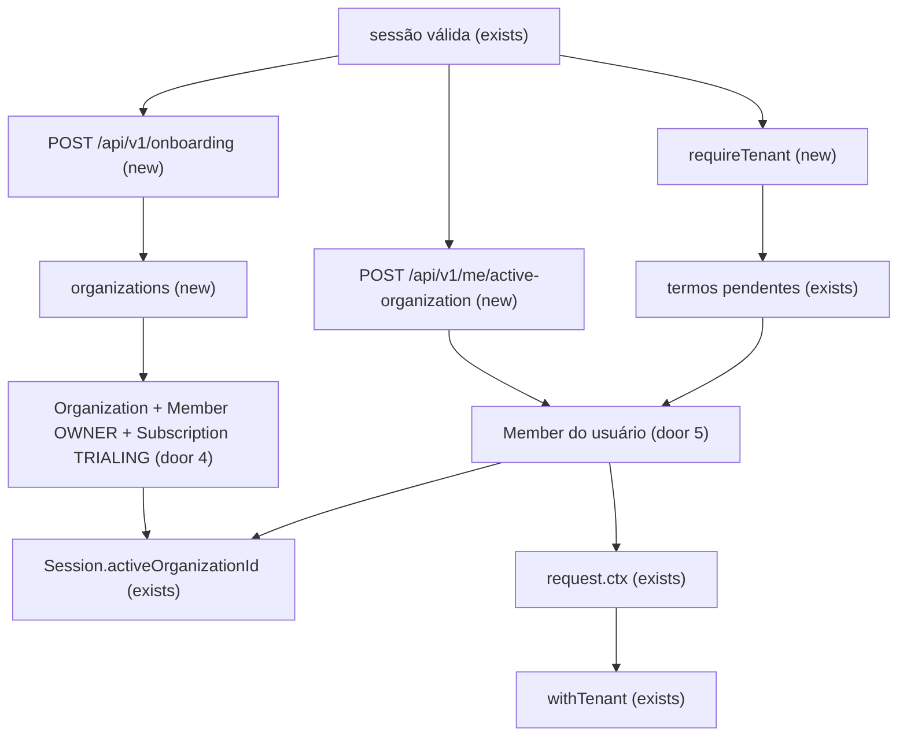
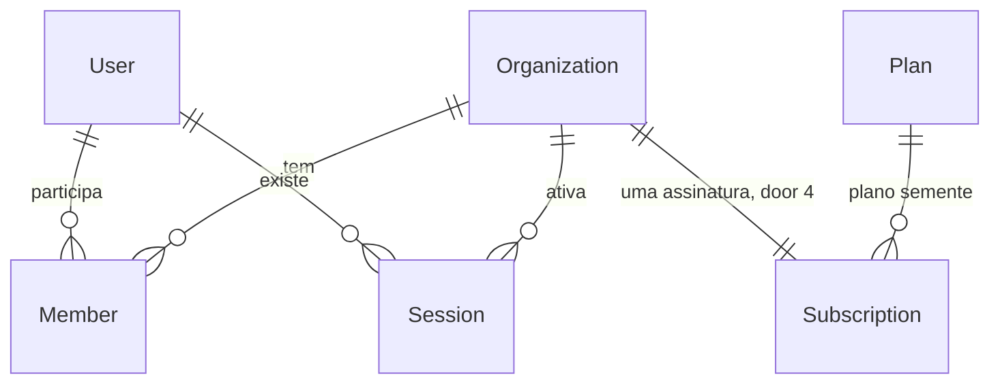

# Org core

> Fase 4, feature 1 de 4. As outras, cada uma com o próprio ciclo: `invitations`, `audit` (papel, OWNER na API, `audit.record`, carteira, `scopeFor`, `withTwoSalespeople`), `org-web`. Este plano para antes dos checks.

## Problem

Um usuário autenticado não tem corretora. A sessão já guarda `activeOrganizationId`, mas ninguém cria organização, ninguém confere se ele é membro, e o `RequestContext` de tenant não existe. O módulo `examples` ainda é o único modelo com `organizationId`, então o isolamento que os próximos módulos vão copiar não tem dono real. Sem incidente: ainda não há cliente.

Com isso pronto, quem aceitou os termos cria a corretora, vira o único OWNER, ganha um trial, e cada request de tenant carrega a organização da sessão. Os dados de uma corretora não aparecem na outra.

## Flow

Reusa `requireSession` e o `/api/v1/me` de `auth`, o `withTenant` de `infrastructure/database`, e o storage não entra aqui. Termos continuam antes do tenant no web (AD-005); o onboarding é rota sem tenant.

1. `POST /api/v1/onboarding` entra com a sessão → `organizations` grava organização, membro OWNER e assinatura `TRIALING` na mesma transação → grava `Session.activeOrganizationId` → `200`
2. `POST /api/v1/me/active-organization` entra com a sessão → lê o `Member` ativo daquele usuário e daquela organização (door 5) → atualiza `Session.activeOrganizationId` → `200`; sem membro, `404`
3. rota com `requireTenant` → termos pendentes, `403` → sem organização ativa, `403` → membro ausente ou inativo, `404` → `request.ctx` com `organizationId`, papel e permissões → `withTenant` (exists)
4. handshake do Socket.IO (exists) usa a mesma resolução: sala `user:<userId>` sempre; sala `org:<organizationId>` só quando o passo 3 montaria o contexto

## Impact

| Front | What changes |
| --- | --- |
| domain | novo termo: **membro** — vínculo de um usuário com uma organização, com um papel (`OWNER`, `ADMIN`, `MANAGER`, `COMMERCIAL`, `VIEWER`) e ativo ou não. Vive em `organizations` |
| domain | termo existente: **organização** era só a raiz do exemplo; passa a ser a corretora (nome, slug). Quem ramifica hoje: `Session.activeOrganization`, `infrastructure/database.spec.ts`, o módulo `examples` |
| domain | `RequestContext` ganha `role` e `permissions`. Quem ramifica hoje: o tipo em `shared/request-context.ts`, ainda sem produtor |
| API | `GET /api/v1/me` ganha `role` (`null` sem org ativa) e `permissions` (lista, vazia sem org ativa) |
| stored data | `Organization` já existe e pode ter linhas do módulo exemplo: a migration preenche `slug` com o id. `Example` é removido. `Member`, `Plan` e `Subscription` nascem vazios |
| web | nada neste ciclo. O guard `_app` continua só com termos e sessão |

## Relations

Um OWNER por organização (door 2). Slug único na organização (door 3). Uma assinatura por organização (door 4). Sem colunas e sem tipos aqui.

## Surface

| Route | In | Out | Status |
| --- | --- | --- | --- |
| `POST /api/v1/onboarding` | `name` | `id` · `name` · `slug` · `role` | `200`, `400`, `401`, `422` |
| `POST /api/v1/me/active-organization` | `organizationId` | `organizationId` · `role` | `200`, `400`, `401`, `404` |
| `GET /api/v1/organization` | — | `id` · `name` · `slug` · `role` | `200`, `401`, `403`, `404` |
| `PATCH /api/v1/organization` | `name` | `id` · `name` · `slug` | `200`, `400`, `401`, `403`, `404` |
| `GET /api/v1/me` | — | passa a incluir `role` · `permissions` | `200`, `401` |

## Landing

| One-way door | Literal shape | Alternative rejected |
| --- | --- | --- |
| 1. Papéis fixos | enum `Role`: `OWNER`, `ADMIN`, `MANAGER`, `COMMERCIAL`, `VIEWER` | papéis por tenant no banco: a ADR-005 recusou, e o mapa estático não cabe nisso |
| 2. Um OWNER | índice único parcial `Member_one_owner` em `(organizationId)` onde `role = 'OWNER'` | trava só no use case: duas escritas concorrentes criam dois donos |
| 3. Slug público | `Organization.slug` único, global | slug único por algo que a tabela não tem: ela não carrega `organizationId` |
| 4. Trial mínimo | uma linha `Plan` com `code = 'trial'` e `maxUsers = 5`; `Subscription` `TRIALING` por 14 dias, única por organização | plano escolhido no onboarding: é a Fase 5, e o onboarding não pode esperar o Asaas |
| 5. RLS de membro | política `tenant_isolation` em `Member`: `USING` é `organizationId = app.tenant_id` **ou** `userId = app.user_id` (`current_setting(..., true)`); `WITH CHECK` é só o tenant. `app.user_id` só é gravado em `database.ts`, via `withUser` | só `app.tenant_id`: a troca de organização não consegue ler o próprio membro. Sem RLS: a ADR-004 exige a política em toda tabela com `organizationId` |
| 6. RLS da organização | `Organization` não tem `organizationId`. Mesmo nome de política: `USING` / `WITH CHECK` é `id = app.tenant_id` **ou** existe `Member` daquele `app.user_id`. O teste de schema passa a exigir essa política nesta tabela | sem RLS: qualquer sessão lê nome e slug de todas as corretoras |
| 7. Rotas sem permissão de papel | `requirePermission` em toda rota `/api/v1` exceto a lista fechada `getMe`, `acceptTerms`, `onboardOrganization`, `setActiveOrganization` | permissão fictícia nessas quatro: elas existem para quem ainda não tem papel |

- Nada mais neste cambio é difícil de reverter. `organization:read` (todos os papéis) e `organization:update` (`OWNER`, `ADMIN`) entram no mapa; o restante da matriz chega com o módulo que a usa.

## Criteria

### S1: Onboarding da corretora (P1)

Quem tem sessão cria a organização, vira o único OWNER e cai nela.

**Acceptance Criteria**

1. WHEN um usuário autenticado envia `POST /api/v1/onboarding` com `{ name }` de 2 a 80 caracteres THEN o sistema SHALL responder `200` com `id`, `name`, `slug` e `role: 'OWNER'`, gravar um `Member` ativo com `commissionSplitBp` 0, gravar uma `Subscription` `TRIALING` no plano `trial` com `trialEndsAt` a 14 dias, e setar `Session.activeOrganizationId` para essa organização, tudo na mesma transação.
2. WHEN o `name` gera um slug já usado THEN o sistema SHALL gravar o slug com sufixo `-2`, `-3`, … e responder `200`. O slug é o nome em minúsculas, sem acento, com o que não for letra ou número virando hífen, hífens das pontas removidos, no máximo 48 caracteres; se sobrar vazio, `org`.
3. WHEN o usuário já tem 1 ou 2 memberships e repete o onboarding THEN o sistema SHALL criar outra organização e tornar essa a ativa.
4. IF o usuário já tem 3 memberships THEN o sistema SHALL responder `422` `{ error: { code: 'ORG_LIMIT_REACHED', message: 'Você já participa do número máximo de organizações.' } }` e não gravar linha. O padrão de `MAX_ORGS_PER_USER` é 3.
5. IF o body tem campo extra, omite `name`, ou `name` tem menos de 2 ou mais de 80 caracteres THEN o sistema SHALL responder `400` com `error.code` `VALIDATION_ERROR` e não gravar linha.
6. IF não há sessão THEN o sistema SHALL responder `401` com `error.code` `UNAUTHENTICATED`.
7. IF a transação falha no meio THEN o sistema SHALL não deixar `Organization`, `Member`, `Subscription` nem `activeOrganizationId` da tentativa.

**Independent test:** `POST /api/v1/onboarding` com sessão, e de novo até o teto de 3.

### S2: Organização ativa e contexto de tenant (P1)

A request de tenant só anda com membro ativo e termos aceitos.

**Acceptance Criteria**

8. WHEN o usuário envia `POST /api/v1/me/active-organization` com o id de uma organização em que o `Member` está ativo THEN o sistema SHALL responder `200` com esse `organizationId` e o `role`, e a sessão passa a apontar para ela.
9. IF o id não é de um membro ativo desse usuário THEN o sistema SHALL responder `404` com `error.code` `NOT_FOUND` e não mudar a sessão.
10. IF o body não é só `organizationId` THEN o sistema SHALL responder `400` com `error.code` `VALIDATION_ERROR`.
11. WHILE os termos estão pendentes, WHEN uma rota com `requireTenant` roda THEN o sistema SHALL responder `403` `{ error: { code: 'TERMS_NOT_ACCEPTED', message: 'Aceite os termos e a política de privacidade para continuar.' } }` e não ler dado de tenant.
12. IF a sessão não tem `activeOrganizationId` THEN uma rota com `requireTenant` SHALL responder `403` `{ error: { code: 'NO_ACTIVE_ORGANIZATION', message: 'Nenhuma organização ativa.' } }`.
13. IF `activeOrganizationId` não tem `Member` ativo desse usuário THEN uma rota com `requireTenant` SHALL responder `404` com `error.code` `NOT_FOUND`.
14. WHEN `GET /api/v1/me` roda com organização ativa THEN o sistema SHALL incluir `role` do membro e `permissions` daquele papel. Sem organização ativa, `role` é `null` e `permissions` é `[]`. `isSuperAdmin` continua verdadeiro só com a flag do usuário e 2FA ligado.
15. WHEN `GET /api/v1/organization` roda com contexto válido THEN o sistema SHALL responder `200` com `id`, `name`, `slug` e `role`. `organization:read` está em todos os papéis.
16. WHEN `PATCH /api/v1/organization` recebe `{ name }` válido de um `OWNER` ou `ADMIN` THEN o sistema SHALL responder `200` com o nome novo e o mesmo `slug`.
17. IF o papel não tem `organization:update` THEN `PATCH /api/v1/organization` SHALL responder `403` com `error.code` `FORBIDDEN` e não alterar a linha.
18. The system SHALL recusar o boot se alguma rota `/api/v1` registrada não usar `requirePermission`, fora `getMe`, `acceptTerms`, `onboardOrganization` e `setActiveOrganization`.
19. WHEN o handshake do socket tem sessão THEN o sistema SHALL colocar o socket na sala `user:<userId>`. SHALL colocar também em `org:<organizationId>` só quando o `requireTenant` dessa sessão montaria contexto. Sem sessão, o socket continua recusado.

**Independent test:** dois usuários, duas organizações; trocar a ativa e ler `GET /api/v1/organization`.

### S3: Isolamento e fim do exemplo (P1)

O banco, e não o filtro da aplicação, separa as corretoras. O exemplo sai.

**Acceptance Criteria**

20. WHEN `withTenant` da organização A lê `Member` THEN o sistema SHALL não devolver linha da organização B. Fora de `withTenant` e de `withUser`, a leitura de `Member` SHALL falhar.
21. WHEN `withUser` de um usuário roda THEN o sistema SHALL devolver só as organizações em que ele tem `Member`, e nenhum nome de outra corretora.
22. The system SHALL oferecer `withTwoTenants` em `apps/server/test`, e os endpoints novos de organização SHALL ter um teste que lê com o tenant A e não vê a linha do tenant B.
23. The system SHALL não expor `GET /api/v1/examples/commission-preview` (`404`) e a tabela `Example` SHALL não existir depois da migration.
24. IF duas transações criam um `OWNER` na mesma organização THEN o sistema SHALL persistir um só; a outra falha.

**Independent test:** o teste de schema mais `withTwoTenants` em `GET /api/v1/organization`.

## Out of scope

| Excluded | Why |
| --- | --- |
| Convite, e-mail e quota de usuários no aceite | feature `invitations`; o `maxUsers` do plano semente fica aqui para ela ler |
| Mudança de papel, remoção de membro, auditoria, transferência de carteira, `scopeFor`, `withTwoSalespeople` | feature `audit`; o índice do OWNER único já impede um segundo dono |
| Telas de onboarding, seletor e settings | feature `org-web`; a ordem no web continua login → termos → onboarding |
| Logo da organização | `org-web` / storage; não bloqueia o contexto de tenant |
| Asaas, `requireFeature`, `assertQuota`, bloqueio `402` | Fase 5 |
| Contato, cliente e carteira de verdade | Fase 6; não há tabela para mover |
| Árvore `parent`/`child` que o `Example` usava para a FK composta | volta no primeiro par de tabelas tenant que se referenciam; os ataques `include`/`connect` que não precisam da árvore passam a usar `Member` |
| Plugin `organization` do Better Auth | ADR-003 |

## Assumptions

| Assumption | Chosen default | Rationale | Confirmed? |
| --- | --- | --- | --- |
| E-mail não verificado pode fazer onboarding | sim, basta sessão | o `/me` já não exige e-mail verificado; criar essa trava aqui muda a Fase 3 | n |
| Segundo onboarding troca a organização ativa para a nova | sim | é o que o AC 3 descreve; a lista para escolher fica no `org-web` | n |
| `commissionSplitBp` do OWNER inicial | 0 | a ADR-010 congela o split na emissão; sem tela de membro neste ciclo | n |

**Open questions:** none - all resolved or logged above.

## Observable

| Surface | Decision | Landing |
| --- | --- | --- |
| API `POST /api/v1/onboarding` | error shape and codes | AC 4, AC 5, AC 6 |
| API `POST /api/v1/onboarding` | empty state | n/a - criação, não lista |
| API `POST /api/v1/onboarding` | rate limit | n/a - o rate limit de escrita da Fase 3 já cobre método mutável; este ciclo não cria limite novo |
| API `POST /api/v1/me/active-organization` | error shape and codes | AC 9, AC 10, AC 6 |
| API `GET /api/v1/organization` | error shape and codes | AC 11, AC 12, AC 13, AC 15 |
| API `GET /api/v1/organization` | empty state | AC 12 |
| API `PATCH /api/v1/organization` | error shape and codes | AC 5, AC 16, AC 17 |
| API `PATCH /api/v1/organization` | destructive action confirms | n/a - só muda o nome; não apaga a corretora |
| API `GET /api/v1/me` | error shape and codes | AC 14; `401` já existe |
| all new `/api/v1` organization routes | versioning | n/a - prefixo `/api/v1` já é o contrato (ADR-007); sem versão paralela |
| socket | rooms | AC 19 |
| screen | empty, loading, error | n/a - sem tela neste ciclo |

## Sources

- `docs/roadmap.md` Fase 4 e o bloco "Remover o módulo exemplo" - o que este ciclo entrega e o que sai
- ADR-003, ADR-004, ADR-005 e AD-001, AD-005 - sem plugin de organização, RLS, mapa de permissões, contexto e termos antes do tenant
- `docs/migration.md` "Auth / Organizations" - onboarding, teto de organizações e troca da ativa; o restante da lista fica nas features seguintes
