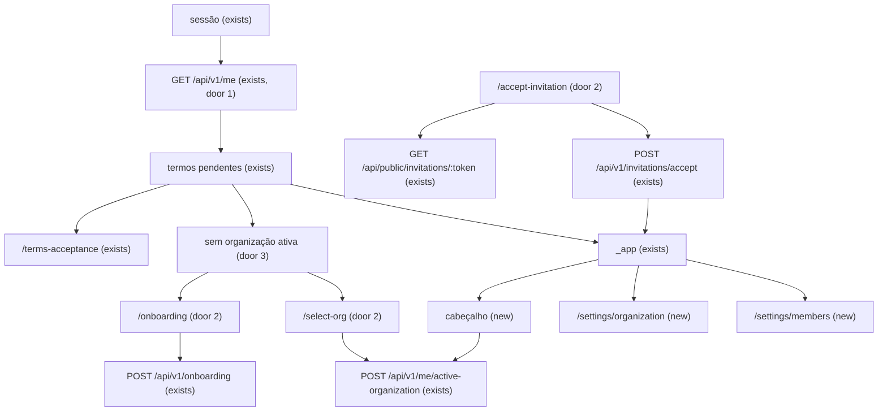

# Org web

> Fase 4, feature 4 de 4. `org-core`, `invitations` e `audit` já têm `verification.md` PASS. Este plano para antes dos checks. Perfil da fase: standard.

## Problem

Quem aceita os termos cai no painel sem corretora. O server já cria a organização, troca a ativa, convida, muda papel e transfere carteira, mas o web não tem tela para nada disso: o guard do `_app` só olha sessão e termos, e o cabeçalho não mostra em qual corretora a pessoa está. Quem paga é o dono, que não consegue chamar a equipe nem alternar entre duas corretoras. Sem incidente: ainda não há cliente.

Com isso pronto, a primeira entrada cria a corretora, quem tem mais de uma escolhe a ativa, e OWNER ou ADMIN gerencia nome, convites e membros nas configurações. O convite do e-mail abre uma tela de aceite.

## Flow

Reusa `GET /api/v1/me`, `POST /api/v1/onboarding`, `POST /api/v1/me/active-organization`, as rotas de convite e de membro, e o guard de sessão e termos que o `_app` já faz. Nenhuma tela autoriza: o server continua decidindo.

1. `GET /api/v1/me` (exists) passa a incluir `organizations` (door 1), lidas com `withUser` (exists): memberships ativos, cada um com `id`, `name` e `role` da organização.
2. O guard do `_app` (exists) continua mandando sem sessão para `/login` e com termos pendentes para `/terms-acceptance`. Sem organização ativa utilizável, manda para `/onboarding` ou `/select-org` (door 2, door 3).
3. `/onboarding` envia `POST /api/v1/onboarding` (exists) e, no `200`, vai para `/dashboard`.
4. `/select-org` e o seletor do cabeçalho enviam `POST /api/v1/me/active-organization` (exists) e, no `200`, vão para `/dashboard` com as queries invalidadas.
5. `/settings/organization` lê `GET /api/v1/organization` (exists) e, com `organization:update`, envia `PATCH /api/v1/organization` (exists).
6. `/settings/members` (new) só abre para quem tem `member:update`. Lista, convite, revogação, papel, ativação e transferência usam as rotas que já existem.
7. `/accept-invitation` lê o preview público (exists) e, com sessão, envia `POST /api/v1/invitations/accept` (exists). No `200`, vai para `/dashboard`.
8. Toda sessão nova (login, link de verificação, 2FA) nasce com a organização inicial (door 4): o hook `databaseHooks.session.create.before` do Better Auth (new) lê `User.lastActiveOrganizationId` e os memberships ativos com `withUser` (exists). Quem grava a ativa (`assignActiveOrganization`, exists: onboarding, troca, aceite) passa a gravar também a última usada no `User`.

## Impact

| Front | What changes |
| --- | --- |
| domain | nenhum termo novo. **organização**, **membro** e **convite** continuam com o sentido que `organizations` já gravou |
| API | `GET /api/v1/me` ganha `organizations`. Quem ramifica hoje: `me.ts`, `me.schema.ts`, `me.spec.ts`, o hook gerado em `apps/web/src/api/` |
| stored data | a lista é calculada de `Member` e `Organization`. `User` ganha `lastActiveOrganizationId` nulo (door 4); linhas existentes ficam `NULL` e caem na regra da corretora única |
| web | o `_app` passa a exigir organização ativa utilizável. O teste e2e que hoje, depois dos termos, espera `/dashboard` passa a esperar `/onboarding`. O cabeçalho mostra o nome da corretora |
| auth | a sessão deixa de nascer sempre sem organização (door 4). Quem ramifica: `auth.ts` (hook), `active-organization.ts` do `auth`, e os e2e de login, termos, 2FA e recuperação de senha, que voltam a cair direto no `_app` |

## Relations

- `User` 0..1 → `Organization`: a última organização ativa (`lastActiveOrganizationId`). Apagar a organização zera o campo (`SetNull`, como `Session.activeOrganizationId`). Só vale no login se ainda houver `Member` ativo do usuário nela.

## Surface

| Route | In | Out | Status |
| --- | --- | --- | --- |
| `GET /api/v1/me` | — | passa a incluir `organizations`: itens `id` · `name` · `role`, só memberships ativos, ordenados por `name` e depois `id` | `200`, `401` |

## Landing

| One-way door | Literal shape | Alternative rejected |
| --- | --- | --- |
| 1. Lista no `/me` | `organizations: { id, name, role }[]` no `200` de `GET /api/v1/me`. Só `Member.active`. Ordem `name` ascendente, `id` ascendente | `GET /api/v1/me/organizations`: o web já lê a pessoa em `GET /api/v1/me` (ADR-009) e o cabeçalho teria um segundo request |
| 2. Rotas fora do `_app` | `/onboarding`, `/select-org`, `/accept-invitation` | debaixo do `_app`: o `beforeLoad` desse layout passa a exigir organização ativa, e essas telas existem para criar, escolher ou aceitar |
| 3. Ordem do guard | sessão, depois termos, depois organização ativa utilizável (`activeOrganizationId` com `role` não nulo) | organização antes dos termos: a AD-005 já manda o aceite para a tela de termos, e o `_app` já faz essa ordem |

| 4. Organização inicial da sessão | `databaseHooks.session.create.before` define `activeOrganizationId`: `User.lastActiveOrganizationId` se o usuário ainda tem `Member` ativo nela; senão, a única organização com `Member` ativo; senão, `null` (→ `/select-org` ou `/onboarding`). `assignActiveOrganization` grava a sessão e `User.lastActiveOrganizationId` na mesma transação. Migration `user_last_active_organization` | copiar da sessão anterior: o sign-out apaga a linha de `Session`, então quem sai e entra perderia a escolha; cookie no web, como o legado: o tenant passaria a vir de um valor do cliente, e sem o `POST` a corretora única ainda cairia em `/select-org` |

- Nada mais neste cambio é difícil de reverter. Não há dependência nova. A door 4 entrou durante o build (rodada 1 do Verifier: toda sessão nova caía em `/select-org`), decidida pelo usuário.

## Criteria

### S1: Criar a corretora (P1)

A primeira entrada, depois dos termos, cria a organização e cai nela.

**Acceptance Criteria**

1. WHEN um usuário autenticado, com termos aceitos e sem membership, abre `/dashboard` THEN o sistema SHALL redirecionar para `/onboarding` e mostrar o título "Criar corretora", o campo "Nome" e o botão "Criar corretora".
2. WHEN esse usuário envia o nome "Corretora Azul" THEN o sistema SHALL chamar `POST /api/v1/onboarding` com `{ name: "Corretora Azul" }`, ir para `/dashboard` e mostrar "Corretora Azul" no cabeçalho.
3. IF o nome tem menos de 2 ou mais de 80 caracteres THEN o sistema SHALL mostrar "O nome precisa ter entre 2 e 80 caracteres." e não chamar `POST /api/v1/onboarding`.
4. IF `POST /api/v1/onboarding` responde `422` com `error.code` `ORG_LIMIT_REACHED` THEN o sistema SHALL mostrar "Você já participa do número máximo de organizações." e permanecer em `/onboarding`.
5. IF não há sessão e a pessoa abre `/onboarding` THEN o sistema SHALL redirecionar para `/login`.
6. WHILE os termos estão pendentes, WHEN a pessoa abre `/onboarding` THEN o sistema SHALL redirecionar para `/terms-acceptance`.
7. WHEN um OWNER que já tem uma corretora abre `/onboarding` e envia outro nome válido THEN o sistema SHALL tornar essa organização a ativa e mostrar o nome novo no cabeçalho do `/dashboard`.

**Independent test:** verificar o e-mail, aceitar os termos, criar "Corretora Azul" e ver o nome no painel.

### S2: Escolher e trocar a corretora (P1)

Quem tem duas corretoras alterna e vê o nome da ativa.

**Acceptance Criteria**

8. WHEN `GET /api/v1/me` roda THEN o sistema SHALL incluir `organizations` só com memberships `active`, cada item `{ id, name, role }`, ordenados por `name` ascendente e, no empate, por `id` ascendente. Membership inativo não entra. Sem nenhum ativo, `organizations` é `[]`.
9. WHEN a pessoa tem dois memberships ativos e `role` nulo no `/me`, e abre `/dashboard` THEN o sistema SHALL redirecionar para `/select-org`, com o título "Escolher corretora" e um botão para cada nome.
10. WHEN ela aciona o botão de uma corretora THEN o sistema SHALL chamar `POST /api/v1/me/active-organization` com o `organizationId` dela, ir para `/dashboard` e mostrar esse nome no cabeçalho.
11. WHEN ela tem duas corretoras e uma ativa, o cabeçalho SHALL ser um botão com o nome da ativa. WHEN ela escolhe a outra THEN o cabeçalho SHALL passar a mostrar o nome escolhido e `GET /api/v1/organization` SHALL responder o `id` dessa.
12. WHEN ela tem uma única corretora ativa THEN o cabeçalho SHALL mostrar o nome como texto, sem botão de troca.
13. WHILE os termos estão pendentes e não há organização ativa, WHEN ela abre `/dashboard` THEN o sistema SHALL redirecionar para `/terms-acceptance`, não para `/onboarding`.
14. WHILE `activeOrganizationId` está preenchido e `role` no `/me` é nulo, WHEN `organizations` tem itens THEN o sistema SHALL redirecionar `/dashboard` para `/select-org`. WHEN `organizations` é `[]` THEN o sistema SHALL redirecionar para `/onboarding`.
15. IF `POST /api/v1/me/active-organization` responde `404` THEN o sistema SHALL mostrar "Organização não encontrada." e permanecer na tela de onde partiu a troca.

42. WHEN uma sessão é criada THEN o sistema SHALL definir `activeOrganizationId` como `User.lastActiveOrganizationId` se o usuário tem `Member` ativo nela; senão, a única organização com `Member` ativo; senão, `null`.
43. WHEN `POST /api/v1/onboarding`, `POST /api/v1/me/active-organization` ou `POST /api/v1/invitations/accept` define a organização ativa THEN o sistema SHALL gravar a mesma organização em `User.lastActiveOrganizationId`, de modo que sair e entrar de novo volta a ela no cabeçalho do `/dashboard`.

**Independent test:** duas corretoras no mesmo usuário; o painel de uma não mostra o nome da outra depois da troca.

### S3: Nome da corretora (P1)

OWNER e ADMIN renomeiam. Os outros papéis só leem.

**Acceptance Criteria**

16. WHEN um OWNER abre `/settings/organization` THEN o sistema SHALL mostrar o título "Corretora", o campo "Nome" com o nome atual, o slug, e o botão "Salvar".
17. WHEN ele salva "Corretora Verde" THEN o sistema SHALL chamar `PATCH /api/v1/organization` com `{ name: "Corretora Verde" }`, mostrar "Nome atualizado." e o slug SHALL permanecer o mesmo.
18. IF o nome tem menos de 2 ou mais de 80 caracteres THEN o sistema SHALL mostrar "O nome precisa ter entre 2 e 80 caracteres." e não chamar `PATCH /api/v1/organization`.
19. WHILE o papel é `VIEWER`, a página SHALL mostrar o nome como texto, sem o botão "Salvar", e não SHALL chamar `PATCH /api/v1/organization`.
20. WHILE `GET /api/v1/organization` está em voo, a página SHALL mostrar "Carregando a corretora…". IF a request falha THEN a página SHALL mostrar "Não foi possível carregar a corretora." e o botão "Tentar de novo".

44. IF `PATCH /api/v1/organization` responde com `error.message` THEN o sistema SHALL mostrar essa mensagem e manter o nome digitado no campo.

**Independent test:** o OWNER renomeia; um VIEWER na mesma corretora vê o nome novo e não vê "Salvar".

### S4: Equipe (P1)

OWNER e ADMIN convidam, mudam papel, desativam e transferem. Os outros papéis não entram na tela.

**Acceptance Criteria**

21. The system SHALL mostrar no menu "Corretora" para todo papel e "Equipe" só quando `permissions` inclui `member:update`.
22. WHILE o papel não tem `member:update`, WHEN a pessoa abre `/settings/members` THEN o sistema SHALL mostrar "Você não gerencia a equipe desta corretora." e não chamar `GET /api/v1/members` nem `GET /api/v1/invitations`.
23. WHEN um OWNER abre `/settings/members` THEN o sistema SHALL mostrar o título "Equipe", a linha do proprietário com o rótulo "Proprietário", sem seletor de papel e sem "Desativar".
24. The system SHALL rotular os papéis assim: `OWNER` "Proprietário", `ADMIN` "Administrador", `MANAGER` "Gerente", `COMMERCIAL` "Comercial", `VIEWER` "Visualizador".
25. WHEN o OWNER envia um convite com e-mail válido e papel "Administrador" THEN o sistema SHALL chamar `POST /api/v1/invitations` com `{ email, role: "ADMIN" }` e mostrar esse e-mail na lista de convites com o rótulo "Administrador".
26. IF o e-mail do convite é inválido THEN o sistema SHALL mostrar "Informe um e-mail válido." e não chamar `POST /api/v1/invitations`.
27. IF `POST /api/v1/invitations` responde `409` com `error.code` `INVITATION_PENDING` THEN o sistema SHALL mostrar "Já existe um convite pendente para este e-mail.".
28. WHEN não há convite pendente THEN o sistema SHALL mostrar "Nenhum convite pendente.".
29. WHEN o OWNER confirma "Revogar o convite para {email}?" THEN o sistema SHALL chamar `DELETE /api/v1/invitations/:id` e a linha SHALL sumir.
30. WHEN o OWNER muda o papel de um membro não OWNER para "Comercial" THEN o sistema SHALL chamar `PATCH /api/v1/members/:id` com `{ role: "COMMERCIAL" }` e a linha SHALL mostrar "Comercial".
31. WHEN o OWNER confirma "Desativar {nome}?" THEN o sistema SHALL chamar `PATCH /api/v1/members/:id` com `{ active: false }` e a linha SHALL mostrar "Inativo".
32. WHEN o OWNER confirma "Transferir a carteira de {origem} para {destino}?" THEN o sistema SHALL chamar `POST /api/v1/members/:id/transfer-portfolio` com `{ toMemberId }` e mostrar "Transferidos: {n}.", com `n` igual ao `transferred` da resposta.
33. WHILE as listas estão em voo, a página SHALL mostrar "Carregando a equipe…". IF uma delas falha THEN a página SHALL mostrar "Não foi possível carregar a equipe." e o botão "Tentar de novo".
34. IF a mutation de membro ou convite responde com `error.message` THEN o sistema SHALL mostrar essa mensagem e não SHALL fechar o diálogo de confirmação em caso de falha.

**Independent test:** o OWNER convida, revoga, muda o papel e desativa; um VIEWER não vê o menu "Equipe".

### S5: Aceitar o convite (P1)

O link do e-mail mostra a corretora e, com a sessão do e-mail certo, entra nela.

**Acceptance Criteria**

35. WHEN uma pessoa sem sessão abre `/accept-invitation?token=` de um convite `PENDING` THEN o sistema SHALL mostrar o `organizationName`, o rótulo do papel, e o link "Entrar para aceitar" apontando para `/login` com `redirect` de volta a essa URL, e não SHALL chamar `POST /api/v1/invitations/accept`.
36. WHEN a sessão é do e-mail do convite e ela aciona "Aceitar convite" THEN o sistema SHALL chamar `POST /api/v1/invitations/accept` com `{ token }`, ir para `/dashboard` e mostrar o nome da corretora no cabeçalho.
37. IF o token não existe THEN o sistema SHALL mostrar "Convite não encontrado." e não mostrar "Aceitar convite".
38. IF o preview traz `status` `EXPIRED` THEN o sistema SHALL mostrar "Este convite expirou." e não mostrar "Aceitar convite".
39. IF o preview traz `status` `REVOKED` ou `ACCEPTED` THEN o sistema SHALL mostrar "Este convite não está mais aberto." e não mostrar "Aceitar convite".
40. IF o aceite responde `403` com `error.code` `INVITATION_EMAIL_MISMATCH` THEN o sistema SHALL mostrar "Este convite é para outro e-mail." e permanecer em `/accept-invitation`.
41. WHILE o preview está em voo, a página SHALL mostrar "Carregando o convite…". A página SHALL abrir sem organização ativa e com termos pendentes: não redireciona para `/onboarding` nem para `/terms-acceptance`.

**Independent test:** abrir o link do convite sem sessão, entrar, aceitar e ver a corretora no painel.

## Out of scope

| Excluded | Why |
| --- | --- |
| Escolha de plano, `/select-plan`, billing e `402` | Fase 5. O onboarding continua no trial que o server já grava |
| Logo da organização | `Organization` não tem campo de logo; upload é storage de fase posterior |
| Tela de trilha de auditoria | Fase 10. A transferência grava `AuditLog` no server e a tela só confirma o `transferred` |
| Editar ou exibir `commissionSplitBp` | o audit devolveu o campo só leitura; comissão é a Fase 8 |
| Canais, agentes de IA e o dashboard real | Fases 10–11. O `/dashboard` continua o texto atual mais o nome da corretora no cabeçalho |
| Checkpoint H2 | depois que esta feature fechar a Fase 4, em sessão nova |

## Assumptions

| Assumption | Chosen default | Rationale | Confirmed? |
| --- | --- | --- | --- |
| Visual das telas novas | reusa o chrome atual: Inter, shadcn, teal do legado, `AuthCard` no onboarding e no aceite, o layout do `_app` nas configurações | a ADR-009 já fixa esse visual; uma direção nova brigaria com login e termos | y |

**Open questions:** none - all resolved or logged above.

## Observable

| Surface | Decision | Landing |
| --- | --- | --- |
| screen `/onboarding` | empty state | n/a - a tela é o formulário de quem ainda não tem corretora |
| screen `/onboarding` | loading state | n/a - o submit usa o estado do botão; não há lista |
| screen `/onboarding` | error state | AC 3, AC 4 |
| screen `/onboarding` | unauthorised | AC 5, AC 6 |
| screen `/onboarding` | destructive action confirms | n/a - criar corretora não apaga dado |
| screen `/select-org` | empty state | AC 14, quando `organizations` é `[]` a pessoa vai para `/onboarding` em vez de uma lista vazia |
| screen `/select-org` | loading state | n/a - a lista vem do `/me` que o guard já esperou |
| screen `/select-org` | error state | AC 15 |
| screen `/select-org` | unauthorised | AC 5 vale o mesmo antesLoad de sessão; AC 13 para termos |
| screen `/select-org` | destructive action confirms | n/a - escolher a ativa não apaga dado |
| screen `/settings/organization` | empty state | n/a - a organização ativa sempre tem nome |
| screen `/settings/organization` | loading, error | AC 20 |
| screen `/settings/organization` | unauthorised | AC 19, leitura para quem não tem `organization:update` |
| screen `/settings/organization` | destructive action confirms | n/a - renomear se desfaz salvando de novo |
| screen `/settings/members` | empty state | AC 28 |
| screen `/settings/members` | loading, error | AC 33 |
| screen `/settings/members` | unauthorised | AC 22 |
| screen `/settings/members` | destructive action confirms | AC 29, AC 31, AC 32 |
| screen `/settings/members` | density and ordering | a ordem é a da API já existente: membros e convites como o server devolve; rótulos em AC 24 |
| screen `/accept-invitation` | empty state | n/a - sem token cai no AC 37 |
| screen `/accept-invitation` | loading, error | AC 37, AC 38, AC 39, AC 40, AC 41 |
| screen `/accept-invitation` | unauthorised | AC 35, o preview é público; o aceite pede sessão por link, não por redirect cego |
| screen `/accept-invitation` | destructive action confirms | n/a - aceitar não apaga dado |
| screen cabeçalho | ordering | AC 11, AC 12 |
| screen `/settings/organization` | error state (mutation) | AC 44 |
| session | initial organization | AC 42, AC 43 |
| API `GET /api/v1/me` | response shape | AC 8 |
| API `GET /api/v1/me` | error shape and codes | existing - `401` `UNAUTHENTICATED` do `getMe` |
| API `GET /api/v1/me` | who may call | existing - `requireSession` |
| API `GET /api/v1/me` | versioning, rate limits | n/a - a rota já existe em `/api/v1` e o rate limit do server não muda |
| document e-mail de convite | structure, tone, next step | existing - o e-mail da feature `invitations` já aponta para `/accept-invitation?token=` |
| collection `organizations` | grouping, naming, ordering, duplicates, exception | AC 8; duplicata n/a - um usuário tem no máximo um `Member` por organização |

## Sources

- `docs/roadmap.md` Fase 4 — telas `(onboarding)`, seletor, `settings/organization` e `settings/members`, guard `beforeLoad`
- `docs/architecture.md` §6 passos 2, 5 e 7, §9 rotas do web — o web lê a pessoa em `GET /me` e quem autoriza é o server
- `.specs/STATE.md` Phase 4 item 4 — onboarding, seletor e settings, depois dos termos
