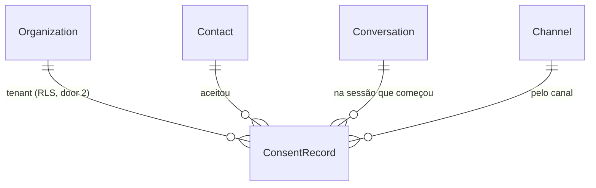

# Public Chat API

> F3, feature 1 de 5 (`public-chat-api` → `visitor-realtime` → `inbox-api` → `web-chat-ui` → `inbox-web`, e o e2e no staging). Depende da F2 (`receiveInbound`, `Channel` Web Chat padrão, `publicChatKey`). Perfil: standard (tenant fora da sessão, consentimento, rate limit).

## Problem

O cliente final da corretora não tem por onde falar com ela. O link `/c/<publicChatKey>` já aparece em Configurações (F1), mas nenhuma rota o atende: a conversa só nasce em teste, com a mensagem injetada. Enquanto isso não existir, a F3 não tem o primeiro fluxo real (cliente fala → comercial responde), e cada corretora que divulga o link leva o cliente a uma página morta.

O canal é público e sem login, e três coisas não podem ficar para depois:
- o tenant sai de uma chave do link, um caminho que o `database.ts` ainda não tem (ADR-014, AD nova);
- o telefone é digitado, não verificado: quem digitar o telefone de outro cliente não pode ler o atendimento dele;
- a LGPD exige o aceite do aviso gravado no backend antes da primeira mensagem (§41).

Quando isso for entregue, o visitante abre o link, informa telefone, aceita o aviso, passa pelo Turnstile e manda mensagens. Elas entram na fila humana do painel (sem IA: `QUEUE`, ADR-014) e aparecem no socket do painel como na F2. O visitante lê a própria sessão por consulta; o socket do visitante é a próxima feature.

## Flow

Reusa o `receiveInbound` da F2 (normalização E.164, `seq`, dedupe, reabertura, evento `message.created`), o padrão do `withInvitation` (a chave é a capacidade; o `organizationId` sai da linha), o fake de siteverify do `signup-gates.spec` e o `{ error: { code, message } }` de `shared/errors.ts`.

1. `GET /api/public/chat/:key` -> `channels` (exists) -> `organizations` (exists) `findPublicChat` lê `Organization` pela chave em `withPublicChatKey` (door 1, `infrastructure/database.ts`) -> `channels` devolve nome, cor, saudação, se há logo, `noticeVersion` e a site key do Turnstile
2. `POST /api/public/chat/:key/sessions` -> `channels` - Zod (telefone, `consent: true`, `noticeVersion`, `turnstileToken`, primeira mensagem com `clientMessageId`) -> siteverify do Turnstile -> `withPublicChatKey` resolve o tenant
3. `channels` -> `conversations` (exists) `receiveInbound` com o canal `WEB_CHAT` da organização e `externalId` derivado do `clientMessageId`; na mesma transação (door 3) o `onReceived` chama `recordConsent` do `contacts` (exists), que grava `ConsentRecord` (door 2) -> COMMIT -> `notify` (exists) empurra ao painel. Um início repetido (mesmo `clientMessageId`) devolve a mesma mensagem e um token novo; se a mensagem guardada é de outro telefone, `409`
4. `channels` assina o token do visitante (door 4) com `organizationId`, `contactId`, `conversationId` e `fromSeq` = `seq` da primeira mensagem -> `Set-Cookie` httpOnly com `Path=/api/public/chat/<key>`
5. `POST /api/public/chat/:key/messages` -> `channels` valida o cookie (assinatura, validade, organização da chave) -> `receiveInbound` com o telefone do contato do token -> a mensagem precisa cair na conversa do token
6. `GET /api/public/chat/:key/messages?after=<seq>` -> `channels` valida o cookie -> mensagens da conversa do token com `seq ≥ fromSeq` e `seq > after`, em `seq` crescente (door 5)
7. `GET /api/public/chat/:key/logo` -> `channels` resolve a organização pela chave e lê o logo pelo `readLogo` do `organizations` (exists), com `ETag`
8. rate limit (door 6) antes do handler: início por IP e por chave; mensagens por token

## Impact

| Front | What changes |
| --- | --- |
| domain | termo novo: **sessão do visitante**. É o token assinado de um navegador, vinculado a uma conversa e a um `fromSeq`, e não é linha no banco. Vive em `channels` |
| domain | termo novo: **aviso do Web Chat** (`WEB_CHAT_NOTICE_VERSION`). É a versão do aviso de privacidade que o visitante aceita, distinta dos Termos de Uso do painel (`terms`). O texto nasce na `web-chat-ui` |
| domain | `receiveInbound` ganha um passo opcional, executado dentro da própria transação (o consentimento). Os chamadores atuais (testes) não mudam |
| tenant | quarto caminho fora do tenant, `withPublicChatKey`. A política `tenant_isolation` de `Organization` ganha o ramo `publicChatKey = app.public_chat_key`. Quem depende dela hoje: `withUser` (troca de organização) e o `requireTenant`. O teste de schema e o `database.spec` cobrem os ramos atuais |
| config | em `NODE_ENV=production`, as duas chaves do Turnstile passam a ser obrigatórias em qualquer `SIGNUP_MODE`, não só em `self_serve`. O staging já tem as duas. Uma produção futura em `closed` sem chaves passa a não subir |
| dependency | `@fastify/rate-limit` 11.x, registrado com `global: false` (só as rotas públicas) |
| stored data | tabela nova `ConsentRecord`, vazia. Nada a migrar |

## Relations

Restrições de mão única:
- `ConsentRecord` com RLS `ENABLE` + `FORCE` e `tenant_isolation`;
- FKs compostas com `organizationId` (`onDelete: Restrict`), como `Conversation`;
- sem único: cada sessão iniciada grava um aceite (door 2).

## Surface

| Route | In | Out | Status |
| --- | --- | --- | --- |
| `GET /api/public/chat/:key` | params `key` (32 hex) | `{ name, brandColor, greeting, hasLogo, noticeVersion, turnstileSiteKey }` | `200`, `400`, `404`, `429` |
| `GET /api/public/chat/:key/logo` | params `key`; `If-None-Match?` | bytes da imagem, `Content-Type` do logo, `Cache-Control: public, no-cache`, `ETag` | `200`, `304`, `400`, `404`, `429` |
| `POST /api/public/chat/:key/sessions` | params `key`; body `phone`, `consent: true`, `noticeVersion`, `turnstileToken`, `clientMessageId` (uuid), `text` (1–4 000) | `201 { message: PublicMessage }` + `Set-Cookie` do visitante | `201`, `400`, `403`, `404`, `409`, `422`, `429` |
| `POST /api/public/chat/:key/messages` | params `key`; cookie do visitante; body `clientMessageId` (uuid), `text` (1–4 000) | `201 { message }` (nova) ou `200 { message }` (repetida) | `200`, `201`, `400`, `401`, `403`, `404`, `429` |
| `GET /api/public/chat/:key/messages` | params `key`; cookie; query `after?` (inteiro ≥ 0) | `{ items: PublicMessage[] }` (até 100, `seq` crescente) | `200`, `400`, `401`, `404`, `429` |

`PublicMessage` = `id` · `seq` · `direction` · `author` (`CONTACT | AI | HUMAN | SYSTEM`) · `kind` · `text` · `sentAt`. Sem `authorUserId`, `deliveryStatus`, `conversationId` nem dado do contato.

De onde vem cada status:
- `400`: Zod `.strict()`;
- `401 VISITOR_SESSION_REQUIRED`: cookie ausente, adulterado, vencido ou de outra organização;
- `403`: `TURNSTILE_FAILED` e o `ORIGIN_NOT_ALLOWED` que já existe (AD-004) nos `POST`;
- `404 NOT_FOUND`: chave desconhecida;
- `409 CONFLICT` (acrescentado no build): o `clientMessageId` já guardado é de outra conversa (`POST /messages`) ou de outro telefone (`POST /sessions`);
- `422`: `INVALID_PHONE` (do `receiveInbound`) e `NOTICE_OUTDATED`;
- `429 RATE_LIMITED`.

## Landing

| One-way door | Literal shape | Alternative rejected |
| --- | --- | --- |
| 1. Tenant pela chave do link (AD-018) | `db.withPublicChatKey(key, tx => …)` faz `set_config('app.public_chat_key', key, true)`. A política de `Organization` libera a linha quando `"publicChatKey" = NULLIF(current_setting('app.public_chat_key', true), '')`. Lê só `Organization`: o `organizationId` sai da linha e o resto roda em `withTenant` | ler a organização com `withoutTenant` e uma exceção na política: abriria a tabela a qualquer transação sem tenant; passar o `organizationId` na URL: o tenant viria do request (ADR-004) |
| 2. `ConsentRecord` | tabela do `contacts`: `contactId`, `conversationId`, `channelId`, `noticeVersion` (texto), `acceptedAt`. RLS + FKs compostas. Uma linha por sessão iniciada | coluna `consentedAt` em `Contact`: perde a versão e o canal de cada aceite e não serve ao opt-in do WhatsApp (F9), que grava o mesmo registro |
| 3. Aceite atômico com a mensagem | `receiveInbound(deps, ctx, input, { onReceived?: (tx, result) => Promise<void> })`, chamado depois do `INSERT` da mensagem e antes do COMMIT; o duplicado não chama | gravar o aceite numa segunda transação: uma falha entre as duas deixa a mensagem sem o registro que a LGPD pede antes dela |
| 4. Token do visitante (AD-018) | cookie `bens_visitor`, `HttpOnly`, `SameSite=Lax`, `Secure` em produção, `Path=/api/public/chat/<key>`, `Max-Age` 30 dias. Valor `v1.<payload base64url>.<HMAC-SHA256>`, payload `{ o, ct, cv, fs, exp }`. A chave é derivada do `BETTER_AUTH_SECRET` com o rótulo `visitor-token` (sem env nova). Sem estado no banco | tabela `VisitorSession`: revogação que nenhum requisito pede (corte + só a última sessão, recusado pelo usuário); `Path=/api/public/chat` para todos os links: dois links de corretoras diferentes no mesmo navegador se sobrescreveriam |
| 5. Corte por `seq` (ADR-014, decisão do usuário) | o visitante lê só `seq ≥ fromSeq` da conversa do token, com `after` em `seq` crescente. Duas sessões no mesmo telefone veem as mensagens novas uma da outra, nunca o que veio antes de cada início | conversa nova por sessão (o que Zendesk e Chatwoot fazem): quebra `Conversation_one_open` do ADR-013 e duplica o contato no inbox; cursor pelo `id` como no painel: o visitante retoma pelo último `seq` que viu, que também é o que o socket da próxima feature entrega |
| 6. `@fastify/rate-limit` | dependência nova, `global: false`, em memória. Limites: início 5/min por IP e 60/min por chave; `POST messages` 20/min por token; os `GET` 120/min por IP. Resposta `429 { error: { code: 'RATE_LIMITED' } }` | limitador próprio: o plugin já trata janela, cabeçalhos e o `429`; Redis: fora do MVP (ADR-002) |
| 7. `externalId` do Web Chat | `webchat:<clientMessageId>`: o reenvio da mesma mensagem cai no dedupe da F2 | sem `externalId`: um reenvio do navegador após timeout duplicaria a mensagem |

- Nada mais nesta mudança é difícil de reverter.

## Criteria

### S1: Abrir o link e iniciar a sessão (P1)

O visitante informa telefone e aceite, manda a primeira mensagem, e ela chega ao painel na fila.

**Acceptance Criteria**

1. WHEN `GET /api/public/chat/:key` recebe a chave de uma organização THEN the system SHALL devolver `name`, `brandColor`, `greeting`, `hasLogo`, `noticeVersion` igual a `WEB_CHAT_NOTICE_VERSION` e `turnstileSiteKey` dessa organização
2. IF a chave não pertence a nenhuma organização THEN as cinco rotas SHALL responder `404 NOT_FOUND`
3. WHEN `POST /sessions` recebe dados válidos THEN the system SHALL criar a mensagem `INBOUND` de autor `CONTACT` na conversa `WEB_CHAT` do contato daquele telefone (E.164) e responder `201` com essa mensagem
4. WHEN `POST /sessions` cria a conversa THEN ela SHALL nascer com `status = OPEN` e `handler = QUEUE`
5. WHEN `POST /sessions` responde `201` THEN the system SHALL ter gravado um `ConsentRecord` com o contato, a conversa, o canal `WEB_CHAT` e o `noticeVersion` aceito
6. IF a gravação da mensagem falha THEN the system SHALL não gravar o `ConsentRecord`; IF a gravação do `ConsentRecord` falha THEN the system SHALL não gravar a mensagem
7. WHEN `POST /sessions` responde `201` THEN the system SHALL enviar `Set-Cookie: bens_visitor` com `HttpOnly`, `SameSite=Lax`, `Path=/api/public/chat/<key>` e `Max-Age=2592000` (e `Secure` quando `NODE_ENV=production`)
8. WHEN a sessão começa THEN a mensagem SHALL chegar à room `conversation:<id>` do painel como evento `message.created`, como na F2
9. The system SHALL gravar a mensagem e o aceite na organização dona da chave, e nunca na organização de outra chave (`withTwoTenants`)

### S2: Recusar o início inválido (P1)

**Acceptance Criteria**

10. IF `consent` não é `true` THEN `POST /sessions` SHALL responder `400` e não gravar contato, conversa, mensagem nem aceite
11. IF `noticeVersion` difere de `WEB_CHAT_NOTICE_VERSION` THEN `POST /sessions` SHALL responder `422 NOTICE_OUTDATED` e não gravar nada
12. IF o telefone não é válido THEN `POST /sessions` SHALL responder `422 INVALID_PHONE` e não gravar nada
13. WHERE `TURNSTILE_SECRET_KEY` está configurada, IF o siteverify recusa o token THEN `POST /sessions` SHALL responder `403 TURNSTILE_FAILED` e não gravar nada
14. WHERE `TURNSTILE_SECRET_KEY` está configurada, WHEN o siteverify aceita THEN `POST /sessions` SHALL ter enviado ao siteverify o segredo e o `turnstileToken` do body
15. IF `NODE_ENV=production` e falta `TURNSTILE_SECRET_KEY` ou `TURNSTILE_SITE_KEY` THEN the system SHALL recusar a configuração no boot, em qualquer `SIGNUP_MODE`
16. IF o body tem campo desconhecido, `text` vazio ou com mais de 4 000 caracteres, ou `clientMessageId` não é UUID THEN as rotas `POST` SHALL responder `400`

### S3: Conversar dentro da sessão (P1)

**Acceptance Criteria**

17. WHEN `POST /messages` chega com um cookie válido THEN the system SHALL gravar a mensagem na conversa do token, com o telefone do contato do token, e responder `201`
18. WHEN `POST /messages` repete um `clientMessageId` já gravado naquela conversa THEN the system SHALL responder `200` com a mensagem original e não criar outra
19. IF o `clientMessageId` repetido pertence a outra conversa THEN `POST /messages` SHALL responder `409 CONFLICT` e não revelar a outra mensagem
20. WHEN a conversa do token está `CLOSED` e o visitante escreve THEN the system SHALL reabrir a mesma conversa (regra da F2) e o cookie SHALL continuar válido
21. IF o cookie falta, foi adulterado, venceu ou foi emitido pela chave de outra organização THEN `POST /messages` e `GET /messages` SHALL responder `401 VISITOR_SESSION_REQUIRED`

### S4: Ler só a própria sessão (P1)

**Acceptance Criteria**

22. WHEN `GET /messages` é chamado THEN the system SHALL devolver as mensagens da conversa do token com `seq ≥ fromSeq`, em `seq` crescente, com os campos de `PublicMessage` e nenhum outro
23. WHEN o telefone já tem uma conversa com mensagens antes do início da sessão THEN `GET /messages` SHALL omitir toda mensagem com `seq < fromSeq`
24. WHEN `after` é informado THEN `GET /messages` SHALL devolver só as mensagens com `seq > after`, até 100 por chamada
25. WHEN um humano responde pelo `sendMessage` da F2 THEN a resposta SHALL aparecer em `GET /messages` com `author = HUMAN` e sem `authorUserId`

### S5: Limitar abuso (P1)

**Acceptance Criteria**

26. WHEN o mesmo IP faz o 6º `POST /sessions` em 1 minuto THEN the system SHALL responder `429 RATE_LIMITED` sem gravar nada
27. WHEN a mesma chave recebe o 61º `POST /sessions` em 1 minuto, de IPs diferentes THEN the system SHALL responder `429 RATE_LIMITED`
28. WHEN o mesmo token faz o 21º `POST /messages` em 1 minuto THEN the system SHALL responder `429 RATE_LIMITED`
29. WHEN o mesmo IP faz a 121ª chamada a um `GET` público em 1 minuto THEN the system SHALL responder `429 RATE_LIMITED`
30. The system SHALL aplicar o rate limit só às rotas `/api/public/chat/*`, e nenhuma rota de `/api/v1` SHALL responder `429` por ele

### S6: Logo público (P2)

**Acceptance Criteria**

31. WHEN a organização tem logo THEN `GET /api/public/chat/:key/logo` SHALL devolver os bytes com o `Content-Type` do logo; sem logo, SHALL responder `404`

## Out of scope

| Excluded | Why |
| --- | --- |
| socket do visitante (namespace próprio) | `visitor-realtime`, próxima feature; aqui o visitante lê por consulta |
| assumir, responder e encerrar pelo painel; selo "telefone não verificado" no inbox | `inbox-api` / `inbox-web` |
| página `/c/:key`, texto do aviso, HTML Open Graph | `web-chat-ui` |
| IA respondendo | F4; sem IA a conversa nasce em `QUEUE` (ADR-014) |
| revogar a sessão de outro navegador; OTP do telefone | recusados: corte por seq (decisão do usuário) e ADR-014 |
| rotacionar o `publicChatKey` | nenhum requisito do MVP pede; a door 1 já permite |
| mensagem que não é texto no Web Chat | o formulário só envia texto; `UNSUPPORTED` é do WhatsApp (F9) |

## Assumptions

| Assumption | Chosen default | Rationale | Confirmed? |
| --- | --- | --- | --- |
| telefone já com conversa aberta | corte por `seq` (door 5) | pesquisa: Intercom, Zendesk, Crisp e Chatwoot prendem a sessão ao navegador, não ao identificador digitado; o corte faz isso sem quebrar o ADR-013 | y (usuário, 2026-09-25) |
| a primeira mensagem vai junto com o início | `POST /sessions` exige `text` | o `fromSeq` e o `ConsentRecord.conversationId` só existem com a mensagem; um início sem mensagem deixaria um aceite sem conversa | y (usuário, 2026-09-25: plano aprovado) |
| limites do rate limit | os da door 6 | não há número no handoff (§43); valores de widget público, ajustáveis sem migração | y (usuário, 2026-09-25: plano aprovado) |
| tamanho máximo da mensagem pública | 4 000 caracteres | o limite da F2 (65 536) é do domínio; no canal anônimo, 4 000 cobre qualquer mensagem de chat e limita o abuso | y (usuário, 2026-09-25: plano aprovado) |
| validade do cookie | 30 dias, sem renovação | cobre a volta do cliente na mesma semana; ao vencer, o visitante inicia outra sessão (novo aceite, sem ver o histórico) | y (usuário, 2026-09-25: plano aprovado) |
| chave do token | derivada do `BETTER_AUTH_SECRET` (HMAC com rótulo) | nenhuma env nova no `.env` do staging (AD-012); trocar o segredo derruba as sessões do painel e as de visitante juntas | y (usuário, 2026-09-25: plano aprovado) |
| Turnstile sem chave (dev e teste) | pula a verificação, como o cadastro | o boot de produção exige as chaves (AC 15) | y (usuário, 2026-09-25: plano aprovado) |
| versão do aviso | `WEB_CHAT_NOTICE_VERSION = '2026-09-25'`, constante no `channels` | o texto é da `web-chat-ui` e passa pela revisão jurídica antes do go-live, como os Termos | y (usuário, 2026-09-25: plano aprovado) |

**Open questions:**

| # | Kind | Question | Until answered |
| --- | --- | --- | --- |
| 1 | blocks go-live | texto do aviso de privacidade do Web Chat revisado pelo jurídico | a versão `2026-09-25` é provisória; entra com a revisão dos Termos (F11) |

## Observable

| Surface | Decision | Landing |
| --- | --- | --- |
| API `/api/public/chat/*` | response shape | Surface; AC 1, AC 3, AC 22 |
| API `/api/public/chat/*` | error shape and codes | existing - `{ error: { code, message } }`; AC 2, AC 10–13, AC 19, AC 21, AC 26 |
| API `/api/public/chat/*` | who may call it | anyone with the key (AC 2, AC 9); the visitor only reads their own session (AC 21–23) |
| API `/api/public/chat/*` | rate limit | AC 26–30 |
| API `/api/public/chat/*` | versioning | n/a - público, mas o único consumidor é a SPA deste repo, publicada junto com a API; sem `/v1`, como `/api/auth` |
| API `GET /messages` | empty state | AC 22 (a sessão sempre tem a própria primeira mensagem; `after` além do fim → `items: []`, AC 24) |

## Sources

- ADR-014 - tenant pelo `publicChatKey`, token de visitante, só a própria sessão, `ConsentRecord`, rate limit, Turnstile
- ADR-013 - uma conversa aberta por contato e canal, `seq`, dedupe por `externalId`
- decisão do usuário (2026-09-25) - corte por `seq`, depois da pesquisa de mercado (Intercom, Zendesk, Crisp, Chatwoot)
