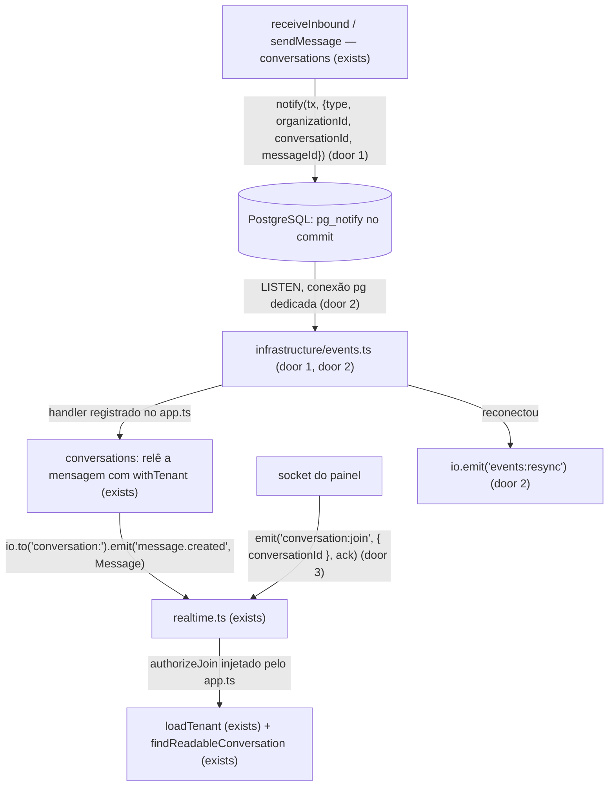

# Realtime events

> F2, feature 4 de 4. Depende da `conversation-core` (use cases que emitem) e da `conversations-api` (`findReadableConversation` autoriza a room). Fecha o critério da F2: mensagem injetada no socket do painel em menos de 2 s. Perfil: standard.

## Problem

Uma mensagem gravada hoje só aparece no painel se alguém recarregar a tela. O handoff pede até 2 s para cliente e corretor (§30, N4). Na F9 a mensagem do WhatsApp é gravada por outro processo (`whatsapp`), que não tem o Socket.IO; um aviso em memória no processo que grava não chega ao processo da API (ADR-012). E um aviso emitido antes do commit anunciaria uma mensagem que um rollback apagou.

A room `conversation:*` ainda não existe (`realtime.ts`: "arrives with the chat"). Sem uma autorização na entrada da room, qualquer socket autenticado da organização ouviria as conversas da carteira de outro comercial.

Quando isso for entregue, a mensagem gravada por qualquer processo chega ao socket de quem está com a conversa aberta, só depois do commit, e só para quem pode lê-la.

## Flow

Reusa o `realtime.ts` (Socket.IO com auth por cookie, rooms `user:` e `org:`), o `loadTenant` do `organizations`, o `findReadableConversation` da `conversations-api` e o `pg` que o `@prisma/adapter-pg` já instala.

1. O use case chama `events.notify(tx, event)` dentro da transação do dado (door 1). O PostgreSQL entrega o `NOTIFY` só no commit.
2. O processo da API mantém uma conexão `pg.Client` dedicada, fora do pool do Prisma, com `LISTEN` no canal (door 2). Cada payload é validado e entregue aos handlers registrados no `app.ts`.
3. O handler de `message.created` relê a mensagem pelo `conversations` (`withTenant` com o `organizationId` do payload; não achou → ignora) e emite o `Message` da `conversations-api` para `conversation:<id>`.
4. O socket entra na room com `conversation:join` e ack. O `realtime.ts` chama o `authorizeJoin` que o `app.ts` lhe entrega: `loadTenant` do momento (termos, membro ativo, papel) e `findReadableConversation`. Fora do tenant ou da carteira → ack `{ ok: false, status: 404, code: 'NOT_FOUND' }`.
5. Se a conexão do `LISTEN` cai, o `events.ts` reconecta com backoff; ao voltar, emite `events:resync` para todos os sockets, e o cliente recarrega pela API. Não há fila de eventos perdidos (ADR-012).

## Impact

| Front | What changes |
| --- | --- |
| domain | termo novo: **evento de app** - aviso transacional só com ids (`message.created`), canal `app_events`. Vive em `infrastructure/events.ts` |
| runtime | o `server.ts` abre uma conexão a mais ao PostgreSQL (o `LISTEN`), inicia depois da fila e fecha no shutdown |
| realtime | `realtime.ts` passa a aceitar `conversation:join`/`conversation:leave`; as rooms `user:` e `org:` não mudam |
| dependency | `pg` passa de `devDependencies` para `dependencies` do `apps/server` (mesma versão `8.23.0`, já instalada pelo `@prisma/adapter-pg`); nenhuma exceção no `pnpm-workspace.yaml` |
| tests | cada worker do Vitest usa o próprio canal (`app_events_<schema>`), como já faz com o schema do pg-boss |
| stored data | nada a migrar |

## Relations

`None - nenhum dado persistido; o evento vive só no NOTIFY`.

## Surface

Contrato do Socket.IO consumido pelo web deste repo (painel), mesmo path `/socket.io`.

| Route | In | Out | Status |
| --- | --- | --- | --- |
| `emit conversation:join` (cliente → server, com ack) | `{ conversationId }` (uuid, sem outros campos) | ack `{ ok: true }` ou `{ ok: false, status, code }` | `200` (`ok: true`), `400 VALIDATION_ERROR`, `404 NOT_FOUND` |
| `emit conversation:leave` (cliente → server, com ack) | `{ conversationId }` | ack `{ ok: true }` ou `{ ok: false, status, code }` | `200` (`ok: true`), `400 VALIDATION_ERROR` |

O ack de erro espelha o corpo de erro da API (`status` + `code` estável), para o web tratar os dois do mesmo jeito.

Eventos empurrados pelo server (sem entrada e sem ack):
- `message.created` → room `conversation:<id>`: `{ conversationId, message: Message }`, `Message` igual ao da `conversations-api`;
- `events:resync` → todos os sockets: `{}`.

## Landing

| One-way door | Literal shape | Alternative rejected |
| --- | --- | --- |
| 1. Evento transacional | `events.notify(tx, event)` → `SELECT pg_notify($canal, $json)` na transação; canal `app_events` (schema `public`) ou `app_events_<schema>` (testes); `event` validado por Zod `.strict()`: `{ type: 'message.created', organizationId: uuid, conversationId: uuid, messageId: uuid }`. Só ids, por construção sem PII e bem abaixo de 8 000 bytes; `notify` recusa payload fora do schema | emitir no Socket.IO depois do `await` do use case: não atravessa processos (F9) e anuncia o que um rollback apagou; evento pela fila do pg-boss: polling de segundos, fora dos 2 s (ADR-012); payload com o texto: PII no `NOTIFY` e limite de 8 KB |
| 2. `LISTEN` dedicado | `new pg.Client({ connectionString: DATABASE_URL })` (role `bens_app`), `LISTEN "<canal>"`; em `error` ou `end`: log `warn`, nova tentativa com espera de 1 s dobrando até 30 s, `LISTEN` de novo e `io.emit('events:resync', {})`. `pg` vira dependência de runtime | a conexão do Prisma: o pool devolve a conexão ao fim de cada query e não entrega notificações; `pg-listen` ou outra lib: dependência nova para ~40 linhas; guardar eventos perdidos: o banco é a fonte da verdade e o cliente recarrega (ADR-012) |
| 3. Entrada na room | `conversation:join` com ack; autorização a cada entrada (`loadTenant` + `findReadableConversation`), `realtime.ts` recebe `authorizeJoin(user, conversationId) => Promise<boolean>` pelas opções | entrar em todas as rooms da organização no `connection`: ignora a carteira; autorizar só no handshake: a carteira muda depois (transferência, atribuição) |

- Nada mais nesta mudança é difícil de reverter.

## Criteria

### S1: Evento só depois do commit (P1)

**Acceptance Criteria**

1. WHEN uma transação que chamou `notify` faz commit THEN the listener SHALL receber o evento com os mesmos `type`, `organizationId`, `conversationId` e `messageId`
2. WHILE a transação que chamou `notify` não fez commit, the listener SHALL não receber o evento
3. IF a transação que chamou `notify` faz rollback THEN the listener SHALL nunca receber o evento (um evento sentinela emitido depois chega sem ele antes)
4. IF `notify` recebe um evento com campo fora do schema (ex.: `text`) ou um id que não é UUID THEN the system SHALL lançar erro sem emitir, e a transação SHALL falhar
5. WHEN `receiveInbound` grava uma mensagem nova, ou `sendMessage` grava uma saída THEN the system SHALL emitir exatamente um `message.created` na mesma transação
6. IF `receiveInbound` recebe um `externalId` repetido (sequencial ou 10 em paralelo) THEN the system SHALL emitir exatamente um `message.created` no total

### S2: Mensagem no painel em menos de 2 s (P1)

**Acceptance Criteria**

7. WHEN um usuário que pode ler a conversa entra na room e uma mensagem é injetada por `receiveInbound` THEN o socket dele SHALL receber `message.created` com o `Message` completo (`id`, `seq`, `text`…) em menos de 2 s, num teste com server HTTP e cliente Socket.IO reais
8. WHEN uma mensagem é gravada numa conversa THEN um socket da mesma organização que não entrou na room dela SHALL não receber `message.created`
9. WHEN um socket entra na room de uma conversa que pode ler THEN o ack SHALL ser `{ ok: true }`
10. IF o socket pede a room de uma conversa de outra organização, ou fora da carteira do COMMERCIAL (conversa `HUMAN` de B com contato de B) THEN o ack SHALL ser `{ ok: false, status: 404, code: 'NOT_FOUND' }` e o socket SHALL não receber os eventos dela
11. WHEN um COMMERCIAL pede a room de uma conversa em `QUEUE` cujo contato é de outro comercial THEN o ack SHALL ser `{ ok: true }`
12. IF o socket não tem organização ativa, ou o usuário tem termos pendentes THEN `conversation:join` SHALL responder `{ ok: false, status: 404, code: 'NOT_FOUND' }`
13. IF o payload de `conversation:join` não é `{ conversationId: uuid }` (campo a mais, id inválido, ausente) THEN o ack SHALL ser `{ ok: false, status: 400, code: 'VALIDATION_ERROR' }`
14. WHEN o socket emite `conversation:leave` THEN the system SHALL tirá-lo da room, e as mensagens seguintes SHALL não chegar a ele

### S3: Queda do LISTEN (P2)

**Acceptance Criteria**

15. WHEN a conexão do `LISTEN` é derrubada (`pg_terminate_backend`) THEN the system SHALL reconectar, e um evento emitido depois da volta SHALL chegar ao listener
16. WHEN o `LISTEN` volta depois de uma queda THEN the system SHALL emitir `events:resync` para todos os sockets conectados
17. The system SHALL registrar em log `warn` cada queda do `LISTEN`, sem o payload de eventos

## Out of scope

| Excluded | Why |
| --- | --- |
| avisos no nível da organização ou do usuário (`org:`, `user:`) para a lista do inbox | F3, com o inbox que os consome; as rooms já existem |
| namespace de visitante do Web Chat | F3 (ADR-014) |
| `NOTIFY` do runtime `whatsapp` | F9; o mesmo `events.notify` serve |
| tirar da room quem perdeu acesso depois de entrar | F5 (atribuição e transferência mudam a carteira); até lá o socket perde a room ao reconectar |
| indicador de digitação, presença, confirmação de leitura | fora do MVP (§30) |

## Assumptions

| Assumption | Chosen default | Rationale | Confirmed? |
| --- | --- | --- | --- |
| o que o socket recebe | o `Message` completo, relido pelo server com `withTenant`, só para a room autorizada | "o socket relê o que precisar" (prompt da F2); o `NOTIFY` continua só com ids | y (2026-09-24) |
| tipos de evento da F2 | só `message.created`; mudanças de `status`/`handler` sem mensagem (take, close) ganham tipo com as rotas da F3/F5 | a F2 só muda a conversa junto com uma mensagem | y (2026-09-24) |
| rooms `org:` e `user:` | não recebem `message.created` na F2 | ids de conversa fora da carteira não vazam para a room da organização; a F3 decide o aviso do inbox com a carteira | y (2026-09-24) |

**Open questions:** none - all resolved or logged above.

## Observable

| Surface | Decision | Landing |
| --- | --- | --- |
| socket `conversation:join` | response shape and error codes | AC 9, AC 10, AC 12, AC 13 |
| socket `conversation:join` | who may call it | AC 10, AC 11, AC 12 |
| socket `message.created` | response shape | AC 7 |
| socket (todos) | versioning | n/a - o único consumidor é o web deste repo, publicado junto com o server |
| socket (todos) | rate limit | n/a - socket autenticado do painel, uma entrada por conversa aberta; o MVP não limita o painel |
| socket `events:resync` | what the client does next | AC 16; o cliente recarrega pela API (ADR-012) |

## Sources

- ADR-012 - `NOTIFY` transacional com payload só de ids, `LISTEN` na API, eventos perdidos na queda
- ADR-006 - Socket.IO no processo da API, rooms `org:`, `user:`, `conversation:`
- handoff §30 - até 2 s
