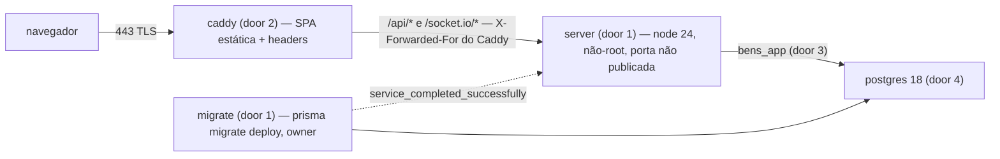

# Staging

> Fase 3, feature 3 de 5 (ver `.specs/STATE.md`). Entrega os artefatos de deploy validados
> localmente em HTTPS e **para antes do deploy**: acesso à VPS, domínio, push e qualquer ação
> remota dependem de ok explícito do usuário.

## Problem

O app só roda com `pnpm dev`: não existe imagem do server, imagem do web, proxy com TLS nem
compose de produção. Tudo o que depende de estar atrás de um proxy HTTPS — cookie `Secure` com
prefixo `__Secure-`, IP do cliente vindo do proxy, `Origin` real do navegador, headers de
segurança da SPA, WebSocket em `wss` — nunca foi exercitado, e o roadmap marca exatamente isso
como o risco da Fase 3 ("validar cedo"). O role `bens_app` só existe com a senha de dev,
criado por um SQL com a senha no texto. Quem paga: cada fase seguinte, que deveria ser validada
num ambiente real e hoje não tem onde.

Com isso pronto, `docker compose -f docker-compose.prod.yml up` sobe Caddy + SPA + server +
Postgres + migrate numa máquina qualquer, em HTTPS e mesma origem, e o ciclo de login do e2e
passa contra ele.

## Flow

Reusa o build existente de cada app (`tsc -p tsconfig.build.json`, `vite build`), o
`prisma migrate deploy` e o mesmo SQL de role da Fase 2 (agora parametrizado); o e2e de
`auth-web` é a prova de ponta a ponta, rodado contra `https://localhost`.

1. `caddy` termina TLS (`SITE_ADDRESS`), serve `dist/` com fallback para `index.html` e manda `/api/*` e `/socket.io/*` para `server:3001`, sobrescrevendo `X-Forwarded-For` com o IP do cliente
2. `server` sobe com `TRUST_PROXY=true`, `NODE_ENV=production`, `APP_URL=https://$SITE_ADDRESS`, conectado como `bens_app`; o boot recusa role com bypass (exists)
3. `migrate` roda uma vez antes do `server`, com a URL do owner
4. `postgres` cria `bens_app` no primeiro boot do volume pelo script de provisionamento (door 3), que também pode ser rodado à mão num banco existente

## Impact

| Front | What changes |
| --- | --- |
| domain | novo termo: **staging** — o mesmo `docker-compose.prod.yml` numa VPS com outro `SITE_ADDRESS`; nada no código distingue staging de produção além do `.env` |
| infra | `docker/postgres/init/01-app-role.sql` vira script parametrizado por `APP_DB_PASSWORD`; `docker-compose.yml` (dev) e o CI passam a senha `bens_app` explicitamente |
| infra | arquivos novos: `apps/server/Dockerfile`, `apps/web/Dockerfile`, `Caddyfile`, `docker-compose.prod.yml`, `.env.prod.example`, `docker-compose.staging-local.yml` (validação local: Mailpit do host e Postgres em `127.0.0.1:55432`), `.dockerignore`, `scripts/staging-smoke.mjs` (um passo por check), `docs/runbooks/staging.md` |
| infra | as portas do Caddy vêm de `HTTP_PORT`/`HTTPS_PORT` (padrão 80/443); a validação local usa 8080/8443, porque a 443 desta máquina está ocupada por outro container |
| stored data | nada a migrar; em produção o volume nasce vazio |

## Relations

None - no stored-data shape change

## Surface

| Route | In | Out | Status |
| --- | --- | --- | --- |
| `https://$SITE_ADDRESS/*` (SPA) | qualquer caminho sem arquivo | `index.html` | `200` |
| `https://$SITE_ADDRESS/assets/*` | arquivo com hash | o arquivo, `Cache-Control: public, max-age=31536000, immutable` | `200`, `404` |
| `https://$SITE_ADDRESS/api/*`, `/socket.io/*` | repassado ao server | resposta do server | os do server; `502` com o server fora |
| `http://$SITE_ADDRESS/*` | — | redirect para `https` | `308` |

## Landing

| One-way door | Literal shape | Alternative rejected |
| --- | --- | --- |
| 1. imagem do server | `apps/server/Dockerfile` multi-stage sobre `node:24-slim`: `pnpm install --frozen-lockfile` → `prisma generate` → `tsc -p tsconfig.build.json` → `pnpm deploy --prod` para `/app`; target `runtime` com `USER node`, `CMD ["node", "dist/server.js"]`; target `migrate` com o Prisma CLI e `CMD ["prisma", "migrate", "deploy"]` | uma imagem só com o Prisma CLI no runtime - leva ferramenta de migração e devDependencies para o processo que atende request |
| 2. imagem do web = Caddy | `apps/web/Dockerfile`: stage `node:24-slim` roda `vite build`; stage final `caddy:2.10-alpine` com `dist/` em `/srv` e o `Caddyfile` em `/etc/caddy/Caddyfile` | container Node para a SPA - runtime desnecessário (ADR-008) |
| 3. provisionamento do role da aplicação | `docker/postgres/init/01-app-role.sh`: `psql -v ON_ERROR_STOP=1 -v app_password="$APP_DB_PASSWORD"` com o SQL atual, trocando a senha literal por `:'app_password'`; falha se `APP_DB_PASSWORD` estiver vazio; idempotente (`CREATE` se não existe, senão `ALTER ROLE … PASSWORD`) | senha literal no SQL - a de produção iria para o git; provisionar à mão no psql - não reprodutível |
| 4. compose de produção | serviços `caddy` (portas `80` e `443`, volumes `caddy_data`/`caddy_config`), `server` (sem `ports`, `restart: unless-stopped`, healthcheck em `/api/health`), `migrate` (one-shot, `depends_on: postgres healthy`), `postgres:18-alpine` (volume, sem `ports`); `server` depende de `migrate: service_completed_successfully`; segredos só por `.env` (`env_file`) | publicar a porta do server ou do Postgres - `TRUST_PROXY=true` só é seguro se ninguém além do Caddy alcança o server |
| 5. headers da SPA no Caddy | `Strict-Transport-Security: max-age=31536000; includeSubDomains`, `X-Content-Type-Options: nosniff`, `Referrer-Policy: strict-origin-when-cross-origin`, `X-Frame-Options: DENY`, `Content-Security-Policy: default-src 'self'; script-src 'self'; style-src 'self' 'unsafe-inline'; img-src 'self' data:; font-src 'self'; connect-src 'self'; frame-ancestors 'none'; base-uri 'self'; form-action 'self'` (a exceção de `/embed/*` e o domínio do Turnstile entram nas features que precisarem) | CSP no `index.html` via meta - não cobre `frame-ancestors` |
| 4b. portas configuráveis (achado no build) | `http_port {$HTTP_PORT:80}` / `https_port {$HTTPS_PORT:443}` no `Caddyfile` e `ports: '${HTTP_PORT:-80}:${HTTP_PORT:-80}'`, `'${HTTPS_PORT:-443}:${HTTPS_PORT:-443}'` (+ `/udp`) no compose | portas fixas 80/443 (door 4) - a validação local não sobe numa máquina com a 443 ocupada; mapear 8443→443 só no host faria o Caddy anunciar a porta errada |

- Nothing else in this change is hard to reverse

## Criteria

### S1: A pilha sobe em HTTPS numa máquina limpa (P1)

**Acceptance Criteria**

1. WHEN `docker compose -f docker-compose.prod.yml -f docker-compose.staging-local.yml up -d --build` roda com o `.env` de exemplo preenchido e `SITE_ADDRESS=localhost` THEN `migrate` SHALL terminar com código 0 antes de `server` iniciar, e `curl -k https://localhost/api/health` SHALL responder `200 {"status":"ok"}`
2. WHEN `https://localhost/login` (rota sem arquivo) é pedido THEN o Caddy SHALL responder `200` com o `index.html`
3. WHEN `http://localhost/` é pedido THEN o Caddy SHALL responder `308` para `https://localhost/`
4. The `server` e o `postgres` SHALL não ter porta publicada no host (`docker compose port` sem saída para os dois)
5. The processo do `server` SHALL rodar como usuário não-root (`docker compose exec server id -u` ≠ `0`)
6. WHEN o volume do Postgres é novo THEN o role `bens_app` SHALL existir com `NOSUPERUSER NOBYPASSRLS` e a senha de `APP_DB_PASSWORD`; IF `APP_DB_PASSWORD` está vazio THEN o script de provisionamento SHALL sair com código ≠ 0 sem criar o role
7. WHEN o script de provisionamento roda de novo com outra senha THEN SHALL terminar com código 0 e o role SHALL aceitar só a senha nova

**Independent test:** `docker compose … up -d --build` seguido de `curl -k https://localhost/api/health`.

### S2: Cookie, Origin e IP atrás do Caddy (P1)

**Acceptance Criteria**

8. WHEN o login responde por `https://localhost` THEN o `set-cookie` da sessão SHALL ter nome com prefixo `__Secure-`, `Secure`, `HttpOnly`, `SameSite=Lax`, `Path=/` e nenhum `Domain`
9. IF um `POST https://localhost/api/auth/sign-in/email` chega com `Origin: https://evil.example` THEN a resposta SHALL ser `403`
10. WHEN 11 tentativas de login vêm do mesmo cliente, cada uma com um `X-Forwarded-For` diferente forjado pelo cliente THEN a 11ª SHALL receber `429` (o Caddy sobrescreve o header e o bucket é o IP real)
11. WHEN `GET https://localhost/api/docs` é pedido THEN a resposta SHALL ser `404` (`NODE_ENV=production`)
12. WHEN uma página da SPA é servida THEN a resposta SHALL ter os headers do door 5 com os valores literais

**Independent test:** script `scripts/staging-smoke.sh` com `curl -k` checando 8 a 12.

### S3: O ciclo de login passa em HTTPS (P1)

**Acceptance Criteria**

13. WHEN `E2E_BASE_URL=https://localhost pnpm e2e` roda contra a pilha local (Mailpit do `staging-local` para os e-mails) THEN os cenários de cadastro, verificação, login, logout e reset de `auth-web` SHALL passar
14. WHEN o navegador logado abre o socket em `wss://localhost/socket.io` THEN a conexão SHALL ser aceita

**Independent test:** `E2E_BASE_URL=https://localhost pnpm e2e`.

### S4: Runbook do staging (P2)

**Acceptance Criteria**

15. The `docs/runbooks/staging.md` SHALL listar, em ordem, os comandos para subir o staging numa VPS (DNS, `.env`, `docker compose … up -d --build`, verificação) e o rollback, sem executar nenhum deles

**Independent test:** leitura do runbook.

## Out of scope

| Excluded | Why |
| --- | --- |
| deploy na VPS, DNS, push, publicação de imagem | exige acesso e ok explícito do usuário; bloqueia go-live (Open questions) |
| pipeline de deploy por tag e GHCR | ADR-008; entra quando houver alvo (Fase 13 ou quando o usuário liberar a VPS) |
| backup `pg_dump` → R2, Sentry, monitor de uptime, `/api/ready` | Fases 12–13 |
| MinIO/R2 no compose de produção | storage externo (R2) por `.env`; nada nesta fase grava arquivo |

## Assumptions

| Assumption | Chosen default | Rationale | Confirmed? |
| --- | --- | --- | --- |
| build das imagens no staging | `docker compose … up -d --build` na própria VPS | sem registry até existir pipeline de deploy; o ADR-008 (GHCR por tag) continua sendo o destino | n |
| TLS local | `SITE_ADDRESS=localhost` com a CA interna do Caddy e `curl -k`/`ignoreHTTPSErrors` no e2e | valida `Secure`/`__Secure-` sem domínio real | n |
| e-mail no staging | `SMTP_URL` do Resend no `.env` da VPS; localmente, Mailpit via `docker-compose.staging-local.yml` | o compose de produção não leva Mailpit | n |
| versão do Caddy | `caddy:2.10-alpine` (ou a estável mais recente na hora do build) | imagem oficial | n |

**Open questions:**

| # | Kind | Question | Until answered |
| --- | --- | --- | --- |
| 1 | blocks go-live | acesso SSH à VPS e o domínio do staging | o staging não sobe; o critério da fase "login funcionando no staging em HTTPS" fica provado só localmente (S3) |

## Observable

| Surface | Decision | Landing |
| --- | --- | --- |
| comando `docker compose … up` | o que acontece quando falha no meio | AC 1 (`migrate` falho impede o `server`) |
| comando script de provisionamento | exit codes e saída ao falhar | AC 6, 7 |
| comando `scripts/staging-smoke.sh` | saída e exit code | AC 8–12: imprime cada verificação e sai ≠ 0 na primeira falha |
| documento `docs/runbooks/staging.md` | estrutura e próximo passo | AC 15 |
| API via Caddy | error shape | existing - do server; `502` do Caddy com o server fora |
| SPA via Caddy | rate limit, versionamento | n/a - estático; rate limit é do server (`auth-core`) |

## Sources

- `docs/decisions/ADR-008-deployment.md` - Caddy + SPA + server + postgres + migrate, mesma origem
- `docs/architecture.md` §10 - Dockerfile multi-stage, runtime não-root; §7 headers da SPA no Caddy
- `prompts/prompt-03.md` - entregar compose + Caddyfile validados localmente e parar antes do deploy
