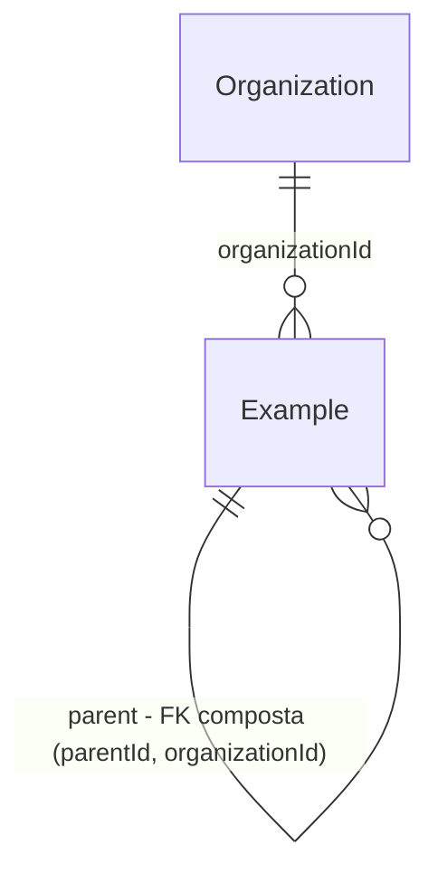

# Tenant guard

> Plano retroativo: o guard foi implementado na Fase 2 (`5111556`) sem plano. Este documento fixa o
> que ele precisa garantir; o que o código atual não garante vira trabalho de build.

## Problem

Hoje, o isolamento entre corretoras depende de cada repository lembrar de filtrar `organizationId`
(ADR-004, camada 2). Um filtro esquecido numa query, ou um id vindo do input usado num `connect`,
lê ou grava dados de outra corretora sem nenhum erro — o legado já teve esse vetor mascarado pelo
uso de `prismaAdmin` em 28 arquivos. Quem paga é a corretora cujos dados vazam (dado pessoal de
cliente, LGPD) e o produto, que perde a confiança de um cliente B2B por um único incidente. Não há
incidente no v2 ainda: o banco está vazio e nenhum módulo de domínio existe.

Com isso pronto, uma query tenant-scoped sem o filtro de tenant falha ruidosamente (500) em dev,
teste e produção, antes de qualquer SQL rodar, em vez de vazar dados em silêncio.

## Flow

Reusa a extensão de query do próprio Prisma (`$extends`) e o error handler existente (erro não
mapeado → 500 com `requestId`); não há segundo client nem wrapper de repository.

1. repository/use case chama `db.<model>.<op>(args)` ou `tx.<model>.<op>(args)` -> `infrastructure/database.ts` (exists) - a extensão `tenant-guard` recebe `model`, `operation`, `args`
2. `createTenantGuard` (exists) - classifica o model pelo datamodel de runtime (door 2); se tenant-scoped, valida `where`, `data` e as escritas aninhadas
3. se válido: a query segue inalterada -> PostgreSQL via `@prisma/adapter-pg` (exists); se inválido: lança `TenantGuardError` antes do SQL
4. out: o resultado da query, ou `TenantGuardError` -> `shared/errors.ts` (exists) -> `500 INTERNAL_ERROR` com `requestId`, logado como `unhandled error`

## Impact

| Front | What changes |
| --- | --- |
| domain | novo termo: **model tenant-scoped** — todo model Prisma com o campo `organizationId`. Vive em `infrastructure/database.ts`. Todo model futuro com esse campo entra no guard automaticamente, sem registro |
| domain | convenção de escrita: `create` de model tenant-scoped usa o escalar `organizationId`, nunca `organization: { connect }` — todo repository futuro segue isso |
| domain | jobs que varrem todas as orgs (`retention.purge`, crons de billing, `policies.expire`) não podem fazer `deleteMany`/`findMany` global: iteram por organização com `RequestContext` de sistema, como a arquitetura já prevê (§5) — quem branch nisso: os `*.jobs.ts` das Fases 5, 8, 10 e 11 |
| domain | listagens de super-admin entre tenants (Fase 12) passam pelo mesmo guard: precisam iterar por org ou consultar só modelos não tenant-scoped |
| stored data | nada a migrar — a tabela `Example` (única tenant-scoped) já existe na `init` |

## Relations

One-way constraints: toda relação entre dois models tenant-scoped referencia `(id, organizationId)`
com `@@unique([id, organizationId])` no alvo (door 4). No columns and no
types here.

## Surface

None - nada consumido fora do processo; o guard não expõe rota. A única superfície externa é a
resposta 500 do error handler, que já existe e não muda.

## Landing

| One-way door | Literal shape | Alternative rejected |
| --- | --- | --- |
| guard como extensão do client único | `client.$extends({ name: 'tenant-guard', query: { $allModels: { $allOperations } } })`; `Database = ReturnType<typeof createDatabase>` é o único tipo de client exportado | RLS (ADR-004 rejeitou: role separada, bypass para jobs); wrapper por repository - depende de cada repository lembrar, o mesmo vetor que o guard fecha |
| classificação pelo datamodel interno do Prisma | `Reflect.get(client, '_runtimeDataModel')` validado com Zod; tenant-scoped = tem campo `organizationId` | lista manual de models - falha aberta quando alguém esquece um model novo; `@prisma/internals getDMMF` - dependência pesada só para metadados |
| escrita de create só pelo escalar | `data: { organizationId: ctx.organizationId, … }` | aceitar `organization: { connect }` - duas formas para validar, e o `connect` de Organization não é tenant-filtrável |
| FK composta entre models tenant-scoped | `@relation(fields: [xId, organizationId], references: [id, organizationId])` + `@@unique([id, organizationId])` no alvo | FK simples por `id` - permite um filho de outra org ligado a um pai desta org, e o `include` o traria; FK composta só nas relações críticas (texto anterior do ADR-004) - depende de alguém julgar o que é crítico |

- Nothing else in this change is hard to reverse

## Criteria

### S1: Toda operação de topo em model tenant-scoped carrega o tenant (P1)

Uma query sem `organizationId` falha antes do SQL; com ele, roda inalterada.

**Acceptance Criteria**

1. IF uma das operações `findUnique`, `findUniqueOrThrow`, `findFirst`, `findFirstOrThrow`, `findMany`, `update`, `updateMany`, `updateManyAndReturn`, `delete`, `deleteMany`, `count`, `aggregate` ou `groupBy` chega a um model tenant-scoped sem `organizationId` string no `where` de topo (direto ou dentro de uma chave única composta como `id_organizationId`) THEN o guard SHALL lançar `TenantGuardError` e nenhum SQL SHALL ser executado
2. WHEN a operação traz `where.organizationId` string THEN o guard SHALL repassar `args` inalterado e a query SHALL retornar só linhas desse tenant
3. IF `where.organizationId` não é uma string literal (`{ equals }`, `{ in }`, `undefined`, ou só dentro de `AND`/`OR`/`NOT`) THEN o guard SHALL lançar `TenantGuardError`
4. IF `create`, `createMany` ou `createManyAndReturn` traz alguma linha de `data` sem `organizationId` string THEN o guard SHALL lançar `TenantGuardError`
5. IF um `upsert` não traz o tenant no `where` ou não traz `create.organizationId` string THEN o guard SHALL lançar `TenantGuardError`
6. IF uma operação fora das 17 listadas nos critérios 1, 4 e 5 chega a um model tenant-scoped THEN o guard SHALL lançar `TenantGuardError` (falha fechada)
7. IF `update`, `updateMany`, `updateManyAndReturn` ou `upsert.update` define `organizationId` em `data` THEN o guard SHALL lançar `TenantGuardError` (uma linha nunca muda de tenant) — **novo: o código atual não garante**
8. The guard SHALL deixar passar sem validação as operações em models sem `organizationId` (hoje `Organization`)

**Independent test:** `db.example.findMany({ where: { name } })` lança; com `organizationId` retorna só as linhas do tenant.

### S2: Referências aninhadas não cruzam tenants (P1)

Um id vindo do input não liga uma linha a outra corretora.

**Acceptance Criteria**

9. IF `data`, em qualquer profundidade (`create`, `createMany.data`, `update`, `upsert.create`, `upsert.update`, `connectOrCreate.create`), referencia um model tenant-scoped por `connect` ou `set` sem `organizationId` string THEN o guard SHALL lançar `TenantGuardError`
10. IF um `connectOrCreate` para model tenant-scoped não traz `organizationId` string no seu `where` THEN o guard SHALL lançar `TenantGuardError`
11. WHEN um `connect` com filtro de tenant aponta para uma linha de outro tenant THEN a operação SHALL falhar com Prisma `P2025` e nenhuma linha SHALL mudar
12. IF uma linha tenant-scoped referencia, pela FK de uma relação com outro model tenant-scoped, uma linha de outro tenant THEN o banco SHALL rejeitar a escrita com Prisma `P2003`
13. WHEN a raiz da leitura tem filtro de tenant THEN `include` e `select` de relações SHALL ser permitidos e retornar só linhas relacionadas do mesmo tenant

**Independent test:** `update` com `parent: { connect: { id: <id de outra org> } }` lança; com `organizationId` retorna `P2025`.

### S3: O guard cobre todo client e falha fechado (P1)

Não existe caminho do código de aplicação para um client sem guard.

**Acceptance Criteria**

14. The guard SHALL valer igualmente para `db` e para o `tx` recebido em `db.$transaction(async (tx) => …)`
15. IF o datamodel de runtime do Prisma está ausente ou não tem o formato esperado THEN `createDatabase` SHALL lançar erro na construção, antes de servir qualquer query
16. The model tenant-scoped SHALL ser toda e qualquer entidade do `schema.prisma` com o campo `organizationId` — sem lista manual

17. IF o `schema.prisma` declara uma relação entre dois models tenant-scoped cujos `fields` não incluem `organizationId` THEN o teste de schema SHALL falhar citando o model e o campo da relação

**Independent test:** `db.$transaction(tx => tx.example.findMany({ where: { name } }))` lança `TenantGuardError`.

## Out of scope

| Excluded | Why |
| --- | --- |
| SQL cru (`$queryRaw`, `$executeRaw`) | ADR-004 aceita o trade-off: SQL cru só em repository, com `organizationId` parametrizado, revisado em PR |
| guard sobre o próprio `Organization` (exigir `where.id`) | é a raiz do tenant; onboarding cria orgs e o super-admin lista todas — o escopo por `id: ctx.organizationId` fica no repository de `organizations` (Fase 4) |
| filtro de carteira (`scopeFor(ctx)`, COMMERCIAL) | é regra de repository (ADR-010), não de tenant; entra na Fase 4 |
| RLS no PostgreSQL | rejeitado no ADR-004, com gatilhos de adoção registrados lá |

## Assumptions

| Assumption | Chosen default | Rationale | Confirmed? |
| --- | --- | --- | --- |
| erro do guard para o cliente HTTP | `500 INTERNAL_ERROR` genérico com `requestId`, detalhes só no log | é bug de programação, não erro do usuário; a mensagem cita o model e não pode vazar | n |
| filtro de tenant aceito | só `organizationId` string literal no topo do `where` ou em chave única composta | uma regra verificável por inspeção sintática; `{ in: [...] }` seria multi-tenant por definição | n |
| leitura do metadado interno `_runtimeDataModel` | aceito, com validação Zod e versão do Prisma fixada (7.10.x) | alternativa pública não existe no Prisma 7; falha fechada no boot se sumir | n |

**Open questions:** none - all resolved or logged above.

Resolvidas com o usuário em 2026-09-21: FK composta em **toda** relação tenant→tenant, com teste de
schema (critério 17, door 4; ADR-004 atualizado); verificação no perfil `standard`.

## Observable

| Surface | Decision | Landing |
| --- | --- | --- |
| None - no user-facing surface | o guard só aparece como `500` pelo error handler existente | existing - `shared/errors.ts` (erro inesperado → 500 + `requestId`) |

## Sources

- `docs/decisions/ADR-004-tenant-isolation.md` - camadas 2–6 do isolamento, SQL cru fora do guard
- `docs/architecture.md` §7 "Isolamento de tenant" e §5 "Jobs" - jobs com contexto de sistema, sem bypass
