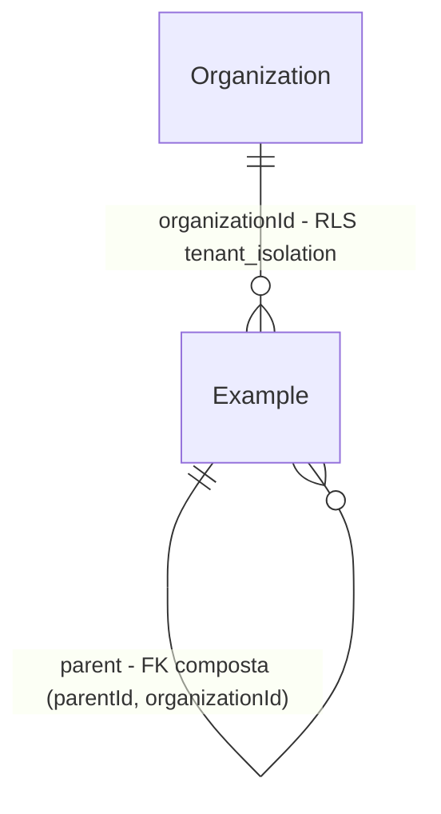

# Tenant RLS

> Substitui a feature `tenant-guard` (guard sintático do Prisma), aprovada pelo usuário em
> 2026-09-21 depois de 4 rodadas de verificação `FAIL` e de um spike de RLS. O ADR-004 é revisado
> neste mesmo plano.

## Problem

O isolamento entre corretoras hoje depende de um guard que inspeciona os argumentos de cada query
do Prisma e recusa formatos perigosos. Em 4 rodadas, um verificador independente achou mais de 25
formatos que passavam — `connect` pela relação, `set`, `_count: true`, `upsert` com dois tenants —
e cada correção fechou um formato para a rodada seguinte achar outro. O guard já tem 316 linhas,
735 linhas de teste, proíbe escrita aninhada e leitura através de `Organization`, e não cobre SQL
cru. Quem paga é a corretora cujos dados vazam (dado pessoal, LGPD) e cada módulo futuro, que
herda as restrições. O banco está vazio: não há incidente, e não há dado a migrar.

Com isso pronto, o PostgreSQL recusa ler ou gravar linha de outro tenant qualquer que seja a forma
da query, inclusive SQL cru, e os repositories deixam de repetir o filtro `organizationId`.

## Flow

Reusa o `$transaction` interativo do Prisma (o mesmo `tx` que o `queue.enqueue(tx)` já recebe) e o
RLS nativo do PostgreSQL; o guard sintático sai inteiro.

1. use case chama `deps.db.withTenant(ctx, async (tx) => …)` -> `infrastructure/database.ts` (exists) - abre a transação e executa `set_config('app.tenant_id', ctx.organizationId, true)` (door 3)
2. repository usa `tx.<model>.<op>(…)` sem filtro de tenant -> PostgreSQL conectado como o role da aplicação (door 1)
3. PostgreSQL (exists) - a política `tenant_isolation` de cada tabela tenant-scoped filtra leituras (`USING`) e recusa escritas de outro tenant (`WITH CHECK`); `organizationId` recebe o tenant por default (door 4)
4. `queue.enqueue(tx, …)` (exists) grava o job no schema do pg-boss na mesma transação, como o mesmo role
5. out: o resultado, ou erro do banco (`42501` → `P2039`, sem tenant → erro de `current_setting`) -> `shared/errors.ts` (exists) -> `500`

`server.ts` (exists) checa no boot que o role conectado não é superuser nem `BYPASSRLS` (door 1).

## Impact

| Front | What changes |
| --- | --- |
| domain | novo termo: **tabela tenant-scoped** — toda tabela com a coluna `organizationId`; tem RLS habilitado e forçado com a política `tenant_isolation`. Vive nas migrations |
| domain | convenção que muda: repository **não** filtra nem grava `organizationId`; recebe o `tx` de `withTenant` e escreve só a regra de negócio (carteira via `scopeFor` continua). Quem branch nisso: `CLAUDE.md` (regra de tenant), `architecture.md` §7, todo módulo das Fases 3+ |
| domain | acesso a tabela tenant-scoped fora de `withTenant` passa a **falhar** (não há tenant na sessão). Jobs e super-admin iteram as orgs e abrem `withTenant` por org (já era a regra da arquitetura §5) |
| domain | `TenantGuardError`, `createTenantGuard`, `readModels` e as restrições do guard (sem escrita aninhada, sem leitura via `Organization`) deixam de existir — nenhum código de domínio usa ainda |
| infra | duas conexões: `DATABASE_URL` com o role da aplicação (runtime, testes, pg-boss) e `MIGRATION_DATABASE_URL` com o owner (Prisma CLI) |
| stored data | nada a migrar (banco vazio). O banco de dev existente recebe o script de roles uma vez; o schema `pgboss` de dev, criado pelo owner, é recriado pelo role da aplicação |

## Relations

One-way constraints: toda tabela com `organizationId` tem RLS `ENABLE` + `FORCE` e a política
`tenant_isolation` (door 2); todo índice único de tabela tenant-scoped inclui `organizationId`
(door 5); FK composta em toda relação entre tabelas tenant-scoped (mantida do ADR-004). No columns
and no types here.

## Surface

None - nada consumido fora do processo; nenhuma rota muda. Erros do banco chegam como `500` pelo
error handler existente.

## Landing

| One-way door | Literal shape | Alternative rejected |
| --- | --- | --- |
| 1. role da aplicação sem bypass | role `bens_app` `LOGIN NOSUPERUSER NOBYPASSRLS` com DML nas tabelas de `public` (grants + `ALTER DEFAULT PRIVILEGES` para as tabelas futuras); owner `bens` só para migrations; boot recusa role com `rolsuper` ou `rolbypassrls`; script `docker/postgres/init/01-app-role.sql` (dev e CI) | conectar como owner e fazer `SET LOCAL ROLE` por transação - uma query fora de `withTenant` rodaria como owner e veria tudo (medido no spike) |
| 2. política por tabela | `ALTER TABLE "X" ENABLE ROW LEVEL SECURITY; ALTER TABLE "X" FORCE ROW LEVEL SECURITY; CREATE POLICY tenant_isolation ON "X" USING ("organizationId" = current_setting('app.tenant_id')::uuid) WITH CHECK (mesma expressão);` anexado à migration que cria a tabela | guard sintático no Prisma - 4 rodadas `FAIL`; extensão de query com `$transaction` por operação - ignora a transação interativa (doc do Prisma 7, issue #20678) e quebraria `enqueue(tx)` |
| 3. tenant por transação | `withTenant(ctx, fn)` = `$transaction(async (tx) => { await tx.$executeRaw\`SELECT set_config('app.tenant_id', ${ctx.organizationId}, true)\`; return fn(tx) })` | `SET` de sessão - vaza para a próxima query que reusar a conexão do pool |
| 4. `organizationId` por default | `organizationId String @default(dbgenerated("(current_setting('app.tenant_id'))::uuid")) @db.Uuid` | escalar obrigatório no `create` - repete o tenant em todo repository, que é o que esta mudança remove |
| 5. unicidade inclui o tenant | todo `@@unique`/`@unique` de tabela tenant-scoped contém `organizationId`; a chave primária não, porque o id é UUID v7 gerado no server e nunca vem do input (critério 18, ratificado pelo usuário na rodada 2) | unicidade global - checagens de unicidade ignoram RLS e revelariam se um valor existe em outro tenant |
| 7. FK para tabela sem RLS não propaga (rodada 2) | `@relation(fields: [organizationId], references: [id], onDelete: Restrict, onUpdate: Restrict)` em toda relação de model tenant-scoped com `Organization` | `ON DELETE CASCADE` - o cascade roda como owner e apagou os dados de B de dentro de `withTenant(A)`; tirar `DELETE`/`UPDATE` de `Organization` do `bens_app` - a Fase 4 precisa editar a org |
| 6. pg-boss no role da aplicação | o schema `pgboss` é criado e usado por `bens_app` (`GRANT CREATE ON DATABASE`) | pg-boss com a URL do owner - uma conexão com bypass dentro do processo |

- Nothing else in this change is hard to reverse

## Criteria

### S1: O banco isola os tenants (P1)

Dentro de `withTenant(A)`, nenhuma query vê ou grava linha de B, qualquer que seja a forma.

**Acceptance Criteria**

1. WHILE uma transação `withTenant(A)` está aberta, leituras de tabela tenant-scoped (`findMany` sem `where`, `findUnique` pelo id de uma linha de B, `count`, `aggregate`, `groupBy`, `include`/`_count` a partir de `Organization`, SQL cru) SHALL retornar só linhas de A
2. IF dentro de `withTenant(A)` uma escrita tenta gravar linha com `organizationId` de B (`create`, `update`/`updateMany` do escalar, `organization.connect`, `upsert` com `create` em B, escrita aninhada com `organizationId` de B) THEN nenhuma linha de B SHALL ser gravada: o banco recusa com Prisma `P2039` (`42501`), ou o Prisma grava a linha aninhada em A por herdar o tenant do pai (`children.create`)
3. IF dentro de `withTenant(A)` uma operação referencia uma linha de B por id (`connect`, `set`, `connectOrCreate.where`, a partir de `Example` ou de `Organization`) THEN ela SHALL não ligar nem mover linha de B (falha com `P2025`, `P2018`, `P2003` ou `P2039`; `set` e `connectOrCreate` concluem sem tocar em B, porque a linha de B é invisível)
4. IF uma query acessa tabela tenant-scoped fora de `withTenant` THEN o banco SHALL lançar erro e nenhuma linha SHALL ser lida ou gravada
5. WHEN `create` é chamado dentro de `withTenant(A)` sem `organizationId` THEN a linha SHALL ser gravada com `organizationId` = A
6. WHEN uma linha de A se liga a outra de A pela FK escalar (`parentId`) THEN o vínculo SHALL ser gravado; IF a outra linha é de B THEN o banco SHALL recusar com `P2003`

**Independent test:** dentro de `withTenant(A)`, `organization.findMany({ include: { examples: true } })` traz só os exemplos de A, e `example.updateMany({ data: { organizationId: B } })` falha com `P2039`.

### S4: Rodada 2 — caminhos que o Verifier abriu (P1)

A tabela sem RLS (`Organization`) não alcança dados de tenant, e nada troca o tenant da sessão.

**Acceptance Criteria**

15. IF um `delete` ou uma troca de `id` de uma `Organization` alcançaria linhas de tabela tenant-scoped (cascade executa como owner e ignora RLS) THEN o banco SHALL recusar (`P2003`) e as linhas do tenant SHALL continuar iguais — **rodada 2**
16. IF uma FK de tabela tenant-scoped para tabela sem `organizationId` usa `CASCADE`, `SET NULL` ou `SET DEFAULT` em `ON DELETE` ou `ON UPDATE` THEN o teste de schema SHALL falhar citando a FK — **rodada 2**
17. IF algum arquivo de `apps/server/src` fora de `infrastructure/database.ts` cita `app.tenant_id` THEN o teste de arquitetura SHALL falhar citando o arquivo — **rodada 2** (código da aplicação não troca o tenant da sessão)
18. IF um schema Zod de entrada exportado por um módulo (nome terminado em `Input`) aceita o campo `id` THEN o teste de arquitetura SHALL falhar citando o schema — **rodada 2 (aprovado pelo usuário)**: ids são UUID v7 gerados no server, premissa da exceção da chave primária no critério 12
19. IF o role conectado tem `BYPASSRLS` sem ser superuser THEN `assertRowSecurityApplies` SHALL lançar `RowSecurityBypassError`, como para superuser — **rodada 2**

**Independent test:** dentro de `withTenant(A)`, `organization.delete({ where: { id: B } })` falha e os exemplos de B continuam lá.

### S2: Nada roda com bypass (P1)

Não existe caminho do código de aplicação para uma conexão que ignore RLS.

**Acceptance Criteria**

7. IF o role de `DATABASE_URL` é superuser ou tem `BYPASSRLS` THEN o server SHALL sair com código 1 no boot, citando o role, antes de escutar a porta
8. The server, os testes e o pg-boss SHALL conectar com o role da aplicação; só o Prisma CLI (migrations) SHALL usar `MIGRATION_DATABASE_URL`
9. WHEN `queue.enqueue(tx, …)` é chamado dentro de `withTenant` THEN o job SHALL ser gravado na mesma transação (rollback → sem job)
10. IF a transação de `withTenant` sofre rollback THEN o `app.tenant_id` SHALL não valer para a próxima transação da mesma conexão (a próxima sem `withTenant` falha como no critério 4)

**Independent test:** apontar `DATABASE_URL` para o owner `bens` e ver o boot sair com código 1.

### S3: O schema não abre brecha (P1)

Toda tabela nova com tenant nasce protegida, ou o teste falha.

**Acceptance Criteria**

11. IF uma tabela com a coluna `organizationId` não tem RLS habilitado **e** forçado **e** a política `tenant_isolation` THEN o teste de schema SHALL falhar citando a tabela
12. IF um índice único de tabela tenant-scoped não inclui `organizationId` THEN o teste de schema SHALL falhar citando o índice
13. IF uma relação entre tabelas tenant-scoped não usa FK composta com `organizationId` THEN o teste de schema SHALL falhar citando a relação (critério mantido do `tenant-guard`)
14. The guard sintático (`createTenantGuard`, `TenantGuardError`, `readModels`) SHALL não existir mais em `apps/server/src`

**Independent test:** criar uma tabela de teste com `organizationId` e sem política faz o teste de schema falhar.

## Out of scope

| Excluded | Why |
| --- | --- |
| RLS em `Organization` | é a raiz do tenant: onboarding cria org sem tenant e a tela "minhas organizações" lê várias; a política depende de `app.user_id` e de `Member`, que chegam na Fase 4 |
| políticas de `Member`/`Invitation` e `app.user_id` | Fase 4 (tenancy); o padrão deste plano se aplica às duas |
| provisionamento do role em produção | Fase 13; o script de init é a referência e o boot recusa role errado |
| filtro de carteira (`scopeFor`) | regra de repository (ADR-010), Fase 4 |

## Assumptions

| Assumption | Chosen default | Rationale | Confirmed? |
| --- | --- | --- | --- |
| repositories deixam de filtrar `organizationId` | sim, o RLS é a garantia; os testes `withTwoTenants` provam por endpoint | é o que limpa o código; manter o filtro seria redundância que vira regra esquecida | y |
| sem tenant na sessão | erro ruidoso (`current_setting` sem `missing_ok`) em vez de lista vazia | falha fechada e visível; lista vazia esconderia o esquecimento | n |
| banco de dev existente | eu rodo o script de roles uma vez e recrio o schema `pgboss` de dev (dados de fila de dev, descartáveis) | necessário para os testes; é aditivo e reversível | n |
| senha do role em dev | `bens_app` / `bens_app` no `docker-compose` e no `.env.example`, como as demais credenciais de dev | paridade com o resto do compose | n |

**Open questions:** none - all resolved or logged above.

## Observable

| Surface | Decision | Landing |
| --- | --- | --- |
| None - no user-facing surface | erros de isolamento chegam como `500` pelo error handler existente | existing - `shared/errors.ts` |
| comando `pnpm dev`/boot do server | o que imprime ao falhar | AC 7 |

## Sources

- `docs/decisions/ADR-004-tenant-isolation.md` - revisado por esta feature (RLS adotado)
- `.specs/features/tenant-guard/verification.md` - as 4 rodadas e os caminhos que o guard deixava passar
- PostgreSQL 18, "Row Security Policies" - superuser/`BYPASSRLS`/owner ignoram RLS sem `FORCE`; checagens de integridade ignoram RLS
- Prisma 7, "Shared extensions" - extensão com método de client ignora a transação interativa (issue #20678)
