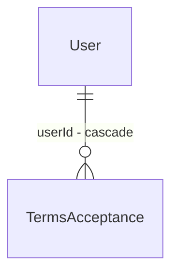

# Terms

> Fase 3, feature 5 de 5 (ver `.specs/STATE.md`). Depende de `auth-core` e `auth-web`.

## Problem

Nada registra que um usuário aceitou os Termos de Uso e a Política de Privacidade, nem qual
versão. Sob a LGPD, a corretora (e nós, como operador) precisa provar o consentimento e pedir de
novo quando o texto muda. O legado grava cada aceite com versão, data e IP e reabre o aceite quando
a versão corrente muda; está na checklist de paridade ("Aceite de termos e privacidade
versionado"). As páginas públicas `/terms` e `/privacy` também não existem no v2. Sem incidente:
ainda não há usuário.

Com isso pronto, todo usuário logado que não aceitou a versão corrente dos dois documentos é
levado a uma tela de aceite antes de usar o app, e cada aceite fica gravado com a versão.

## Flow

Reusa o `requireSession`/`UserContext` e o `/api/v1/me` de `auth-core` e o guard `_app` de
`auth-web`; as versões correntes são constantes no código, como no legado.

1. `GET /api/v1/me` (exists) → lê os aceites do usuário → acrescenta `terms: { pending, termsVersion, privacyVersion }`
2. web `_app` `beforeLoad` (exists) → `me.terms.pending` → `redirect({ to: '/terms-acceptance', search: { redirect } })`
3. `/terms-acceptance` → `POST /api/v1/me/terms-acceptance` (door 2) → `modules/auth` grava um `TermsAcceptance` por documento (door 1) → `200`
4. out: o web invalida o `/me` e segue para o `redirect`

## Impact

| Front | What changes |
| --- | --- |
| domain | novo termo: **documento legal** — `TERMS` (Termos de Uso) ou `PRIVACY` (Política de Privacidade), cada um com uma versão corrente em `modules/auth/terms.ts` (`'1.0'` e `'1.0'`) |
| domain | novo termo: **aceite pendente** — falta aceite da versão corrente de pelo menos um dos dois documentos. Quem passa a ramificar nisso: o guard `_app` (web) e, pela AD-005, o `requireTenant` da Fase 4 |
| API | `GET /api/v1/me` ganha o campo `terms` (aditivo) |
| web | páginas públicas `/terms` e `/privacy` com o texto do legado; tela `/terms-acceptance` |
| stored data | tabela nova, vazia |

## Relations

One-way constraints: `TermsAcceptance` único por (`userId`, `document`, `version`) (door 1); sem
coluna `organizationId` (aceite é do usuário, não do tenant; fora do RLS). No columns and no types
here.

## Surface

| Route | In | Out | Status |
| --- | --- | --- | --- |
| `GET /api/v1/me` (muda) | cookie | + `terms`: `pending` · `termsVersion` · `privacyVersion` | `200`, `401` |
| `POST /api/v1/me/terms-acceptance` | `termsVersion`, `privacyVersion` | `termsVersion` · `privacyVersion` · `acceptedAt` | `200`, `400`, `401`, `403`, `409` |

## Landing

| One-way door | Literal shape | Alternative rejected |
| --- | --- | --- |
| 1. registro do aceite | model `TermsAcceptance` (`userId` → `User` `onDelete: Cascade`, `document` enum `LegalDocument { TERMS PRIVACY }`, `version`, `acceptedAt`, `ipAddress?`), `@@unique([userId, document, version])`; aceitar de novo a mesma versão não cria linha | colunas `termsVersion`/`privacyVersion` no `User` (legado tinha as duas coisas) - perde o histórico de versões aceitas, que é a prova |
| 2. contrato do aceite | `POST /api/v1/me/terms-acceptance`, body `z.object({ termsVersion: z.string(), privacyVersion: z.string() }).strict()`, `operationId: 'acceptTerms'`; versão diferente da corrente → `409 TERMS_VERSION_MISMATCH` | aceitar sem mandar versão - o usuário poderia aceitar uma versão que nunca viu, se o texto mudou entre carregar e clicar |
| 3. bloqueio no server (AD-005) | a partir da Fase 4, `requireTenant` responde `403 TERMS_NOT_ACCEPTED` com aceite pendente; nesta fase não há rota de tenant para bloquear | bloquear em `requireSession` - travaria o próprio `/me` e o aceite |

- Nothing else in this change is hard to reverse

## Criteria

### S1: Estado do aceite no /me (P1)

**Acceptance Criteria**

1. WHEN um usuário sem nenhum aceite chama `GET /api/v1/me` THEN a resposta SHALL trazer `terms: { pending: true, termsVersion: '1.0', privacyVersion: '1.0' }`
2. WHEN o usuário aceitou as versões correntes dos dois documentos THEN `terms.pending` SHALL ser `false`
3. IF o usuário aceitou só versões anteriores de um dos documentos (versão corrente mudou) THEN `terms.pending` SHALL ser `true`

**Independent test:** `/me` antes e depois do `POST` de aceite.

### S2: Aceitar (P1)

**Acceptance Criteria**

4. WHEN `POST /api/v1/me/terms-acceptance` recebe as versões correntes THEN o sistema SHALL gravar um `TermsAcceptance` `TERMS` e um `PRIVACY` com essas versões, `acceptedAt` do momento e `ipAddress` = IP da request, e SHALL responder `200` com `termsVersion`, `privacyVersion` e `acceptedAt`
5. WHEN o mesmo usuário aceita de novo as mesmas versões THEN o sistema SHALL responder `200` com o `acceptedAt` do primeiro aceite e SHALL não criar linha nova
6. IF alguma versão do body difere da corrente THEN o sistema SHALL responder `409 { error: { code: 'TERMS_VERSION_MISMATCH', message: 'Os termos foram atualizados. Recarregue a página para ver a versão atual.' } }` e SHALL não gravar nada
7. IF o body tem campo extra ou falta versão THEN o sistema SHALL responder `400 VALIDATION_ERROR`
8. IF não há sessão THEN o sistema SHALL responder `401 UNAUTHENTICATED`
9. The aceite de um usuário SHALL não aparecer no `/me` de outro usuário (o `pending` de B continua `true` depois do aceite de A)

**Independent test:** dois usuários; A aceita; `/me` de A `pending: false`, de B `pending: true`.

### S3: Web (P1)

**Acceptance Criteria**

10. WHEN uma rota sob `_app` abre com `terms.pending: true` THEN o web SHALL redirecionar para `/terms-acceptance?redirect=<caminho original>`
11. WHEN "Li e aceito" é clicado em `/terms-acceptance` THEN o web SHALL enviar as versões do `/me` e SHALL navegar para o `redirect` interno (regra de `auth-web` AC 6) ou `/dashboard`
12. IF o aceite responde `409` THEN o web SHALL mostrar a mensagem do erro e SHALL recarregar o `/me`
13. The tela `/terms-acceptance` SHALL ter links para `/terms` e `/privacy`, abertos em nova aba
14. WHEN `/terms` ou `/privacy` é aberto sem sessão THEN o web SHALL mostrar o texto do documento com a versão corrente

**Independent test:** e2e — após o primeiro login, `/dashboard` cai em `/terms-acceptance`; aceitar leva ao `/dashboard`.

## Out of scope

| Excluded | Why |
| --- | --- |
| checkbox de aceite no `/register` | o aceite gravado acontece no primeiro login; um checkbox no cadastro sem registro no server seria só visual (ver Assumptions) |
| versões vindas de CMS ou banco | o legado usa constantes; troca de texto é deploy |
| aceite por organização (contrato da corretora) | Fase 5 (billing) se o produto pedir |
| bloqueio no server de rota de tenant | AD-005, Fase 4 |

## Assumptions

| Assumption | Chosen default | Rationale | Confirmed? |
| --- | --- | --- | --- |
| quando o primeiro aceite acontece | na tela `/terms-acceptance`, no primeiro acesso ao app depois do login; o `/register` não tem checkbox | um único mecanismo para o primeiro aceite e para o re-aceite, sempre gravado com versão e IP; o legado tinha checkbox só visual no cadastro + modal de re-aceite. **Diverge do legado — confirmar** | n |
| guardar o IP | sim, `ipAddress` no aceite | prova de consentimento (legado fazia); dado pessoal com base legal no próprio registro de consentimento | n |
| texto dos documentos | portar `features/legal/data/{terms-of-use,privacy-policy}.ts` do legado como está, versão `1.0` | revisão jurídica do texto não é desta fase | n |

**Open questions:** none - all resolved or logged above.

## Observable

| Surface | Decision | Landing |
| --- | --- | --- |
| API `POST /api/v1/me/terms-acceptance` | response shape | AC 4, 5 |
| API `POST /api/v1/me/terms-acceptance` | error shape e códigos | AC 6, 7, 8 |
| API `POST /api/v1/me/terms-acceptance` | quem pode chamar | AC 8, 9 |
| API `POST /api/v1/me/terms-acceptance` | rate limit | n/a - autenticado e idempotente (AC 5); rate limit geral fora desta fase |
| API `POST /api/v1/me/terms-acceptance` | versionamento | existing - prefixo `/api/v1` |
| tela `/terms-acceptance` | loading e error | AC 12; o botão fica desabilitado com "Aguarde…" durante o envio (convenção de `auth-web`) |
| tela `/terms-acceptance` | empty, unauthorised | n/a - sem listagem; sem sessão o guard `_app` manda ao login |
| documento `/terms`, `/privacy` | estrutura e próximo passo | AC 14 - texto do legado, versão visível |

## Sources

- `docs/migration.md` - "Aceite de termos e privacidade versionado"
- legado `apps/server/src/routes/terms/*` e `apps/web/src/features/legal/*` - versões `1.0`, `409` em versão divergente, IP no aceite
