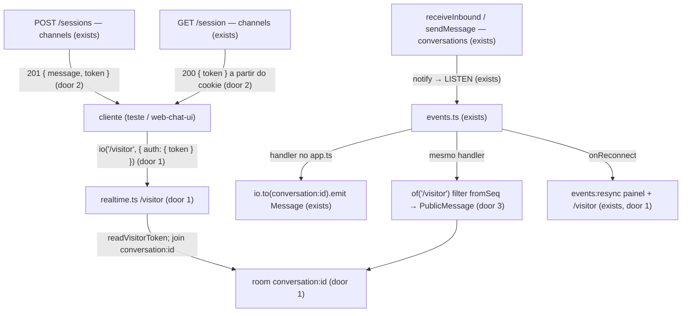

# Visitor realtime

> F3, feature 2 de 5 (`public-chat-api` → `visitor-realtime` → `inbox-api` → `web-chat-ui` → `inbox-web`, e o e2e no staging). Depende da `public-chat-api` (token, `PublicMessage`, corte por `seq`) e da `realtime-events` (`notify` + `LISTEN` + `message.created`). Perfil: standard (auth fora da sessão do painel, isolamento por `fromSeq`, payload público).

## Problem

O visitante do Web Chat só lê mensagens por consulta (`GET /messages`). A resposta do comercial (e qualquer mensagem nova na conversa) só aparece se o cliente ficar pedindo de novo. O handoff pede até 2 s para o cliente ver a mensagem (§30, N4); a F2 já entrega isso ao painel. Enquanto o visitante não tiver o mesmo caminho, o fluxo e2e da F3 (cliente envia → comercial responde → cliente vê) depende de polling, e a `web-chat-ui` não tem contrato de socket para ligar.

O cookie `bens_visitor` tem `Path=/api/public/chat/<key>` (AD-018): o browser não o envia ao handshake do Socket.IO (`/socket.io`). Autenticar o visitante no namespace exige outro transporte do token, sem enfraquecer o escopo do cookie HTTP.

Quando isso for entregue, o visitante conectado no namespace próprio recebe `message.created` com `PublicMessage` em menos de 2 s, só com `seq ≥ fromSeq`, sem ver `authorUserId` nem o histórico anterior à sessão. A SPA ainda não existe nesta feature: a prova é teste de integração com cliente Socket.IO real.

## Flow

Reusa o `readVisitorToken` / `signVisitorToken` da `public-chat-api`, o `PublicMessage` (mesmos campos do `GET /messages`), o `findMessage` + handler `message.created` da F2 (painel continua igual), o `events:resync` no reconnect do `LISTEN`, e o `allowRequest` por `Origin` do `realtime.ts`.

1. `POST /api/public/chat/:key/sessions` passa a devolver `{ message, token }` além do `Set-Cookie` (door 2). O cookie HTTP não muda.
2. `GET /api/public/chat/:key/session` (novo): cookie válido daquele link → `{ token }` (o valor do cookie), para o cliente remontar o socket após reload sem `sessionStorage`.
3. O cliente abre `io('/visitor', { path: '/socket.io', auth: { token }, extraHeaders: { origin } })`. O middleware do namespace valida o token (door 1); inválido/ausente/vencido → `connect_error` com `UNAUTHENTICATED`. Na conexão, o socket entra sozinho na room `conversation:<conversationId>` do token (sem `conversation:join`: o visitante só tem uma conversa).
4. No handler de `message.created` (já existente), além do emit do painel: no namespace `/visitor`, para cada socket na room da conversa com `seq ≥ socket.data.session.fromSeq`, emite `message.created` com `{ conversationId, message: PublicMessage }` (door 3).
5. Queda do `LISTEN` → `events:resync` também no `/visitor`; o cliente recarrega por `GET /messages` (ADR-012).

## Impact

| Front | What changes |
| --- | --- |
| domain | termo novo: **namespace do visitante** (`/visitor`) — Socket.IO autenticado pelo token da sessão do visitante, rooms só `conversation:*`, payload `PublicMessage`. Vive em `infrastructure/realtime.ts` + wiring em `app.ts` / `channels` |
| domain | `sessão do visitante` (AD-018) ganha um segundo transporte: o mesmo token assinado vai no body/API e no `auth` do socket; o cookie HTTP permanece o caminho das rotas REST |
| API | `POST /sessions` muda a forma de saída (`token` ao lado de `message`); Orval regenera o hook |
| realtime | o namespace default (painel) não muda; `events:resync` passa a atingir os dois namespaces |
| stored data | nada a migrar |

## Relations

`None - nenhum dado persistido; o socket carrega a VisitorSession já assinada no token`.

## Surface

| Route | In | Out | Status |
| --- | --- | --- | --- |
| `POST /api/public/chat/:key/sessions` (assinatura muda) | igual à `public-chat-api` | `201 { message: PublicMessage, token: string }` + `Set-Cookie` | `201`, `400`, `403`, `404`, `409`, `422`, `429` |
| `GET /api/public/chat/:key/session` (nova) | params `key`; cookie `bens_visitor` | `{ token }` | `200`, `400`, `401`, `404`, `429` |
| `io('/visitor')` connect (cliente → server) | `auth: { token }` (string do token); `Origin` = app | conexão aberta; socket já na room `conversation:<id>` | `200` (conectado), `401 UNAUTHENTICATED`, `403 ORIGIN_NOT_ALLOWED` |

De onde vem cada status:
- `POST /sessions` `201`: body ganha `token` (string `v1.…`); demais códigos iguais à feature anterior;
- `GET /session` `200`: cookie válido da organização da chave; `401 VISITOR_SESSION_REQUIRED` (ausente/adulterado/vencido/outra org); `400` chave inválida; `404` chave desconhecida; `429` rate limit dos GETs públicos (120/min por IP, já existente);
- connect `200`: handshake aceito; `401 UNAUTHENTICATED`: `connect_error` com essa mensagem (token ausente/inválido/vencido); `403 ORIGIN_NOT_ALLOWED`: `allowRequest` recusa o upgrade (mesmo critério do painel; o cliente vê falha de transporte, não um body JSON).

Eventos empurrados pelo server no `/visitor` (sem entrada e sem ack):
- `message.created` → room `conversation:<id>`, só sockets com `seq ≥ fromSeq`: `{ conversationId, message: PublicMessage }`;
- `events:resync` → todos os sockets do `/visitor`: `{}`.

Não há `conversation:join` no visitante. Falha de auth = `connect_error`, não ack.

## Landing

| One-way door | Literal shape | Alternative rejected |
| --- | --- | --- |
| 1. Namespace `/visitor` com auth por token | `io.of('/visitor')`, mesmo `path: '/socket.io'` e `allowRequest` por `Origin === APP_URL`. Middleware: `auth.token` (Zod `.strict()` `{ token: z.string().min(1) }`) → `readVisitorToken`; sucesso → `socket.data.session = VisitorSession` e `join('conversation:' + conversationId)`; falha → `next(new Error('UNAUTHENTICATED'))`. Sem rooms `user:`/`org:`. Sem `conversation:join`/`leave` | namespace default com o mesmo cookie do painel: o Path do cookie não cobre `/socket.io` e misturaria papéis; auth só por cookie com `Path=/`: revisa a door 4 da AD-018 (recusado: opção B); exigir `conversation:join` com id: o visitante só tem a conversa do token — um id a mais seria superfície de probe |
| 2. Token no body + `GET /session` (opção A, 2026-09-25) | `POST /sessions` → `{ message, token }` (o mesmo valor do cookie). `GET /session` lê o cookie, confere a org da chave, devolve `{ token }`. Cookie `Path=/api/public/chat/<key>` inalterado (AD-018). O cliente do socket usa só `auth.token` | cookie com `Path=/` ou segundo cookie `Path=/socket.io`: opções B/C recusadas; só `sessionStorage` sem `GET /session`: reload sem storage deixa o socket morto com o cookie HTTP ainda válido |
| 3. Emit separado, filtro por `fromSeq` | No handler de `message.created`, depois do emit do painel: `of('/visitor').in('conversation:'+id).fetchSockets()`, e para cada socket com `message.seq >= session.fromSeq` emite `PublicMessage` (campos do `publicMessage` da `public-chat-api`, sem `authorUserId` / `deliveryStatus` / `createdAt`). Conversão a partir do `Message` já relido ou select público equivalente | emitir o `Message` do painel na mesma room: vaza `authorUserId` e `deliveryStatus`; filtrar só no cliente: o histórico com `seq < fromSeq` chegaria ao browser; room por `fromSeq`: explode o número de rooms sem ganho |

- Nada mais nesta mudança é difícil de reverter.

## Criteria

### S1: Conectar com o token da sessão (P1)

O visitante autentica o namespace com o token e entra na room da conversa do token.

**Acceptance Criteria**

1. WHEN `POST /api/public/chat/:key/sessions` responde `201` THEN the body SHALL conter `token` (string assinada `v1.…`) e `message`, e o `Set-Cookie` `bens_visitor` SHALL continuar sendo enviado como na `public-chat-api`
2. WHEN `GET /api/public/chat/:key/session` é chamado com o cookie válido daquele link THEN the system SHALL responder `200 { token }` com o mesmo valor do cookie
3. IF o cookie falta, foi adulterado, venceu ou é de outra organização THEN `GET /session` SHALL responder `401 VISITOR_SESSION_REQUIRED`
4. WHEN o cliente conecta em `/visitor` com `auth: { token }` válido THEN the system SHALL aceitar a conexão e colocar o socket na room `conversation:<conversationId>` do token
5. IF `auth.token` falta, é inválido ou está vencido THEN the system SHALL recusar a conexão com `connect_error` cuja mensagem é `UNAUTHENTICATED`
6. IF o `Origin` do handshake não é o da aplicação THEN the system SHALL recusar o upgrade (mesmo `allowRequest` do painel)
7. WHEN um socket de visitante está conectado THEN he SHALL não estar nas rooms `user:*` nem `org:*` do namespace default, e um socket do painel SHALL não receber os emits feitos só no `/visitor`

### S2: Mensagem ao visitante em menos de 2 s, só a partir do `fromSeq` (P1)

**Acceptance Criteria**

8. WHEN um visitante está conectado e uma mensagem nova é gravada na conversa do token (inbound ou `sendMessage` humano) com `seq ≥ fromSeq` THEN o socket dele SHALL receber `message.created` com `PublicMessage` (`id`, `seq`, `direction`, `author`, `kind`, `text`, `sentAt` — sem `authorUserId`, `deliveryStatus` nem `createdAt`) em menos de 2 s, num teste com server HTTP e cliente Socket.IO reais
9. WHEN a conversa já tem mensagens com `seq < fromSeq` e uma mensagem nova é gravada THEN o socket do visitante SHALL não receber nenhum `message.created` cujo `message.seq < fromSeq`
10. WHEN dois visitantes na mesma conversa têm `fromSeq` diferentes (ex.: 5 e 10) e nasce uma mensagem com `seq = 7` THEN só o socket com `fromSeq ≤ 7` SHALL receber o evento
11. WHEN uma mensagem é gravada numa conversa THEN um socket de visitante de outra conversa (mesmo ou outro tenant) SHALL não receber `message.created`
12. WHEN o painel está na room `conversation:<id>` do namespace default e o visitante no `/visitor` THEN cada um SHALL receber o próprio formato (`Message` vs `PublicMessage`), e o visitante SHALL não receber o payload do painel

### S3: Resync após queda do LISTEN (P2)

**Acceptance Criteria**

13. WHEN o `LISTEN` volta depois de uma queda THEN the system SHALL emitir `events:resync` também no namespace `/visitor` (além do namespace default)

## Out of scope

| Excluded | Why |
| --- | --- |
| página `/c/:key`, UI do chat, texto do aviso, Open Graph | `web-chat-ui` |
| inbox, assumir, responder, encerrar no painel | `inbox-api` / `inbox-web` |
| polling como transporte principal do visitante | esta feature é o socket; o `GET /messages` continua para resync e carga inicial |
| indicador de digitação, presença, confirmação de leitura | fora do MVP (§30) |
| adapter Redis / 2+ réplicas da API | ADR-002 / ADR-006; sem gatilho |
| mudar o `Path` do cookie `bens_visitor` | AD-018; opção B recusada |
| IA respondendo | F4 |

## Assumptions

| Assumption | Chosen default | Rationale | Confirmed? |
| --- | --- | --- | --- |
| transporte do token no socket | `auth.token` + token no body do `POST /sessions` + `GET /session` (opção A) | cookie não cobre `/socket.io`; usuário escolheu A em 2026-09-25; `GET /session` evita socket morto no reload com cookie ainda válido | y (2026-09-25) |
| nome do namespace | `/visitor` | ADR-006 aposenta `/widget` em favor do namespace de visitante; nome estável e curto | n |
| entrada na room | automática no `connection`, sem `conversation:join` | o token já amarra uma conversa; join com id seria probe inútil | n |
| rate limit do `GET /session` | o mesmo dos outros GETs públicos (120/min por IP) | já existe na `public-chat-api`; sem limite novo | n |
| cliente desta feature | só testes de integração; a `web-chat-ui` consome depois | igual à `realtime-events` na F2 | n |

**Open questions:** none - all resolved or logged above.

## Observable

| Surface | Decision | Landing |
| --- | --- | --- |
| API `POST /sessions` | response shape | AC 1; Surface |
| API `GET /session` | response shape and error codes | AC 2, AC 3 |
| API `GET /session` | who may call it | AC 3 (cookie da sessão) |
| API `GET /session` | rate limit | existing - 120/min por IP nos GETs públicos |
| API `GET /session` | versioning | n/a - mesmo prefixo `/api/public/chat`, sem `/v1` |
| API `GET /session` | empty state | n/a - não é listagem; sem cookie → 401 |
| socket `/visitor` connect | error shape | AC 5, AC 6 |
| socket `/visitor` `message.created` | response shape | AC 8, AC 12 |
| socket `/visitor` | who may connect | AC 4, AC 5 |
| socket `/visitor` `events:resync` | what the client does next | AC 13; recarrega por `GET /messages` (ADR-012) |

## Sources

- ADR-014 / AD-018 - token de visitante, corte por `seq`, cookie escopado ao link
- ADR-006 - Socket.IO no processo da API; namespace de visitante no lugar de `/widget`
- ADR-012 - `NOTIFY` + resync; sem fila de eventos perdidos
- decisão do usuário (2026-09-25) - opção A: `auth.token`, cookie HTTP inalterado
- handoff §30 - até 2 s
