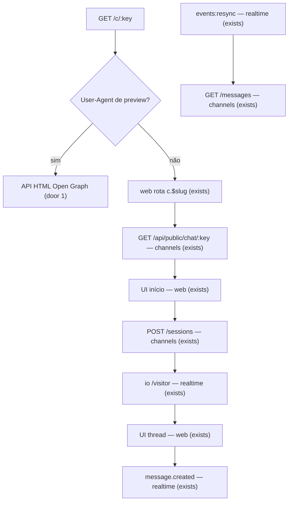

# Web Chat UI

> F3, fecha o gap: `public-chat-api` + `visitor-realtime` já existem sem tela. Antecipada antes de `inbox` (decisão 2026-09-25: toda feature com superfície de usuário é fullstack + smoke Playwright). Depois: `inbox` → e2e completo no staging. Perfil: **ui**.

## Problem

O link `/c/<publicChatKey>` aparece em Configurações e a API pública + o socket `/visitor` já aceitam sessão e mensagens, mas o visitante que abre o link não encontra página: a rota SPA e o HTML Open Graph ainda não existem. Quem divulga o link leva o cliente a uma tela morta; o caminho feliz da F3 (cliente fala → mensagem chega → resposta aparece) não dá para provar no navegador.

Quando isso for entregue, o visitante abre o link, vê a identidade da corretora, aceita o aviso, envia a primeira mensagem e conversa em tempo real. Um smoke Playwright cobre esse fluxo (a resposta humana nesta feature é injetada pela API/`sendMessage`, sem inbox).

## Flow

Reusa `GET/POST` públicos e o cookie/token da `public-chat-api`, o namespace `/visitor` da `visitor-realtime`, o link em Configurações (F1), os hooks Orval e o padrão Playwright de `apps/web/e2e/`.

1. Navegador em `/c/:key` → SPA; crawler → HTML OG na API (door 1).
2. SPA carrega descrição (`GET /api/public/chat/:key`, exists) → formulário de início.
3. `POST /sessions` (exists) → token em `sessionStorage` + `GET /session` no reload (door 2) → `io('/visitor')` (exists).
4. Thread: `GET /messages` / `POST /messages` (exists); push `message.created`; `events:resync` → recarrega.
5. Smoke Playwright: org do teste → link → início → envio → vê mensagem → `sendMessage` — conversations (exists) → vê resposta em < 2 s.

## Impact

| Front | What changes |
| --- | --- |
| domain | termo novo na UI: **aviso do Web Chat** (texto ligado a `WEB_CHAT_NOTICE_VERSION`); provisório até revisão jurídica (F11) |
| web | rota pública `c.$slug` fora do layout autenticado; cliente Socket.IO do visitante |
| API | rota (ou handler) que serve HTML OG em `/c/:key` para crawlers, sem tirar a SPA do Caddy no browser |
| process | AD-019: features com UI são fullstack + smoke Playwright; ordem F3: `web-chat-ui` antes de `inbox` |
| stored data | nada a migrar |

## Relations

`None - no stored-data shape change`

## Surface

| Route | In | Out | Status |
| --- | --- | --- | --- |
| `GET /c/:key` (crawler / OG, door 1) | path `key` (32 hex); User-Agent de preview | HTML com `og:title`, `og:description`, `og:image` (logo absoluto se houver) | `200`, `400`, `404` |
| screen `Web Chat` (SPA `/c/:key`) | path `key`; formulário ou thread | estados da página | `200` (página montada), `404` (chave inválida/desconhecida na UI) |
| `POST /api/v1/conversations/:id/messages` (door 3) | params `id`; body `{ text }` (1–4000) | `{ message: Message }` | `201`, `400`, `401`, `403`, `404`, `409` |

As rotas REST/socket (`/api/public/chat/*`, `/visitor`) não mudam de assinatura nesta feature.

De onde vem cada status:
- OG `200`: chave válida + UA de preview; `400`: chave fora do formato 32 hex; `404`: chave desconhecida;
- screen `200`: SPA renderiza início ou thread; `404`: estado de erro na página (não é status HTTP do document se o Caddy sempre serve `index.html` — a UI trata como 404 visual; o smoke afirma o texto de erro).

Eventos já existentes consumidos pela SPA (sem mudança de contrato): `message.created` (`PublicMessage`), `events:resync`.

## Landing

| One-way door | Literal shape | Alternative rejected |
| --- | --- | --- |
| 1. Open Graph na API | `GET /c/:key` no Fastify: se o `User-Agent` casa com a lista de previews (WhatsApp, Facebook, Twitter/X, Slack, LinkedIn, Telegram — substring case-insensitive), responde `text/html` com meta `og:*` (nome, saudação truncada, logo absoluto via `/api/public/chat/:key/logo`); senão `404` (browser humano fica com a SPA no Caddy/Vite). Caddy faz proxy de `/c/*` só quando o UA casa com a mesma lista | SSR Next (ADR-009 rejeitou); meta só no `index.html` estático: o preview não recebe nome/logo por corretora |
| 2. Token do socket no cliente | após `POST /sessions`, a SPA guarda `token` em `sessionStorage` sob a chave `bens_visitor_token:<publicChatKey>` e passa em `auth: { token }`; no reload, tenta `GET /session` (cookie) e só então `sessionStorage` | só cookie no socket: Path não cobre `/socket.io` (recusado na `visitor-realtime`); só `sessionStorage` sem `GET /session`: reload com cookie válido deixaria o socket morto |
| 3. Envio do painel (smoke / inbox cedo) | `POST /api/v1/conversations/:id/messages` `{ text }`, permissão `conversation:write`; se `handler = QUEUE`, a mesma transação assume (`HUMAN` + `assigneeId = eu`) e chama `sendMessage` | esperar o `inbox` inteiro: bloqueia o smoke Playwright exigido; só SQL+notify no e2e: não exercita `sendMessage` |

- Nada mais nesta mudança é difícil de reverter.

## Criteria

### S1: Abrir o link e ver a corretora (P1)

**Acceptance Criteria**

1. WHEN o visitante abre `/c/:key` de uma organização existente THEN the system SHALL mostrar o nome da corretora e, se configurados, a cor, a saudação e o logo
2. IF a chave é desconhecida ou malformada THEN the page SHALL mostrar um estado de erro em pt-BR e não exibir o formulário de início
3. WHEN um User-Agent de preview conhecido pede `/c/:key` de uma org existente THEN the API SHALL responder HTML `200` com `og:title` igual ao nome da corretora
4. IF a chave é desconhecida THEN o HTML OG SHALL responder `404`

### S2: Iniciar a conversa (P1)

**Acceptance Criteria**

5. WHEN o visitante informa telefone válido, marca o aceite do aviso na versão atual e passa o Turnstile (ou o ambiente sem chave o pula, como a API) THEN the system SHALL criar a sessão e mostrar a thread com a primeira mensagem
6. IF o aceite não está marcado THEN the system SHALL não chamar `POST /sessions` e SHALL indicar que o aceite é obrigatório
7. WHEN a sessão começa THEN the client SHALL conectar ao namespace `/visitor` com o `token` devolvido e SHALL permanecer na room da conversa

### S3: Conversar em tempo real (P1)

**Acceptance Criteria**

8. WHEN o visitante envia uma mensagem na thread THEN ela SHALL aparecer na lista e a API SHALL tê-la gravado (`POST /messages` 201/200)
9. WHEN uma mensagem `OUTBOUND` de autor `HUMAN` é gravada na conversa (via `sendMessage` no smoke) THEN the visitor UI SHALL mostrar o texto em menos de 2 s sem recarregar a página
10. WHEN o socket emite `events:resync` THEN the client SHALL recarregar as mensagens por `GET /messages` e manter o corte por `fromSeq`

### S4: Smoke Playwright (P1)

**Acceptance Criteria**

11. WHEN o smoke e2e sobe uma org, abre o link público, inicia a sessão e envia uma mensagem THEN the browser SHALL exibir essa mensagem na thread
12. WHEN o smoke em seguida grava uma resposta humana na mesma conversa THEN the browser SHALL exibir essa resposta na thread em menos de 2 s

## Out of scope

| Excluded | Why |
| --- | --- |
| inbox do painel (lista, assumir, responder pela UI) | `inbox` |
| e2e completo cliente↔comercial no staging | fecha a F3 depois do inbox |
| texto jurídico definitivo do aviso | F11 / revisão jurídica; versão provisória `2026-09-25` |
| IA no Web Chat | F4 |
| OTP / revogação de sessão | ADR-014 |

## Assumptions

| Assumption | Chosen default | Rationale | Confirmed? |
| --- | --- | --- | --- |
| ordem F3 | `web-chat-ui` antes de `inbox` | fecha o gap de tela + smoke; usuário 2026-09-25 | y |
| resposta humana no smoke | `sendMessage` via API de teste, sem UI do painel | inbox ainda não existe; prova o socket do visitante | n |
| Turnstile no e2e | ambiente de teste sem chaves (API pula), como cadastro | já é o padrão local; staging real fica para o e2e da F3 | n |
| texto do aviso | provisório em pt-BR na SPA, versão = `WEB_CHAT_NOTICE_VERSION` | igual à API; jurídico na F11 | n |
| detecção OG | lista fixa de substrings de User-Agent | suficiente para WhatsApp/Facebook; sem lib | n |

**Open questions:** none - all resolved or logged above.

## Observable

| Surface | Decision | Landing |
| --- | --- | --- |
| screen Web Chat início | empty / loading / error / success | AC 1, AC 2, AC 5 |
| screen Web Chat início | destructive confirm | n/a - sem ação destrutiva |
| screen Web Chat thread | empty / loading / error / success | AC 8, AC 9 |
| screen Web Chat | ordering / density | AC 8 — ordem por `seq` crescente |
| `GET /c/:key` OG | error shape and codes | AC 3, AC 4 |
| `GET /c/:key` OG | who may call | crawlers (UA); browser → SPA |
| `GET /c/:key` OG | versioning / rate limit | n/a - HTML estático por request; sem `/v1` |
| smoke Playwright | path | AC 11, AC 12 |

## Sources

- ADR-014 / AD-018 - link `/c/:slug`, token, corte por `seq`
- ADR-009 - SPA Vite; OG pela API, não Next
- roadmap F3 - `/c/:slug` + HTML Open Graph
- decisão do usuário (2026-09-25) - fullstack + smoke browser; fechar gap antes de seguir
