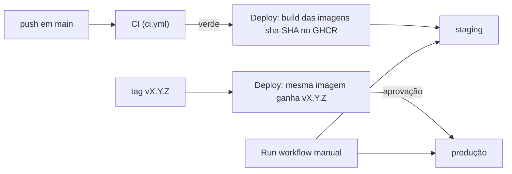

# Runbook: deploy na VPS (staging e produção)

Põe o Bens Seguros no ar numa VPS da Hostinger, com deploy automático pelo GitHub (ADR-008). Faça
tudo uma vez para o **staging**; a produção repete os passos numa segunda VPS, trocando `staging`
por `production` e os valores.

Validação local da mesma pilha: `node scripts/staging-smoke.mjs up` e depois `… all`; do script
de deploy: `node scripts/deploy-smoke.mjs up` e depois `… all`.

## Visão geral



- **Staging:** todo push em `main` com CI verde publica as imagens `sha-<SHA>` e instala.
- **Produção:** uma tag `vX.Y.Z` num commit de `main` dá às mesmas imagens a tag da versão e
  instala depois da sua aprovação.
- **Redeploy e rollback:** Actions → Deploy → Run workflow, com qualquer tag que já existe.

O GitHub entra na VPS como `deploy`, copia três arquivos e roda `scripts/deploy-remote.sh`, que
baixa as imagens, aplica as migrations e sobe o `docker-compose.prod.yml`. Se o pull ou a
migration falha, a versão anterior continua no ar.

| O quê | Onde |
| --- | --- |
| Acesso SSH a cada VPS | environments `staging` e `production` do GitHub |
| Segredos da aplicação | `.env` da VPS e a sua cópia `.env.staging` (nunca no GitHub) |
| Versão instalada | `deploy.env` na pasta de deploy da VPS |

## Pré-requisitos

- Uma VPS KVM da Hostinger por ambiente, com pelo menos 2 GB de RAM.
- Um domínio com DNS editável (ex.: `staging.seudominio.com.br`).
- Resend com o domínio de envio verificado, e a chave de API.
- Um widget do Cloudflare Turnstile com o hostname do ambiente (site key e secret key).
- Admin no repositório `arturmois/bens-seguros-v2`; na sua máquina, `ssh`, `openssl` e este
  repositório clonado.

## Criar a VPS na Hostinger

hPanel → **VPS**: sistema **Ubuntu 24.04 LTS** ou **26.04 LTS** (template limpo), senha de root
forte e a sua chave SSH pessoal (VPS → Gerenciar → Configurações → Chaves SSH). Anote o IPv4.

Sem chave pessoal ainda:

**💻 sua máquina**

```bash
ssh-keygen -t ed25519 -C "seu-nome@sua-maquina"
cat ~/.ssh/id_ed25519.pub
```

Nos comandos, troque `203.0.113.10` pelo IP da VPS e `staging.seudominio.com.br` pelo seu nome.

## Proteger a VPS

**🖥️ VPS, como root** (`ssh root@203.0.113.10`)

```bash
apt update && apt full-upgrade -y
timedatectl set-timezone America/Sao_Paulo
adduser ops
usermod -aG sudo ops
rsync --archive --chown=ops:ops ~/.ssh /home/ops
```

Antes de seguir, confirme que o `ops` entra **pela chave** (o próximo passo desliga senha e root):

**💻 sua máquina**

```bash
ssh -o PasswordAuthentication=no -o KbdInteractiveAuthentication=no -t ops@203.0.113.10 'sudo -v && echo SUDO_OK'
```

Sem `SUDO_OK`, pare. Se `/var/run/reboot-required` existe, rode `reboot` como root agora.

Daqui em diante, tudo na VPS é como `ops` (`ssh ops@203.0.113.10`).

**🖥️ VPS, como ops**

```bash
sudo tee /etc/ssh/sshd_config.d/01-hardening.conf <<'EOF'
PermitRootLogin no
PasswordAuthentication no
KbdInteractiveAuthentication no
EOF
sudo sshd -t && sudo systemctl restart ssh
sudo sshd -T | grep -Ei '^(permitrootlogin|passwordauthentication|kbdinteractiveauthentication)'
```

As três linhas precisam dizer `no`. O nome `01-` importa: o `sshd` usa o primeiro valor que lê, e
a imagem traz um `50-cloud-init.conf` com `PasswordAuthentication yes`.

Firewall do painel: VPS → **Segurança** → **Firewall**, regras **accept** para TCP `22` (origem
qualquer: o GitHub muda de IP), TCP `80`, TCP `443` e UDP `443`. Ative.

**🖥️ VPS, como ops**

```bash
sudo ufw allow OpenSSH && sudo ufw allow 80/tcp && sudo ufw allow 443/tcp && sudo ufw allow 443/udp
sudo ufw --force enable
sudo dpkg-reconfigure -plow unattended-upgrades
sudo fallocate -l 2G /swapfile && sudo chmod 600 /swapfile && sudo mkswap /swapfile && sudo swapon /swapfile
echo '/swapfile none swap sw 0 0' | sudo tee -a /etc/fstab
```

O swap é para VPS de 2 GB; rode uma vez só. Portas de container passam por fora do `ufw`: não
acrescente `ports:` ao `server` nem ao `postgres` no compose.

## Instalar o Docker

**🖥️ VPS, como ops**

```bash
sudo apt install -y ca-certificates curl
sudo install -m 0755 -d /etc/apt/keyrings
sudo curl -fsSL https://download.docker.com/linux/ubuntu/gpg -o /etc/apt/keyrings/docker.asc
sudo chmod a+r /etc/apt/keyrings/docker.asc
sudo tee /etc/apt/sources.list.d/docker.sources <<EOF
Types: deb
URIs: https://download.docker.com/linux/ubuntu
Suites: $(. /etc/os-release && echo "${UBUNTU_CODENAME:-$VERSION_CODENAME}")
Components: stable
Architectures: $(dpkg --print-architecture)
Signed-By: /etc/apt/keyrings/docker.asc
EOF
sudo apt update
sudo apt install -y docker-ce docker-ce-cli containerd.io docker-buildx-plugin docker-compose-plugin
sudo docker run --rm hello-world && docker compose version
```

## Usuário de deploy

**🖥️ VPS, como ops**

```bash
sudo adduser --disabled-password --gecos "" deploy
sudo usermod -aG docker deploy
sudo install -d -o deploy -g deploy -m 750 /opt/bens-seguros
```

Quem está no grupo `docker` tem poder de root: a chave do `deploy` fica só no GitHub e na sua
máquina, e você continua entrando como `ops`. `/opt/bens-seguros` é o `DEPLOY_PATH`.

## DNS

Crie um registro `A` de `staging` para o IPv4 da VPS (e `AAAA` se houver IPv6). Espere resolver:

**💻 sua máquina**

```bash
dig +short staging.seudominio.com.br    # precisa mostrar o IP da VPS
```

O Caddy só obtém o certificado HTTPS com o DNS certo e as portas 80/443 abertas.

## Chave SSH do deploy

Uma chave por ambiente, sem senha, e a host key da VPS.

**💻 sua máquina**

```bash
ssh-keygen -t ed25519 -N "" -C "github-actions-staging" -f ~/.ssh/bens-deploy-staging
ssh-keyscan -t ed25519 203.0.113.10 > ~/.ssh/bens-known_hosts-staging
ssh-keygen -lf ~/.ssh/bens-known_hosts-staging
cat ~/.ssh/bens-deploy-staging.pub
```

**🖥️ VPS, como ops** (troque `<CHAVE PÚBLICA>` pela linha do `.pub`, mantendo as aspas)

```bash
ssh-keygen -lf /etc/ssh/ssh_host_ed25519_key.pub
sudo install -d -o deploy -g deploy -m 700 /home/deploy/.ssh
echo 'restrict <CHAVE PÚBLICA>' | sudo tee /home/deploy/.ssh/authorized_keys
sudo chown deploy:deploy /home/deploy/.ssh/authorized_keys && sudo chmod 600 /home/deploy/.ssh/authorized_keys
```

A impressão digital (`SHA256:…`) da VPS precisa ser igual à do `ssh-keyscan`; se não for, pare.
O `restrict` proíbe terminal e redirecionamentos, mas deixa rodar comandos e copiar arquivos.

**💻 sua máquina**

```bash
ssh -i ~/.ssh/bens-deploy-staging -o UserKnownHostsFile=~/.ssh/bens-known_hosts-staging deploy@203.0.113.10 'docker compose version'
```

## .env

Um comando, da raiz do repositório na sua máquina. Na primeira vez ele pergunta o domínio, a
chave do Resend, o remetente e as duas chaves do Turnstile, gera as senhas e grava
`.env.staging` (ignorado pelo git); depois valida e envia para `/opt/bens-seguros/.env`.

**💻 sua máquina**

```bash
scripts/env-push.sh staging
```

- Guarde uma cópia do `.env.staging` num gerenciador de senhas.
- Para mudar um valor depois: edite o `.env.staging` e rode `scripts/env-push.sh staging --apply`.
- O comando recusa mudar `POSTGRES_USER`, `POSTGRES_DB`, `POSTGRES_PASSWORD` ou `APP_DB_PASSWORD`
  de uma VPS que já tem banco: elas só valem no primeiro boot do volume.
- VPS que já tem `.env`: copie-o uma vez para `.env.staging` (`ssh ops@… sudo cat /opt/bens-seguros/.env`).

## Configurar o GitHub

Settings → **Environments** → **New environment** → `staging`.

**Environment secrets:**

| Secret | Valor |
| --- | --- |
| `SSH_HOST` | o IP da VPS |
| `SSH_USER` | `deploy` |
| `SSH_PRIVATE_KEY` | o conteúdo de `~/.ssh/bens-deploy-staging`, com as linhas `BEGIN` e `END` |
| `SSH_KNOWN_HOSTS` | o conteúdo de `~/.ssh/bens-known_hosts-staging` |

**Environment variables** (variables, não secrets: o workflow lê `vars.*`):

| Variable | Valor |
| --- | --- |
| `DEPLOY_PATH` | `/opt/bens-seguros` |
| `SITE_URL` | `https://staging.seudominio.com.br` |

**Deployment branches and tags:** Selected → branch `main`.

Com o `gh`, da sua máquina:

```bash
gh secret set SSH_HOST --env staging --body 203.0.113.10
gh secret set SSH_USER --env staging --body deploy
gh secret set SSH_PRIVATE_KEY --env staging < ~/.ssh/bens-deploy-staging
gh secret set SSH_KNOWN_HOSTS --env staging < ~/.ssh/bens-known_hosts-staging
gh variable set DEPLOY_PATH --env staging --body /opt/bens-seguros
gh variable set SITE_URL --env staging --body https://staging.seudominio.com.br
```

Environment `production`: o mesmo com os valores da produção, mais **Required reviewers** (quem
aprova releases) e, em Deployment branches and tags, a tag `v*` e a branch `main`.

Opcionais:

- Ruleset em `main` com **Require status checks** (`ci`): a partir daí nada entra em `main` sem
  CI verde, e toda mudança passa a chegar por pull request (push direto é recusado).
- Se o pull na VPS der `denied`: Packages → o pacote → Package settings → Manage Actions access →
  **Read** para `bens-seguros-v2`.

## Primeiro deploy

Faça um push em `main` (ou re-rode o último **CI** de `main`). Com o CI verde, **Actions** →
**Deploy** roda `build` e `deploy-staging`, que só termina verde se
`https://staging.seudominio.com.br/api/health` responder `200`. No primeiro deploy o Caddy ainda
pede o certificado; se o health check vencer, rode o job de novo.

**💻 sua máquina**

```bash
curl https://staging.seudominio.com.br/api/health      # {"status":"ok"}
curl -I http://staging.seudominio.com.br/              # 308 para https://
```

**🖥️ VPS, como deploy** (`sudo -iu deploy`)

```bash
cd /opt/bens-seguros && cat deploy.env
docker compose -f docker-compose.prod.yml --env-file .env --env-file deploy.env ps -a
```

`migrate` em `exited (0)`, `server` e `postgres` `healthy`, `caddy` `running`. No navegador:
criar conta, confirmar pelo e-mail, entrar e sair.

## Produção por tag

Num commit de `main` já testado no staging:

**💻 sua máquina**

```bash
git switch main && git pull
git tag -a v0.1.0 -m "v0.1.0"
git push origin v0.1.0
```

O job `promote` confere o commit e as imagens `sha-<SHA>` e dá a elas a tag `v0.1.0`;
`deploy-production` espera em **Review deployments** → **Approve and deploy**. `PATCH` para
correção, `MINOR` para funcionalidade, `MAJOR` para mudança que quebra.

`Imagens sha-<SHA> não encontradas` = a tag está num commit sem CI verde em `main`. Apague e
refaça no commit certo:

```bash
git push --delete origin v0.1.0 && git tag -d v0.1.0
```

## Rollback

Actions → Deploy → **Run workflow**: `main`, o ambiente e a tag anterior (`vX.Y.Z` ou
`sha-<SHA de 40 caracteres>`; a última está em `deploy.env.previous`). Na produção, espera
aprovação.

**A migration não volta.** O rollback troca as imagens, mas o banco fica no schema novo. Só é
seguro se as migrations desfeitas só acrescentaram; senão, a saída é restaurar o backup (F11). Até
lá, escreva migrations que só acrescentam e remova o antigo numa release seguinte.

Sem o GitHub, como `deploy` na VPS, com um token clássico só com `read:packages`:

```bash
cd /opt/bens-seguros
read -rs TOKEN
printf '%s' "$TOKEN" | IMAGE_REGISTRY=ghcr.io/arturmois/bens-seguros-v2 REGISTRY_USER=<seu-usuario> ./deploy-remote.sh v0.1.0
unset TOKEN
```

## Operação do dia a dia

**🖥️ VPS, como deploy** — um atalho, uma vez:

```bash
echo "alias dc='docker compose -f /opt/bens-seguros/docker-compose.prod.yml --env-file /opt/bens-seguros/.env --env-file /opt/bens-seguros/deploy.env'" >> ~/.bashrc && source ~/.bashrc
```

| Tarefa | Comando |
| --- | --- |
| Versão instalada | `cat /opt/bens-seguros/deploy.env` |
| Containers | `dc ps -a` |
| Logs | `dc logs -f --tail 200 server` (ou `caddy`) |
| Reiniciar o server | `dc restart server` |
| Mudar o `.env` | na sua máquina: `scripts/env-push.sh staging --apply` |
| Abrir o banco | `dc exec postgres psql -U bens -d bens` |
| Limpar imagens antigas | `docker image prune -a --filter until=336h` |

Trocar `APP_DB_PASSWORD` de um banco que já existe: edite o `.env` na VPS (como `deploy`), rode o
comando abaixo e copie o novo valor para o seu `.env.staging`. O `postgres` também é recriado
(queda de segundos, dados preservados).

```bash
cd /opt/bens-seguros
dc exec -e APP_DB_PASSWORD="$(grep ^APP_DB_PASSWORD= .env | cut -d= -f2)" \
  postgres /docker-entrypoint-initdb.d/01-app-role.sh
dc up -d --wait server
```

Trocar a chave do deploy: gere outra ("Chave SSH do deploy") e troque o `authorized_keys` e o
secret `SSH_PRIVATE_KEY`.

`dc down --volumes` apaga **todos** os dados, inclusive os certificados (o Let's Encrypt limita
emissões por semana). Nunca na produção.

## Problemas comuns

| Sintoma | Solução |
| --- | --- |
| O Deploy não começa | O CI falhou, ou o push não foi em `main` |
| Preflight: `… não está configurado no environment` | Falta o secret ou a variable citada (`DEPLOY_PATH` e `SITE_URL` são variables) |
| Preflight: `SITE_URL precisa começar com https://` | Corrija a variable `SITE_URL` |
| `Host key verification failed` | `SSH_KNOWN_HOSTS` errado ou VPS reinstalada: refaça o `ssh-keyscan` e confira a impressão digital |
| `Permission denied (publickey)` | Chave fora do `authorized_keys` do `deploy`, permissões diferentes de 700/600, ou `SSH_USER` errado |
| `deploy: erro: .env precisa de permissão 600` | `chmod 600 /opt/bens-seguros/.env` |
| `deploy: erro: não foi possível baixar …` | Tag inexistente ou pacote sem acesso **Read** do repositório. Nada mudou na VPS |
| `deploy: erro: migrate falhou` | Erro do Prisma no log do job; a versão anterior continua no ar |
| O `up` falha esperando o `server` ficar healthy | O site está **fora do ar**: o server antigo já foi trocado. Faça o **Rollback** para a tag de `deploy.env` e veja `dc logs server` (quase sempre uma variável do `.env`) |
| Health check falha no fim do job | DNS, portas 80/443 num dos firewalls, ou certificado (`dc logs caddy`) |
| `deploy-production` parado em Waiting | Falta aprovar em Review deployments |
| `env-push: erro: … difere do .env da VPS` | O `.env.staging` não é a cópia do da VPS; copie de lá (seção `.env`) |

## Pendências

- **Backup do banco:** `pg_dump` diário para fora da VPS, retenção de 30 dias, restore testado
  (F11). Até lá o staging é descartável e a produção não recebe dados reais.
- **Observabilidade:** Sentry, monitor externo, `/api/ready` e alertas (F11).
- **WhatsApp:** o serviço `whatsapp` entra no mesmo compose na F9 (ADR-012).
