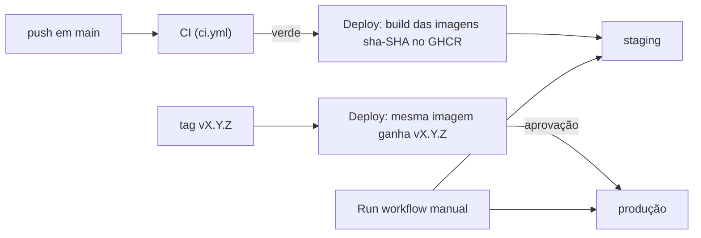

# Runbook: deploy na VPS (staging e produção)

Tutorial completo para pôr o Bens Seguros no ar numa VPS da Hostinger com deploy automático pelo
GitHub (ADR-008). Faça tudo uma vez para o **staging**; a produção repete os mesmos passos numa
segunda VPS, com outros valores.

Nada aqui roda sozinho: cada comando é executado por quem tem acesso à VPS e ao GitHub. A
validação local da mesma pilha é `node scripts/staging-smoke.mjs up` seguido de
`node scripts/staging-smoke.mjs all`; a do script de deploy é `node scripts/deploy-smoke.mjs up`
seguido de `node scripts/deploy-smoke.mjs all`.

## Visão geral



Três caminhos, todos em `.github/workflows/deploy.yml`:

1. **Staging automático.** Todo push em `main` que passa no CI (lint, typecheck, testes, build e
   e2e) gera três imagens no GHCR (o registro de imagens do GitHub) com a tag `sha-<SHA do commit>`
   e instala essa versão no staging.
2. **Produção por tag.** Uma tag `vX.Y.Z` num commit de `main` dá às **mesmas** imagens a tag da
   versão, sem recompilar, e instala na produção depois da sua aprovação no GitHub.
3. **Redeploy e rollback.** Em Actions → Deploy → Run workflow você escolhe o ambiente e qualquer
   tag que já existe.

Em cada ambiente, o GitHub entra na VPS por SSH, copia três arquivos para a pasta de deploy e roda
`scripts/deploy-remote.sh`. O script baixa as imagens, aplica as migrations e sobe a pilha do
`docker-compose.prod.yml`. Se a imagem não existe ou a migration falha, ele para antes de trocar o
`server`, e a versão anterior continua no ar. No fim, o GitHub pede `/api/health` de fora da VPS.

Onde fica cada coisa:

| O quê | Onde |
| --- | --- |
| Código, workflows, compose | este repositório |
| Imagens `server`, `migrate` e `web` | GHCR, em `ghcr.io/arturmois/bens-seguros-v2/...` |
| Acesso SSH a cada VPS | environments `staging` e `production` do GitHub |
| Segredos da aplicação (senhas, chaves) | só no `.env` da VPS, nunca no GitHub |
| Versão instalada | `deploy.env` na pasta de deploy da VPS |

## Pré-requisitos

- Uma VPS KVM da Hostinger por ambiente, com pelo menos 2 GB de RAM.
- Um domínio em que você edita o DNS, por exemplo `staging.seudominio.com.br` para o staging e
  `app.seudominio.com.br` para a produção.
- Uma conta no Resend com o domínio de envio verificado (é o SMTP dos e-mails de cadastro e
  convite).
- Um widget do Cloudflare Turnstile (o captcha do cadastro) com o hostname de cada ambiente.
- Acesso de administrador ao repositório `arturmois/bens-seguros-v2` no GitHub.
- Na sua máquina: `ssh`, `ssh-keygen` e `git`.

Nos comandos abaixo, troque `203.0.113.10` pelo IP da sua VPS e `staging.seudominio.com.br`
pelo seu hostname.

## Criar a VPS na Hostinger

1. No painel da Hostinger (hPanel), vá em **VPS** e contrate ou selecione o plano.
2. Escolha o datacenter mais próximo dos seus usuários.
3. Em **Sistema operacional**, escolha **Ubuntu 24.04 LTS** (o template limpo). Existe um
   template "Ubuntu 24.04 with Docker"; se usá-lo, pule a instalação do Docker mais abaixo, mas
   confira que `docker compose version` funciona (o plugin, com espaço, e não o antigo
   `docker-compose`).
4. Defina uma senha forte de root e, se o assistente oferecer, adicione sua chave SSH pessoal.
   Para adicionar depois: VPS → **Gerenciar** → **Configurações** → **Chaves SSH** →
   **Adicionar chave SSH**.
5. Anote o IPv4 (e o IPv6, se houver) que aparece na visão geral da VPS.

Se ainda não tem uma chave SSH pessoal, crie na sua máquina e cole o conteúdo do `.pub` no hPanel:

```bash
ssh-keygen -t ed25519 -C "seu-nome@sua-maquina"
cat ~/.ssh/id_ed25519.pub
```

Primeiro acesso:

```bash
ssh root@203.0.113.10
```

## Proteger a VPS

Ainda como root, atualize o sistema e crie um usuário administrador para você:

```bash
apt update && apt full-upgrade -y
timedatectl set-timezone America/Sao_Paulo
adduser admin
usermod -aG sudo admin
rsync --archive --chown=admin:admin ~/.ssh /home/admin
```

**Abra outro terminal e confirme que `ssh admin@203.0.113.10` funciona e que `sudo -v` aceita a
senha antes de continuar.** O próximo passo desliga o login de root e por senha; se o acesso do
`admin` não estiver funcionando, você perde o acesso SSH (sobra o terminal do navegador no hPanel).

Desligue o login por senha e o de root:

```bash
sudo tee /etc/ssh/sshd_config.d/99-hardening.conf <<'EOF'
PermitRootLogin no
PasswordAuthentication no
KbdInteractiveAuthentication no
EOF
sudo sshd -t && sudo systemctl restart ssh
```

Firewall do painel (primeira camada). Em VPS → **Segurança** → **Firewall** → **Adicionar
firewall**, crie um chamado `bens` e adicione regras **accept** para:

- TCP `22` (SSH), com origem **qualquer**: o GitHub Actions conecta de IPs que mudam;
- TCP `80` (HTTP, usado pelo Let's Encrypt e pelo redirect para HTTPS);
- TCP `443` (HTTPS);
- UDP `443` (HTTP/3).

Ative o firewall. Ele bloqueia tudo o que não tem regra de accept, e a mudança vale em até dois
minutos.

Firewall da própria VPS (segunda camada):

```bash
sudo ufw allow OpenSSH
sudo ufw allow 80/tcp
sudo ufw allow 443/tcp
sudo ufw allow 443/udp
sudo ufw enable
```

Portas publicadas por containers passam por fora do `ufw` (limitação do Docker). Por isso o
`docker-compose.prod.yml` só publica as portas do Caddy; o `server` e o Postgres não têm porta no
host. Não acrescente `ports:` a eles.

Atualizações de segurança automáticas:

```bash
sudo apt install -y unattended-upgrades
sudo dpkg-reconfigure -plow unattended-upgrades
```

Opcional: `sudo apt install -y fail2ban` bloqueia IPs que erram o login SSH repetidamente (a
configuração padrão já protege o `sshd`).

Com 2 GB de RAM ou menos, crie um swap para um pico de memória não derrubar o server:

```bash
sudo fallocate -l 2G /swapfile && sudo chmod 600 /swapfile
sudo mkswap /swapfile && sudo swapon /swapfile
echo '/swapfile none swap sw 0 0' | sudo tee -a /etc/fstab
```

## Instalar o Docker

Repositório oficial do Docker (documentação: docs.docker.com, "Install Docker Engine on Ubuntu"):

```bash
sudo apt update
sudo apt install -y ca-certificates curl
sudo install -m 0755 -d /etc/apt/keyrings
sudo curl -fsSL https://download.docker.com/linux/ubuntu/gpg -o /etc/apt/keyrings/docker.asc
sudo chmod a+r /etc/apt/keyrings/docker.asc
sudo tee /etc/apt/sources.list.d/docker.sources <<EOF
Types: deb
URIs: https://download.docker.com/linux/ubuntu
Suites: $(. /etc/os-release && echo "${UBUNTU_CODENAME:-$VERSION_CODENAME}")
Components: stable
Architectures: $(dpkg --print-architecture)
Signed-By: /etc/apt/keyrings/docker.asc
EOF
sudo apt update
sudo apt install -y docker-ce docker-ce-cli containerd.io docker-buildx-plugin docker-compose-plugin
sudo systemctl enable --now docker
```

Confira:

```bash
sudo docker run --rm hello-world
docker compose version
```

## Usuário de deploy

O GitHub entra na VPS como um usuário próprio, `deploy`, que só serve para isso:

```bash
sudo adduser --disabled-password --gecos "" deploy
sudo usermod -aG docker deploy
sudo install -d -o deploy -g deploy -m 750 /opt/bens-seguros
```

**Atenção:** quem está no grupo `docker` tem, na prática, poder de root na máquina. Por isso a
chave desse usuário fica só no GitHub, com as restrições da seção "Chave SSH do deploy", e você
continua entrando como `admin`.

A pasta `/opt/bens-seguros` é o `DEPLOY_PATH`. Depois do primeiro deploy ela contém:

- `docker-compose.prod.yml`, `deploy-remote.sh` e `docker/postgres/init/01-app-role.sh`, copiados
  pelo GitHub a cada deploy;
- `.env`, escrito por você na próxima seção;
- `deploy.env` (a versão instalada) e `deploy.env.previous` (a anterior), escritos pelo script.

## DNS

1. No editor de zona DNS do seu domínio (na Hostinger: **Domínios** → seu domínio → **DNS /
   Nameservers**), crie um registro `A` de `staging` apontando para o IPv4 da VPS. Se a VPS tem
   IPv6, crie também o `AAAA`.
2. Espere o nome resolver para a VPS:

   ```bash
   dig +short staging.seudominio.com.br
   ```

O Caddy só consegue o certificado HTTPS do Let's Encrypt quando o nome já aponta para a VPS e as
portas 80 e 443 estão abertas nos dois firewalls. Faça o DNS antes do primeiro deploy.

## .env

Os segredos da aplicação ficam só na VPS. Entre como `admin`, vire o usuário `deploy` e crie o
arquivo a partir do modelo `.env.prod.example` do repositório:

```bash
sudo -iu deploy
cd /opt/bens-seguros
curl -fsSL https://raw.githubusercontent.com/arturmois/bens-seguros-v2/main/.env.prod.example -o .env
chmod 600 .env
nano .env
```

Preencha todos os valores:

| Variável | Valor |
| --- | --- |
| `SITE_ADDRESS` | `staging.seudominio.com.br` (sem `https://`) |
| `APP_URL` | `https://staging.seudominio.com.br` |
| `HTTP_PORT`, `HTTPS_PORT` | `80` e `443` |
| `POSTGRES_USER`, `POSTGRES_DB` | `bens` |
| `POSTGRES_PASSWORD`, `APP_DB_PASSWORD` | cada um com `openssl rand -hex 24` (caracteres seguros em URL) |
| `BETTER_AUTH_SECRET` | `openssl rand -base64 32` |
| `SMTP_URL` | `smtps://resend:<RESEND_API_KEY>@smtp.resend.com:465` |
| `EMAIL_FROM` | `"Bens Seguros <nao-responda@seudominio.com.br>"`, com o domínio verificado no Resend |
| `SIGNUP_MODE` | `self_serve` |
| `TURNSTILE_SITE_KEY`, `TURNSTILE_SECRET_KEY` | as do widget do Turnstile com esse hostname (o server não sobe sem elas) |
| `LOG_LEVEL` | `info` |

Regras:

- **Permissão 600 é obrigatória.** O script de deploy se recusa a rodar com o `.env` legível por
  outros usuários.
- Cada ambiente tem os próprios valores; nunca reutilize senhas entre staging e produção.
- `APP_DB_PASSWORD` só é aplicada no primeiro boot do volume do Postgres. Para trocar depois, veja
  "Operação do dia a dia".
- Guarde uma cópia dos valores num gerenciador de senhas: se a VPS for perdida, você precisa
  deles para recriar o ambiente.

## Chave SSH do deploy

Uma chave por ambiente, criada **na sua máquina**, sem senha (o GitHub precisa usá-la sozinho):

```bash
ssh-keygen -t ed25519 -N "" -C "github-actions-staging" -f ~/.ssh/bens-deploy-staging
```

Instale a chave pública na VPS (como `admin`), com a opção `restrict`, que proíbe port
forwarding, agent forwarding e terminal interativo (o deploy continua podendo rodar comandos e
copiar arquivos):

```bash
# na sua máquina: copie a linha que aparecer
cat ~/.ssh/bens-deploy-staging.pub

# na VPS, como admin: troque <CHAVE PÚBLICA> pela linha copiada
sudo install -d -o deploy -g deploy -m 700 /home/deploy/.ssh
echo 'restrict <CHAVE PÚBLICA>' | sudo tee /home/deploy/.ssh/authorized_keys
sudo chown deploy:deploy /home/deploy/.ssh/authorized_keys
sudo chmod 600 /home/deploy/.ssh/authorized_keys
```

Teste da sua máquina:

```bash
ssh -i ~/.ssh/bens-deploy-staging deploy@203.0.113.10 'docker compose version'
```

Agora a **impressão digital do servidor** (host key). O GitHub só aceita conectar numa VPS cuja
chave ele já conhece; isso impede que alguém se passe pelo seu servidor. Na sua máquina:

```bash
ssh-keyscan -t ed25519 203.0.113.10 > known_hosts-staging
ssh-keygen -lf known_hosts-staging
```

Na VPS (sessão `admin` ou o terminal do navegador no hPanel), compare com:

```bash
ssh-keygen -lf /etc/ssh/ssh_host_ed25519_key.pub
```

As duas impressões (`SHA256:...`) precisam ser idênticas. Se forem diferentes, pare: você não está
falando com a sua VPS.

## Configurar o GitHub

### Environment `staging`

No repositório: **Settings** → **Environments** → **New environment** → `staging`.

Em **Environment secrets**, crie:

| Secret | Valor |
| --- | --- |
| `SSH_HOST` | o IP da VPS (`203.0.113.10`) |
| `SSH_USER` | `deploy` |
| `SSH_PRIVATE_KEY` | o conteúdo inteiro de `~/.ssh/bens-deploy-staging`, incluindo as linhas `BEGIN` e `END` |
| `SSH_KNOWN_HOSTS` | o conteúdo do arquivo `known_hosts-staging` |

Em **Environment variables**, crie:

| Variable | Valor |
| --- | --- |
| `DEPLOY_PATH` | `/opt/bens-seguros` |
| `SITE_URL` | `https://staging.seudominio.com.br` |

Em **Deployment branches and tags**, escolha **Selected branches and tags** e adicione a branch
`main`.

Depois de colar a chave privada no GitHub, apague a cópia local ou guarde-a num gerenciador de
senhas.

### Environment `production`

Mesmo procedimento, com a VPS, a chave (`bens-deploy-production`), o `known_hosts` e o domínio da
produção. Além disso:

- **Required reviewers:** adicione você (e quem mais puder aprovar uma release). O deploy de
  produção fica esperando até alguém aprovar.
- **Deployment branches and tags:** **Selected branches and tags**, com a regra de tag `v*` (para
  as releases) e a branch `main` (para o rollback manual, que roda a partir de `main`).

Enquanto a VPS de produção não existe, pode deixar esse environment sem secrets. Uma tag `v*`
nesse período falha no passo "Preflight" com a mensagem de qual secret falta, sem efeito nenhum.

### Repositório

- **Proteja a `main`:** Settings → Rules → Rulesets → New branch ruleset, alvo `main`, com
  **Require status checks to pass** marcando o job `ci`. Assim nada entra em `main` sem CI verde.
- **Proteja as tags de release (opcional):** um tag ruleset para `v*` restringindo quem cria.
- **Permissões do workflow:** não precisa mudar nada. O `.github/workflows/deploy.yml` declara o mínimo de que
  precisa em cada job (`packages: write` só para publicar imagens).
- **Imagens:** depois do primeiro build, as três imagens aparecem em **Packages** no seu perfil.
  O deploy baixa com o token temporário do próprio job; se aparecer `denied` no pull, abra o
  pacote → **Package settings** → **Manage Actions access** e dê acesso **Read** ao repositório
  `bens-seguros-v2`.

## Primeiro deploy

Checklist: DNS resolvendo, portas liberadas nos dois firewalls, `.env` preenchido com permissão
600, chave do deploy testada, environment `staging` com os quatro secrets e as duas variables.

1. Faça um push em `main` (ou, sem nada para enviar, abra o último run do **CI** em `main` e
   clique em **Re-run all jobs**).
2. Quando o CI termina verde, o workflow **Deploy** começa sozinho. Acompanhe em **Actions** →
   **Deploy**: `build` publica as imagens e `deploy-staging` instala.
3. No primeiro boot do volume, o Postgres roda `docker/postgres/init/01-app-role.sh` e cria o role
   `bens_app`; o `migrate` aplica as migrations como dono das tabelas.
4. O job termina verde só se `https://staging.seudominio.com.br/api/health` responder `200`.

Verifique:

```bash
curl https://staging.seudominio.com.br/api/health      # {"status":"ok"}
curl -I http://staging.seudominio.com.br/              # 308 para https://
```

No navegador: criar conta, confirmar pelo e-mail, entrar e sair.

Na VPS, como `deploy`:

```bash
cd /opt/bens-seguros
cat deploy.env
docker compose -f docker-compose.prod.yml --env-file .env --env-file deploy.env ps
```

`migrate` deve aparecer com `exited (0)`, `server` e `postgres` com `healthy`, `caddy` como
`running`.

O e2e contra o staging, de uma máquina com o repositório:
`E2E_BASE_URL=https://staging.seudominio.com.br pnpm e2e`. Ele exige acesso ao Postgres
(`E2E_DATABASE_URL`) e à caixa de e-mail de teste; sem isso, fique na verificação manual acima.

## Produção por tag

Pré-requisito: a VPS de produção e o environment `production` configurados como nas seções
anteriores, com os valores da produção.

1. Escolha um commit de `main` que já está no staging e foi testado ali.
2. Crie e envie a tag (versão no formato `vMAJOR.MINOR.PATCH`):

   ```bash
   git switch main && git pull
   git tag -a v0.1.0 -m "v0.1.0"
   git push origin v0.1.0
   ```

3. Em **Actions** → **Deploy**, o job `promote` confere que o commit está em `main` e que as
   imagens `sha-<SHA>` dele existem, e dá a elas a tag `v0.1.0`, com o mesmo conteúdo que o
   staging recebeu.
4. `deploy-production` fica em **Waiting**. Clique em **Review deployments** → marque
   `production` → **Approve and deploy**.

Números de versão: aumente o `PATCH` para correções, o `MINOR` para funcionalidades novas e o
`MAJOR` para mudanças que quebram algo para quem usa.

Se o `promote` falhar com `Imagens sha-<SHA> não encontradas: o CI deste commit passou em main?`,
a tag está num commit que não passou pelo CI em `main`. Apague a tag e crie no commit certo:

```bash
git push --delete origin v0.1.0 && git tag -d v0.1.0
```

## Rollback

Em **Actions** → **Deploy** → **Run workflow**:

- **Use workflow from:** `main`;
- **Ambiente:** `staging` ou `production`;
- **Tag da imagem:** a versão anterior, `vX.Y.Z` ou `sha-<SHA de 40 caracteres>`.

A tag anterior de um ambiente está em `deploy.env.previous` na VPS; a lista completa fica em
**Packages** e em `git tag`. Na produção, o rollback também espera a aprovação.

**Atenção: a migration não volta.** O rollback troca as imagens, mas o banco continua com o schema
mais novo. Ele só é seguro quando as migrations da versão desfeita são compatíveis com a versão
anterior (só acrescentam tabelas e colunas opcionais). Se uma migration apagou ou renomeou algo,
a versão anterior pode quebrar, e a saída é restaurar o backup do banco, que só existe a partir da
F11 (ver "Pendências"). Até lá, escreva migrations que só acrescentam: primeiro a versão nova
passa a usar a estrutura nova; a remoção da antiga vem numa release seguinte.

Sem o GitHub (emergência), na VPS como `deploy`, com um token pessoal clássico do GitHub que tenha
só o escopo `read:packages`:

```bash
cd /opt/bens-seguros
read -rs TOKEN   # cole o token e tecle Enter
printf '%s' "$TOKEN" | IMAGE_REGISTRY=ghcr.io/arturmois/bens-seguros-v2 REGISTRY_USER=<seu-usuario> ./deploy-remote.sh v0.1.0
unset TOKEN
```

## Operação do dia a dia

Na VPS, como `deploy`, um atalho para o compose com os dois arquivos de variáveis:

```bash
echo "alias dc='docker compose -f /opt/bens-seguros/docker-compose.prod.yml --env-file /opt/bens-seguros/.env --env-file /opt/bens-seguros/deploy.env'" >> ~/.bashrc
source ~/.bashrc
```

| Tarefa | Comando |
| --- | --- |
| Ver a versão instalada | `cat /opt/bens-seguros/deploy.env` |
| Estado dos containers | `dc ps` |
| Logs do server | `dc logs -f --tail 200 server` |
| Logs do Caddy (certificado, proxy) | `dc logs -f --tail 200 caddy` |
| Reiniciar o server | `dc restart server` |
| Aplicar uma mudança no `.env` | `dc up -d --wait` (recria só o que mudou) |
| Abrir o banco | `dc exec postgres psql -U bens -d bens` |
| Limpar imagens antigas | `docker image prune -a --filter until=336h` |

Trocar `APP_DB_PASSWORD` num banco que já existe: edite o `.env` e rode o script de role à mão,
depois recrie o server:

```bash
cd /opt/bens-seguros
dc exec -e APP_DB_PASSWORD="$(grep ^APP_DB_PASSWORD= .env | cut -d= -f2)" \
  postgres /docker-entrypoint-initdb.d/01-app-role.sh
dc up -d --wait server
```

Trocar a chave do deploy: gere uma nova (seção "Chave SSH do deploy"), substitua a linha no
`authorized_keys` e o secret `SSH_PRIVATE_KEY` do environment.

Reinícios da VPS são seguros: o Docker sobe com a máquina e os serviços têm
`restart: unless-stopped`.

Recriar o staging do zero: `dc down --volumes` apaga **todos** os dados do staging, inclusive os
certificados do Caddy. Não repita isso várias vezes seguidas, porque o Let's Encrypt limita
quantos certificados um mesmo nome pode emitir por semana. Nunca rode na produção.

## Problemas comuns

| Sintoma | Causa provável e solução |
| --- | --- |
| O Deploy não começa depois do push | O CI falhou, ou o push não foi em `main`. O Deploy só roda depois de CI verde num push em `main` deste repositório |
| Preflight: `SSH_HOST não está configurado no environment ...` | Falta o secret ou a variable citada no environment daquele ambiente |
| `Host key verification failed` | `SSH_KNOWN_HOSTS` errado, ou a VPS foi reinstalada e ganhou outra host key. Refaça o `ssh-keyscan` e confira a impressão digital |
| `Permission denied (publickey)` | A chave pública não está no `authorized_keys` do `deploy`, as permissões não são 700/600, ou `SSH_USER` está errado |
| `deploy: erro: .env precisa de permissão 600` | `chmod 600 /opt/bens-seguros/.env` |
| `deploy: erro: não foi possível baixar ...` | A tag não existe no GHCR, ou o repositório não tem acesso de leitura ao pacote (ver "Configurar o GitHub", Imagens). Nada foi alterado na VPS |
| `deploy: erro: migrate falhou` | A migration quebrou. O erro do Prisma está no log do job; a versão anterior continua no ar. Corrija e faça um novo push |
| O `up` falha esperando o `server` ficar healthy | `dc logs server`: normalmente uma variável faltando ou errada no `.env` |
| Health check falha no fim do job | DNS não aponta para a VPS, portas 80/443 fechadas num dos firewalls, ou o Caddy não conseguiu o certificado (`dc logs caddy`) |
| `deploy-production` parado em Waiting | Falta a aprovação em Review deployments |
| Site com certificado inválido logo após o primeiro deploy | O Caddy ainda está pedindo o certificado; espere um minuto e veja `dc logs caddy` |

## Pendências

- **Backup do banco:** `pg_dump` diário para fora da VPS, com retenção de 30 dias e restore
  testado. É da F11 (roadmap). Até lá os dados do staging são descartáveis, e a produção não deve
  receber dados reais.
- **Observabilidade:** Sentry, monitor externo, `/api/ready` e alertas também são da F11. Até lá,
  o sinal é o health check de cada deploy e os logs (`dc logs`).
- **WhatsApp:** o serviço `whatsapp` entra no mesmo compose na F9 (ADR-012).
